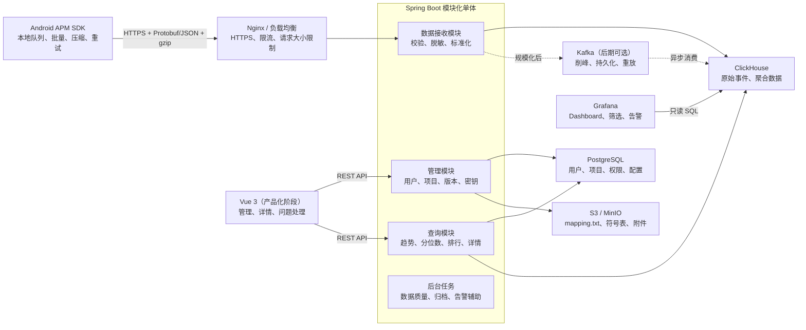

# Android APM 性能监测平台技术方案

> 服务端、数据存储、Grafana Dashboard 与后续产品化方案
> 文档版本：1.0
> 更新日期：2026-08-14

## 1. 方案摘要

本方案面向以下现状：

- Android 端性能数据已经可以采集。
- 开发者熟悉 Java 和 Kotlin，但暂时没有后端及网页开发经验。
- 下一步需要完成数据上传、服务端存储、聚合分析、Dashboard 展示和告警。

推荐采用“模块化单体 + 双数据库 + Grafana 先行”的技术路线：

```text
后端：Java 21 + Spring Boot 4.1 + Spring MVC
事务数据：PostgreSQL
APM 数据：ClickHouse
数据展示：Grafana
文件存储：S3 / MinIO（按需加入）
部署：Docker Compose + Nginx
后期扩展：Kafka + Vue 3
```

第一版不建议引入：

- 微服务
- Kubernetes
- Kafka
- Redis
- 自研 Vue Dashboard

先完成一条最小可用链路：

```text
创建项目
  → 获取上报 Key
  → Android 批量上报
  → Spring Boot 接收并校验
  → ClickHouse 入库
  → Grafana 展示 p95 趋势
  → 点击查看慢样本
  → 配置阈值告警
```

---

## 2. 建设目标与第一版范围

### 2.1 建设目标

平台需要解决以下问题：

1. Android 性能数据能够在弱网环境下可靠上传。
2. 服务端能够完成项目识别、校验、脱敏、存储和聚合。
3. 能够按时间、版本、渠道、设备和系统等维度查询。
4. 能够展示 p50、p90、p95、p99 等性能分位数。
5. 能够发现版本性能退化、慢设备、慢页面和慢接口。
6. 能够针对异常指标配置告警。
7. 后续可以演进为多租户、产品化的 APM 平台。

### 2.2 第一版建议覆盖的指标

建议先选择三类数据完成完整闭环：

#### App 启动

- 冷启动、温启动、热启动
- 总启动耗时
- Application、Activity、首帧等阶段耗时
- 启动版本、设备和系统分布

#### 网络性能

- 总耗时
- DNS、连接、TLS、TTFB、下载耗时
- 请求方法、状态码、错误类型
- 请求和响应字节数
- 标准化域名与接口路径

#### 卡顿或 ANR

- 卡顿次数和卡顿率
- 页面名称
- 帧耗时分布
- 堆栈信息
- 受影响设备数
- App 版本和 Android 系统版本

Crash、内存、CPU、耗电、完整 Trace 等功能可以在上述链路稳定后逐步增加。

### 2.3 Dashboard 应回答的问题

- 某个版本的冷启动 p50、p90、p95、p99 是多少？
- 新版本相对旧版本是否发生性能退化？
- 哪些设备、系统、渠道或页面的性能最差？
- 哪些接口耗时最高、错误率最高？
- 某个慢样本的设备、会话、网络和阶段耗时是什么？
- 某项性能问题影响了多少用户或设备？
- 最近一段时间是否出现异常突增？

---

## 3. 总体架构



### 3.1 模块职责

| 模块 | 主要职责 | 第一版部署方式 |
|---|---|---|
| Android SDK | 本地队列、批量、gzip、采样、弱网重试、Schema 版本 | 集成在业务 App |
| 接入层 | HTTPS、限流、请求大小限制、反向代理 | Nginx 或云负载均衡 |
| 接收模块 | 项目识别、Schema 校验、脱敏、标准化、批量写入 | Spring Boot 内部模块 |
| 管理模块 | 用户、项目、App、版本、成员、密钥、制品 | Spring Boot 内部模块 |
| 查询模块 | 趋势、排行、分位数、版本对比、事件详情 API | Spring Boot 内部模块 |
| 后台任务 | 数据质量检查、保留策略、归档、告警辅助 | Spring Scheduler |
| Grafana | Dashboard、临时分析、告警 | 独立容器 |

### 3.2 为什么使用模块化单体

- 一个仓库、一个 Spring Boot 进程，部署和调试成本低。
- 接收、查询、管理、存储在代码层保持清晰边界。
- 未来可以根据真实负载单独拆分接收服务和查询服务。
- 避免第一版同时学习服务发现、分布式事务和服务治理。

建议先建立代码边界，不提前建立部署边界。

---

## 4. 数据流与可靠性

### 4.1 第一版数据流

1. Android 在本地积累一个事件批次。
2. 使用 gzip 压缩后通过 HTTPS 上传。
3. 服务端检查请求大小、项目状态、Schema 版本和字段合法性。
4. 服务端对 URL、用户标识、设备标识等字段脱敏和标准化。
5. 服务端批量写入 ClickHouse。
6. 写入确认后返回成功；失败时返回是否可重试。
7. Android 按指数退避并加入随机抖动后重试。
8. Grafana 使用只读账号查询 ClickHouse。

### 4.2 第一版为什么不使用 Kafka

第一版直接写 ClickHouse 的优点：

- 组件更少。
- 数据链路更短。
- 容易调试和排查数据丢失。
- 不需要学习 Topic、Partition、Offset、消费者组和积压监控。

在服务端确认 ClickHouse 写入成功后再响应客户端，可以让失败交给 Android 本地队列重试。

### 4.3 何时加入 Kafka

出现以下情况时再加入 Kafka：

- ClickHouse 短暂不可用时，服务端仍必须持续接收数据。
- 上报峰值明显超过数据库实时写入能力。
- 同一份数据需要同时用于存储、告警、异常检测、导出等多个消费者。
- 需要回放历史数据重新计算。
- 需要将数据接收与数据处理完全解耦。

### 4.4 消息队列选择

| 方案 | 优势 | 限制 | 建议 |
|---|---|---|---|
| 直接写 ClickHouse | 组件少、链路短、容易排障 | 数据库不可用时依赖客户端重试 | 第一版推荐 |
| Kafka | 高吞吐、持久化、削峰、重放、多消费者 | 部署和运维复杂 | 规模化阶段推荐 |
| RabbitMQ | 路由、确认和任务队列体验成熟 | 长期保留和大规模回放不如 Kafka | 业务任务较多时考虑 |
| Redis Streams | 已使用 Redis 时接入较快 | 不宜作为长期核心遥测总线 | 小规模过渡方案 |

---

## 5. 后端技术方案

### 5.1 推荐技术栈

| 领域 | 推荐技术 | 选择理由 |
|---|---|---|
| JDK | Java 21 LTS | 成熟稳定，可使用虚拟线程，Android 开发者迁移成本低 |
| 后端框架 | Spring Boot 4.1 | Web、安全、监控和生态完整 |
| Web 模型 | Spring MVC | 与 JDBC/JPA 阻塞访问匹配，比 WebFlux 更容易学习 |
| 构建工具 | Gradle Kotlin DSL | 延续 Android 项目经验 |
| API | REST + OpenAPI | 容易调试，可生成接口文档和客户端类型 |
| 事务访问 | Spring Data JPA | 适合用户、项目、成员和版本等关系模型 |
| ClickHouse 访问 | JdbcClient 或 NamedParameterJdbcTemplate | 原生 SQL 更适合分位数、物化视图和复杂聚合 |
| 数据库迁移 | Flyway | 管理 PostgreSQL 表结构版本 |
| 安全 | Spring Security | 登录、Session、角色和接口保护 |
| 后台任务 | Spring Scheduler | 第一版定时任务足够 |
| 接口文档 | springdoc-openapi | 自动生成 Swagger/OpenAPI 文档 |
| 测试 | JUnit 5 + Testcontainers | 使用真实 PostgreSQL 和 ClickHouse 进行集成测试 |
| 压测 | k6 或 Gatling | 测试上报吞吐和查询延迟 |

Spring Boot 4.1 支持 Java 17 至 Java 26。推荐使用 Java 21，以获得更成熟的生态兼容性。如果某些第三方库暂时不兼容 Spring Boot 4，可退回维护中的 Spring Boot 3.5。

### 5.2 Spring MVC 与 WebFlux

推荐 Spring MVC：

- 编程模型接近普通 Java 调用。
- JDBC、JPA 和 ClickHouse 客户端大多是阻塞式。
- 调试和排错更直接。
- Java 21 虚拟线程可以改善大量阻塞请求的并发处理。

WebFlux 需要理解 `Mono`、`Flux`、背压以及响应式数据库驱动。除非未来明确采用全链路响应式技术，否则第一版没有必要。

### 5.3 JPA、MyBatis 与原生 SQL

推荐组合使用：

- PostgreSQL：Spring Data JPA。
- ClickHouse：JdbcClient 或 NamedParameterJdbcTemplate。
- 复杂分析报表：明确编写 ClickHouse SQL。

不建议使用 JPA 抽象 ClickHouse，因为 APM 查询会大量使用分位数、时间窗口、聚合状态、物化视图和 ClickHouse 专有函数。

### 5.4 建议项目结构

```text
apm-platform/
├─ backend/
│  ├─ apm-bootstrap
│  ├─ apm-common
│  ├─ apm-auth
│  ├─ apm-project
│  ├─ apm-ingest
│  ├─ apm-query
│  ├─ apm-alert
│  └─ apm-storage
├─ dashboard/
│  ├─ provisioning
│  └─ dashboards
├─ web/                  # 产品化阶段加入 Vue 3
├─ deploy/
│  ├─ docker-compose.yml
│  ├─ nginx/
│  └─ database/
└─ docs/
   ├─ api/
   ├─ event-schema/
   └─ architecture/
```

这些是代码模块，不代表每个模块都需要独立部署。第一版统一打成一个 Spring Boot 应用。

---

## 6. 数据存储设计

### 6.1 PostgreSQL、ClickHouse 与对象存储的分工

| 存储 | 保存内容 | 数据特征 |
|---|---|---|
| PostgreSQL | 用户、组织、项目、成员、App、版本、环境、渠道、密钥、告警规则、制品元数据 | 需要事务、更新、唯一约束和关系查询 |
| ClickHouse | 启动、网络、卡顿、ANR、Crash、内存、CPU、耗电、Trace 和聚合结果 | 高体量、追加写、按时间和维度聚合 |
| S3 / MinIO | R8 `mapping.txt`、NDK 符号表、大体积附件和归档 | 对象存储，按 `buildId` 或版本关联 |

### 6.2 为什么选择 ClickHouse

APM 原始事件具有以下特点：

- 数据量增长快。
- 主要是追加写入，很少更新。
- 经常按照时间范围查询。
- 需要按照版本、渠道、设备、系统、页面、接口等维度聚合。
- 需要计算 p50、p90、p95、p99。
- 需要从趋势下钻到原始样本。

这些特征比传统事务数据库更适合列式分析数据库。

### 6.3 其他数据库方案

| 方案 | 优势 | 缺点 | 适用场景 |
|---|---|---|---|
| 只用 PostgreSQL | 最简单，只维护一个数据库 | 数据增长后聚合和存储成本提高 | 原型和小规模验证 |
| PostgreSQL + TimescaleDB | 保持 PostgreSQL 使用体验，增强时序能力 | 高基数多维分析通常不如 ClickHouse | 中等规模、希望减少组件 |
| ClickHouse | 聚合快、压缩率高、适合海量观测数据 | 不适合作为事务主库 | APM 原始数据和趋势，推荐 |
| Elasticsearch/OpenSearch | 全文搜索能力强 | 内存与运维成本较高 | 日志全文搜索是核心需求 |
| Prometheus | 指标、告警和生态成熟 | 不适合大量客户端原始事件和高基数明细 | 监控 APM 服务自身 |

### 6.4 ClickHouse 原始事件模型

第一版可以使用统一的原始事件表：

```text
apm_event_raw
├─ project_id
├─ app_id
├─ event_id
├─ event_type
├─ event_time
├─ received_time
├─ schema_version
├─ app_version
├─ version_code
├─ build_id
├─ channel
├─ environment
├─ session_id
├─ anonymous_device_id
├─ os_version
├─ device_model
├─ network_type
├─ duration_ms
├─ status
├─ measurements Map(String, Float64)
└─ attributes   Map(String, String)
```

设计原则：

- 高频查询和聚合字段建立为明确的类型列。
- 不稳定或低频属性放入 `Map` 或 JSON。
- 不要把所有数据放入一个 JSON 字符串。
- 第一版使用统一表；热点类型稳定后再建立专用事实表或物化视图。
- 每条事件携带 `eventId` 和 `schemaVersion`。

### 6.5 分区、排序与保留策略

建议：

- 按月份分区：`PARTITION BY toYYYYMM(event_time)`。
- 排序键优先覆盖 `project_id`、`event_type` 和 `event_time`。
- 原始数据通过 TTL 保留 7 至 90 天。
- 小时和天级聚合数据可以保留一年或更久。
- Dashboard 优先查询聚合表，点击详情时才查原始表。

典型聚合维度：

```text
project_id
  + event_type
  + app_version
  + channel
  + hour
    → count
    → avg
    → p50 / p90 / p95 / p99
    → error_count
    → affected_device_count
```

### 6.6 写入策略

ClickHouse 不适合逐条小批量写入。建议：

- Android 端进行批量上报。
- Spring Boot 批量解析和写入。
- 可以启用 ClickHouse 异步插入，合并多个并发小批次。
- 第一版在 ClickHouse 确认写入后再返回成功。
- 数据规模扩大后，通过 Kafka 聚合和削峰。

### 6.7 重复数据处理

遥测系统通常采用“至少一次”传递。网络中断后的重试可能造成少量重复，因此：

- 每条事件必须携带唯一 `eventId`。
- 趋势统计可以容忍极少量重复。
- 关键详情查询可以按 `eventId` 去重。
- 不建议为了绝对去重引入高成本的全局事务。

---

## 7. 上报协议与 API

### 7.1 公共事件信封

```json
{
  "schemaVersion": 1,
  "eventId": "全局唯一ID",
  "eventType": "app_start",
  "occurredAt": 1786675200000,
  "sessionId": "会话ID",
  "anonymousDeviceId": "匿名设备ID",
  "appVersion": "3.2.0",
  "versionCode": 320,
  "buildId": "构建ID",
  "environment": "production",
  "channel": "official",
  "osVersion": "16",
  "deviceModel": "设备型号",
  "networkType": "wifi",
  "measurements": {
    "durationMs": 823.4
  },
  "attributes": {
    "startType": "cold"
  }
}
```

### 7.2 上报接口

```http
POST /ingest/v1/batches
Content-Type: application/x-protobuf
Content-Encoding: gzip
X-Project-Key: 项目上报标识
X-SDK-Version: 1.0.0
X-Schema-Version: 1
```

响应示例：

```json
{
  "requestId": "请求ID",
  "accepted": 500,
  "rejected": 2,
  "retryable": false,
  "retryAfterSeconds": null
}
```

建议：

- 调试阶段先使用 JSON + gzip。
- 正式阶段使用 Protobuf + gzip。
- 请求和解压后的内容都要限制最大大小。
- 响应应明确区分永久错误和临时错误。
- 对可重试错误支持 `Retry-After`。

### 7.3 查询与管理 API

```http
GET  /api/v1/projects/{id}/overview
GET  /api/v1/projects/{id}/startup/trend
GET  /api/v1/projects/{id}/network/endpoints
GET  /api/v1/projects/{id}/jank/pages
GET  /api/v1/projects/{id}/events
GET  /api/v1/projects/{id}/events/{eventId}

POST /api/v1/projects
POST /api/v1/projects/{id}/apps
POST /api/v1/projects/{id}/keys
POST /api/v1/projects/{id}/artifacts/mapping
```

查询接口必须设置：

- 最大时间范围
- 最大返回行数
- 分页或游标
- 查询超时
- 默认聚合粒度
- 项目权限校验

### 7.4 是否使用 OTLP

可以在后期兼容 OpenTelemetry Protocol（OTLP）：

- OTLP 已稳定支持指标、日志和 Trace。
- 支持 HTTP/gRPC、Protobuf 和 gzip。
- Android 启动、卡顿等专有事件未必能自然映射成标准信号。

推荐：

1. 第一版继续使用自己的 APM Event Envelope。
2. 字段命名尽量参考 OpenTelemetry。
3. 保留 `schemaVersion`。
4. 后续增加 OTLP 接收器或转换器。

---

## 8. Grafana Dashboard 方案

### 8.1 为什么第一版使用 Grafana

- 可以直接连接 ClickHouse。
- 支持 SQL 编辑器和可视化查询。
- 内置折线图、柱状图、表格、日志、Trace 等视图。
- 内置时间选择、变量、筛选、链接、注释和告警。
- 可以把 Dashboard JSON 放入 Git 管理。
- 可以先验证指标是否有价值，再决定是否自研前端。

第一版可以暂时完全不开发 Vue 页面：

```text
Android SDK
  → Spring Boot
  → ClickHouse
  → Grafana Dashboard
```

### 8.2 Dashboard 清单

| Dashboard | 核心图表 | 主要筛选条件 |
|---|---|---|
| 全局总览 | 事件量、活跃设备、启动 p95、卡顿率、ANR 率、网络错误率 | 时间、项目、版本、渠道、环境 |
| 启动分析 | 冷/温/热启动趋势、分位数、阶段耗时、慢样本 | 版本、设备、系统、启动类型 |
| 网络分析 | 接口耗时、错误率、状态码、DNS/连接/TLS/TTFB 分解 | 域名、路径、网络类型、版本 |
| 卡顿分析 | 卡顿趋势、页面排行、帧耗时分布、受影响设备 | 页面、设备、系统、版本 |
| 版本对比 | 新旧版本 p95 变化、回归维度和受影响范围 | 基准版本、目标版本、渠道 |
| 数据质量 | 上报延迟、拒绝量、Schema 分布、无数据告警 | SDK 版本、Schema、项目 |

### 8.3 Dashboard 全局变量

建议配置以下 Grafana 变量：

```text
project_id
app_version
channel
environment
os_version
device_model
network_type
event_type
interval
```

时间范围使用 Grafana 自带的时间选择器。

### 8.4 Grafana 与 Vue 的边界

| 能力 | Grafana | Vue 自研 |
|---|---|---|
| 趋势、排行、筛选 | 非常适合，配置速度快 | 需要 API、状态管理和图表开发 |
| 告警 | 内置规则和通知能力 | 需要单独建设任务和通知系统 |
| 项目、密钥管理 | 不适合完整业务流程 | 适合 |
| Crash/ANR 详情 | 可以展示，但交互有限 | 适合堆栈、归组和处理状态 |
| 版本回归分析 | 适合基础数据分析 | 可以形成完整产品功能 |
| 多租户商业化 | 权限隔离配置较复杂 | 可以精确实现租户和角色模型 |

推荐的演进方式：

1. 第一阶段：所有图表使用 Grafana。
2. 第二阶段：Spring Boot 补充用户、项目、密钥和制品管理。
3. 第三阶段：Vue 负责产品界面和事件详情，Grafana 保留为内部分析与运维平台。

不建议第一版直接通过 `iframe` 把 Grafana 嵌入 Vue，因为登录状态、Cookie、跨域和多租户隔离会显著增加复杂度。

### 8.5 Grafana 连接 ClickHouse 的安全要求

- 使用专用 ClickHouse 只读账户。
- 只授予指定数据库和表的 `SELECT` 权限。
- 设置查询超时和最大返回行数。
- ClickHouse 不直接暴露公网。
- Grafana 通过内网连接 ClickHouse。
- Dashboard 默认查询聚合表。
- 原始详情查询必须限制时间范围和数量。
- 多租户场景不能只依赖隐藏 `projectId` 变量。
- 对外场景应使用数据源隔离、ClickHouse 行级策略或后端查询代理。

### 8.6 告警示例

```text
启动耗时 p95 > 1500 ms
网络错误率 > 5%
某版本 ANR 率高于上一版本
卡顿率在 10 分钟内增长超过阈值
连续 10 分钟没有收到任何数据
上报拒绝率超过阈值
ClickHouse 磁盘使用率超过阈值
```

---

## 9. 认证、安全与隐私

### 9.1 区分两类身份

| 身份 | 推荐机制 | 关键控制 |
|---|---|---|
| Android 上报 | 项目 Key + HTTPS + 限流；可选 Play Integrity | 密钥轮换、配额、请求大小、时间窗口、异常设备/IP |
| 网页用户 | Spring Security + Session + HttpOnly Cookie | CSRF、Secure、SameSite、角色和项目权限 |
| Grafana 用户 | 独立登录或统一 OIDC | 组织、文件夹、Dashboard 和数据源权限 |

APK 中的项目 Key 可以被逆向，因此它主要用于识别项目，不能被当作绝对安全的客户端秘密。

### 9.2 网页登录建议

第一版推荐：

- Spring Security
- 服务端 Session
- HttpOnly Cookie
- Secure Cookie
- SameSite Cookie
- 前端与 API 使用同一域名
- 开启 CSRF 保护

角色可以设计为：

```text
Owner
Admin
Developer
Viewer
```

多服务、第三方登录或对外开放 API 出现后，再引入 OIDC/JWT。

### 9.3 多租户安全

每一次查询都必须由服务端检查：

```text
当前用户
  → 是否属于目标项目
  → 在项目中具有什么角色
  → 是否有权访问当前资源
```

不能只相信前端或 Grafana 传入的 `projectId`。

### 9.4 默认禁止采集的数据

- 完整 URL 查询参数
- Cookie
- Authorization 等敏感请求头
- 请求体和响应体
- 用户输入内容
- 手机号和邮箱
- 明文用户 ID
- 能直接识别个人的设备标识

建议：

- URL 标准化为 `/users/{id}` 等路径模板。
- 用户和设备标识使用按项目加盐的哈希。
- 服务端对字段名和属性名实施白名单。
- mapping 文件和堆栈信息实施访问控制。
- 日志中禁止输出完整上报 Key 和完整事件体。
- 明确原始数据保留与删除策略。

---

## 10. 部署与运维

### 10.1 第一版部署拓扑

```text
一台开发机或云主机
├─ Nginx
│  ├─ HTTPS
│  ├─ 反向代理
│  └─ 限流
├─ Spring Boot
│  ├─ 接收
│  ├─ 管理
│  ├─ 查询
│  └─ 后台任务
├─ PostgreSQL
├─ ClickHouse
├─ Grafana
└─ MinIO（按需加入）
```

本地和小规模内测使用 Docker Compose 即可。正式对外后，优先将 PostgreSQL 和 ClickHouse 迁移到独立磁盘或托管服务，再考虑将 Spring Boot 横向扩容。

### 10.2 暂时不要使用 Kubernetes

只有出现以下情况时再考虑 Kubernetes：

- 多个服务需要独立扩缩容。
- 需要频繁滚动发布。
- 需要复杂的服务发现和流量治理。
- 团队已经有 Kubernetes 运维能力。
- Docker Compose 或普通云服务已成为明确瓶颈。

### 10.3 必须建设的运维能力

- HTTPS 证书管理。
- 环境变量或密钥服务管理敏感配置。
- PostgreSQL 定期备份和恢复演练。
- ClickHouse TTL、磁盘容量和慢查询监控。
- Spring Boot Actuator 和 JVM 监控。
- 上报错误率、写入延迟、拒绝率和数据延迟监控。
- 开发、测试、生产环境隔离。
- GitHub Actions 或 GitLab CI。
- 日志轮转和错误追踪。

---

## 11. 测试方案

### 11.1 测试工具

| 测试层次 | 工具 | 重点 |
|---|---|---|
| 单元测试 | JUnit 5、Mockito | 校验、脱敏、转换、权限判断 |
| 数据库集成 | Testcontainers | 真实 PostgreSQL/ClickHouse 写入、迁移和查询 |
| 接口测试 | REST Assured 或 MockMvc | 状态码、鉴权、错误响应、Schema 兼容 |
| 性能测试 | k6 或 Gatling | 上报吞吐、p95 延迟、写入和查询性能 |
| Dashboard 检查 | 固定测试数据 + 截图检查 | 分位数、筛选、时间粒度和无数据状态 |

### 11.2 必测场景

- 同一个批次重复上报。
- 连接中断后的重复重试。
- gzip 数据损坏。
- 请求体或解压后内容过大。
- 字段缺失和未知 Schema 版本。
- 非法事件时间和客户端时钟偏差。
- ClickHouse 临时不可用或写入超时。
- 不同项目之间的数据隔离。
- 无权限用户枚举 `projectId`。
- 时间范围过大的查询。
- Android 不同时区的数据展示。
- 高基数设备、URL、页面数据。
- p50、p95、p99 与固定样本人工计算结果一致。

---

## 12. 开发步骤与阶段验收

| 阶段 | 主要工作 | 验收结果 |
|---|---|---|
| 0. 指标定义 | 选择启动、网络、卡顿/ANR；定义问题、字段和统计口径 | 事件协议 v1 和示例数据确定 |
| 1. 基础环境 | 建立 Spring Boot 工程和 Docker Compose，启动 PostgreSQL、ClickHouse、Grafana | 健康检查和数据库连接通过 |
| 2. 管理能力 | 用户、项目、App、版本、密钥、mapping 元数据 | 能创建项目并获取上报 Key |
| 3. 上报链路 | JSON、gzip、批量、校验、脱敏、写入和错误响应 | 模拟 Android 数据稳定进入 ClickHouse |
| 4. 协议优化 | Protobuf、Schema 兼容、批次与重试优化 | 不同 SDK 版本能够兼容上报 |
| 5. 聚合查询 | 原始表、TTL、小时聚合、分位数、排行、版本对比 | 固定数据集结果正确且查询受限 |
| 6. Dashboard | 总览、启动、网络、卡顿、版本对比、数据质量 | 筛选、下钻、无数据和告警可用 |
| 7. 安全测试 | 项目隔离、限流、密钥轮换、敏感字段、只读账号 | 越权和隐私测试通过 |
| 8. 部署运维 | HTTPS、备份、监控、CI/CD、容量和故障演练 | 测试环境端到端运行并可恢复 |

### 12.1 阶段 0：从查询问题反推事件字段

先确定 Dashboard 需要展示什么，再确定 Android 上传什么。

例如为了回答“新版本冷启动是否退化”，至少需要：

```text
project_id
app_version
version_code
event_time
start_type
duration_ms
device_model
os_version
channel
anonymous_device_id
```

避免采集大量暂时没有查询场景的数据。

### 12.2 阶段 1：建立本地环境

通过 Docker Compose 启动：

- PostgreSQL
- ClickHouse
- Grafana
- Spring Boot
- Nginx（可以稍后加入）

首先实现：

```http
GET /actuator/health
GET /api/v1/ping
```

### 12.3 阶段 2：管理功能

实现：

- 用户登录
- 创建项目
- 创建 Android 应用
- 创建和轮换上报 Key
- App 版本管理
- mapping 文件上传与版本关联

### 12.4 阶段 3：打通上报链路

先使用 JSON：

```text
Android 模拟数据
  → POST /ingest/v1/batches
  → 参数校验
  → 脱敏和标准化
  → ClickHouse
  → SQL 验证
```

完成后再加入：

- Protobuf
- gzip
- 批量写入
- 限流
- 重试响应
- Schema 兼容
- 去重策略

### 12.5 阶段 4：聚合与查询

优先实现：

- 按小时的事件量和设备数。
- 启动 p50、p90、p95、p99。
- 网络接口耗时和错误率排行。
- 页面卡顿率排行。
- App 版本对比。
- 原始事件下钻。

### 12.6 阶段 5：Grafana Dashboard

顺序建议：

1. 全局筛选变量。
2. 数据质量 Dashboard。
3. 启动 Dashboard。
4. 网络 Dashboard。
5. 卡顿/ANR Dashboard。
6. 版本对比 Dashboard。
7. 告警规则。

先做数据质量 Dashboard，可以更早发现 SDK 版本、Schema、延迟和入库问题。

---

## 13. 产品化演进路线

### 13.1 第一阶段：Grafana 优先

完成：

- 数据上报
- ClickHouse 存储
- 聚合 SQL
- Grafana Dashboard
- Grafana 告警

暂时不开发 Vue。

### 13.2 第二阶段：管理能力

增加：

- 用户和团队
- 项目和 App 管理
- 项目成员与角色
- 上报 Key 管理
- mapping 文件管理
- 数据保留配置
- 告警规则管理

图表仍然使用 Grafana。

### 13.3 第三阶段：Vue 产品界面

推荐前端技术：

```text
Vue 3
TypeScript
Vite
Vue Router
Pinia
Axios
Element Plus
Apache ECharts
Vitest
Playwright
```

Vue 负责：

- 登录与权限
- 项目管理
- Crash/ANR/卡顿事件详情
- 堆栈反混淆
- 问题归组
- 评论和处理状态
- 版本回归报告
- 面向客户的多租户体验

Grafana 继续负责：

- 内部实时趋势
- 临时数据分析
- 运维 Dashboard
- 告警

### 13.4 扩展触发条件

| 出现的需求或问题 | 建议动作 |
|---|---|
| ClickHouse 不可用时仍必须接收数据 | 加入 Kafka |
| 接收与查询互相影响，扩容节奏不同 | 拆分 `apm-ingest` 与 `apm-query` |
| 多个消费者需要处理同一份数据 | 使用 Kafka Topic 和消费者组 |
| 需要问题归组、评论和完整产品交互 | 开发 Vue 产品界面 |
| 单机数据库容量、IO 或可用性不足 | 托管集群、分片副本和冷热分层 |
| 多个服务需要复杂编排和独立扩缩容 | 再评估 Kubernetes |

---

## 14. 第一版最终选型清单

### 后端

- Java 21
- Spring Boot 4.1
- Spring MVC
- Gradle Kotlin DSL
- Spring Security + Session
- Spring Data JPA
- Spring JdbcClient
- springdoc-openapi
- Flyway

### 存储

- PostgreSQL
- ClickHouse
- MinIO（需要上传 mapping 文件时加入）

### 数据展示

- Grafana
- Grafana ClickHouse 数据源
- Dashboard JSON 进入 Git 管理

### 工程与测试

- Docker Compose
- Nginx
- GitHub Actions 或 GitLab CI
- JUnit 5
- Testcontainers
- k6 或 Gatling

### 第一版暂不使用

- Kafka
- Redis
- Vue
- 微服务
- Kubernetes

---

## 15. 正式建表前需要确认的参数

以下信息不会改变总体技术方向，但会影响批次大小、保留期限、表结构、分区、机器配置和是否提前引入 Kafka：

1. 预计 DAU 和峰值在线设备数。
2. 每天预计产生多少事件。
3. 每类事件的平均大小和采样率。
4. Android 端每个批次的事件数及最大字节数。
5. 原始数据和聚合数据需要保留多久。
6. 是否面向多个公司或团队提供 SaaS 多租户能力。
7. 是否包含 Crash、ANR 反混淆和 NDK 符号化。
8. 是否需要完整的 Trace/Span 链路。
9. 部署位置、云厂商和预算范围。
10. 可接受的数据丢失、查询延迟和服务可用性目标。

---

## 16. 官方参考资料

- [Spring Boot 系统要求](https://docs.spring.io/spring-boot/system-requirements.html)
- [ClickHouse 可观测性与实时分析场景](https://clickhouse.com/use-cases)
- [ClickHouse 批量写入建议](https://clickhouse.com/blog/common-getting-started-issues-with-clickhouse)
- [Grafana ClickHouse 数据源](https://grafana.com/docs/plugins/grafana-clickhouse-datasource/latest/)
- [Grafana Dashboard 变量](https://grafana.com/docs/grafana/latest/visualizations/dashboards/variables/)
- [Grafana ClickHouse 告警](https://grafana.com/docs/plugins/grafana-clickhouse-datasource/latest/alerting/)
- [OpenTelemetry OTLP 规范](https://opentelemetry.io/docs/specs/otlp/)
- [Apache Kafka 官方文档](https://kafka.apache.org/documentation/)
- [Vue 与 TypeScript 指南](https://vuejs.org/guide/typescript/overview)
- [Apache ECharts 功能说明](https://echarts.apache.org/en/feature.html)
