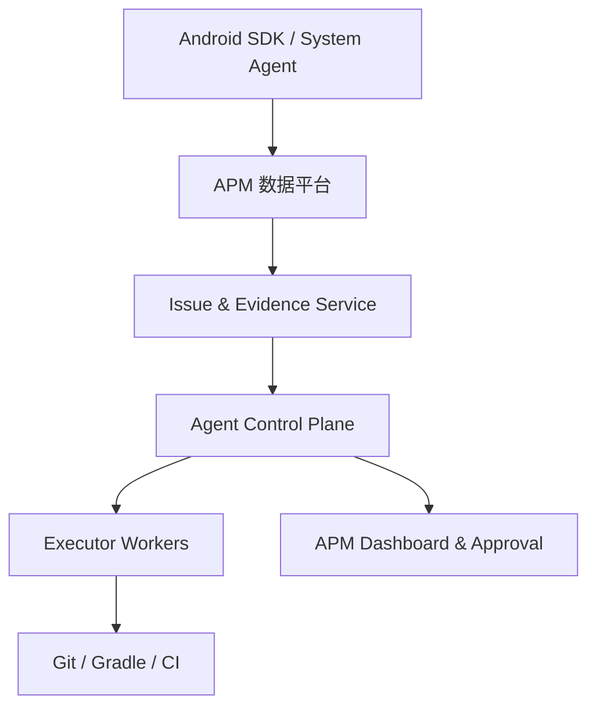
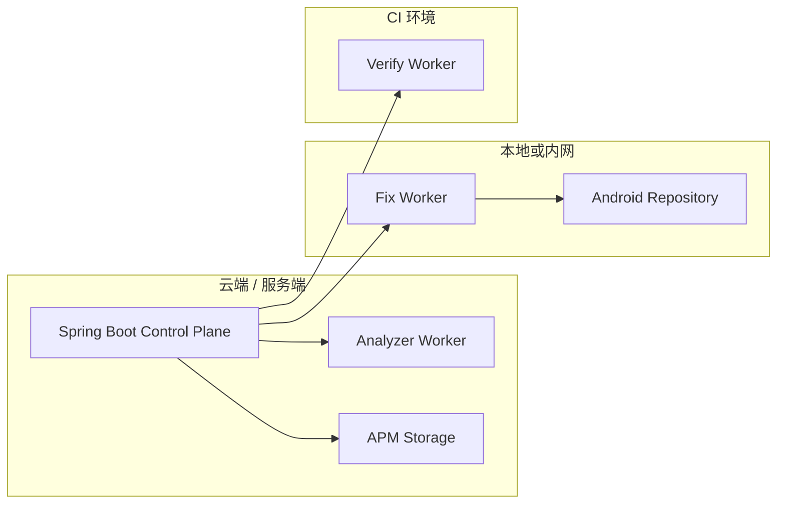
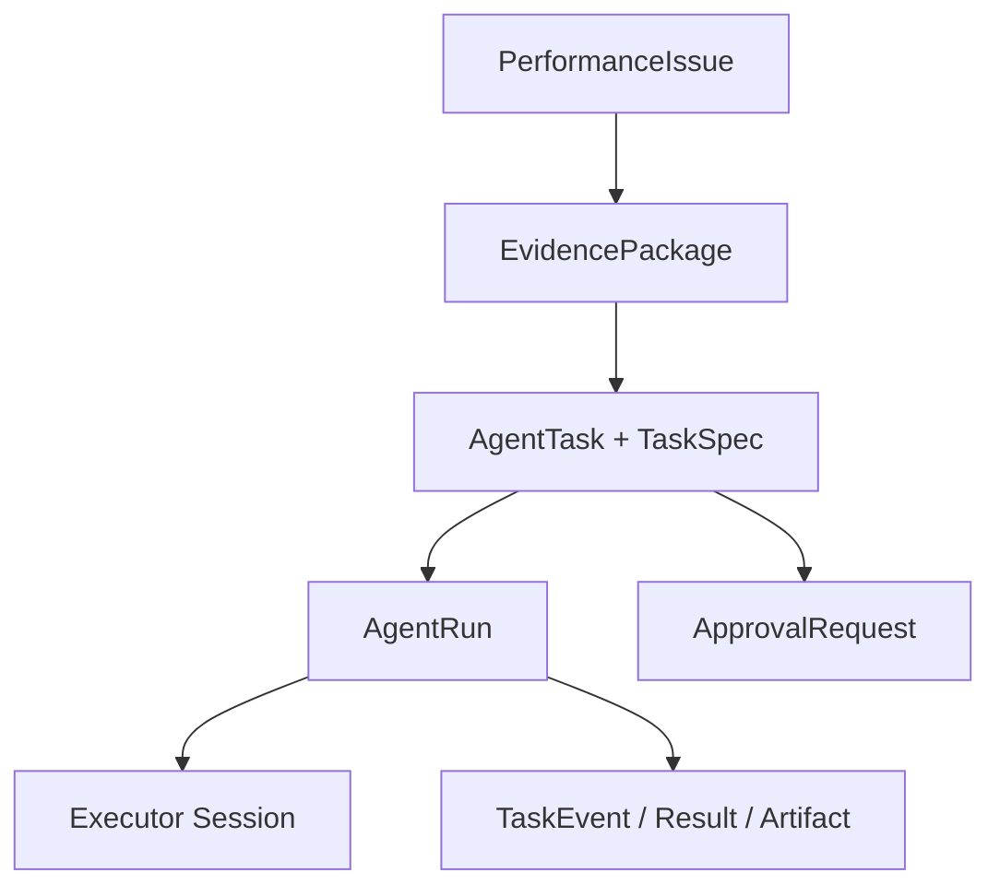
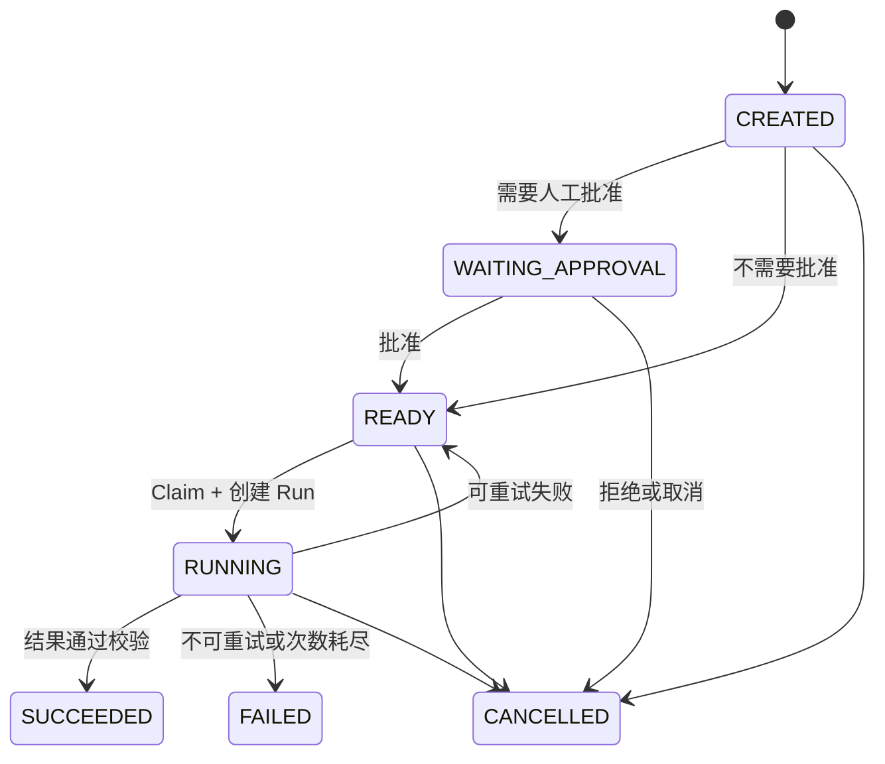
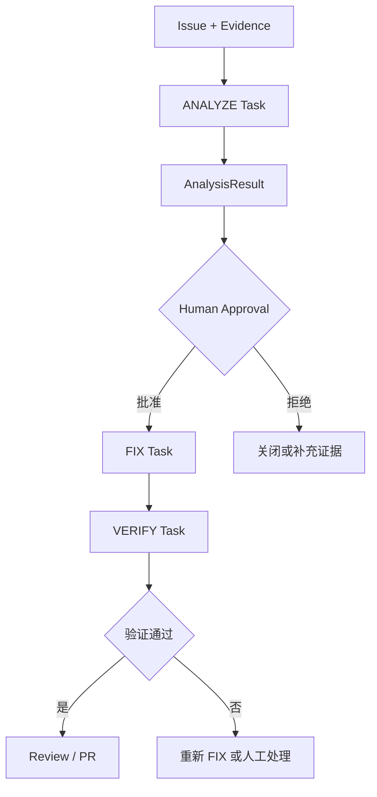

# APM Agent Platform 项目级架构设计

> 状态：架构基线（Draft / V1）  
> 更新日期：2026-09-19  
> 读者：Codex、后端开发、Agent Worker 开发、Android/APM 开发、CI 运维  
> 目标：固化 OpenCode SDK、APM 接入、AgentTask Runtime 的已收敛设计，作为后续实现依据。

## 1. 文档定位

本文描述一个面向车机 Android 应用的 APM Agent 平台。平台从卡顿、启动、内存、Crash、ANR 等 APM 数据中形成问题，自动完成证据整理与根因分析；经人工批准后，由受控的本地或内网 Coding Agent 修改代码，再交给 CI 构建、测试和性能验证。

本文是项目架构基线，不是 OpenCode API 使用手册。所有业务状态、审计记录和执行结果都必须由平台自己持久化，不能依赖某个 Coding Agent Runtime 的内部模型。

### 1.1 已确定的核心结论

1. 分析对象是聚合后的 `PerformanceIssue`，不是单条原始事件。
2. 核心链路固定为：`Issue → EvidencePackage → AgentTask → AgentRun → Executor Session`。
3. `AgentTask`、`AgentRun`、OpenCode `Session` 是三个不同生命周期的概念，禁止合并。
4. `ANALYZE`、`FIX`、`VERIFY`、`REVIEW` 是任务类型；`JANK`、`ANR`、`OOM`、`CRASH` 等是 Issue 类型，两组维度必须分离。
5. 分析、修改、验证拆成不同 Task；不同 Task 可以选择不同模型、权限、执行机器、超时和重试策略。
6. Task 创建时冻结 `TaskSpec`，保证结果可审计、可复现。
7. 云端负责数据聚合、根因推理、任务规划；本地/内网 Worker 负责源码修改；CI 负责构建与验证；人负责批准和最终合并。
8. ANALYZE 默认只读；FIX 只能在隔离 worktree 内修改；默认禁止 `git push`；生成修复前必须经过人工批准。
9. Agent 的自然语言回答仅用于展示，平台必须保存版本化的结构化 Result。
10. OpenCode、Codex 或其他 Coding Agent 都只是可替换的 Executor；平台的核心资产是 Task、Run、Event、Result 和 Approval。

### 1.2 不在 V1 范围内

- 无人工审批的全自动提交、推送、合并和发布。
- 跨仓库的大规模自动重构。
- 让单个长生命周期 Session 同时承担分析、修改和验证。
- 把原始海量事件、Perfetto 文件或视频全部直接塞进 Prompt。
- 依赖 OpenCode 的内部数据库充当平台任务数据库。
- 第一版就实现复杂的多 Agent 自主协商或二三十种任务状态。

## 2. 设计原则

### 2.1 业务模型与执行器解耦

平台关心“要完成什么”和“结果是否可信”；OpenCode 关心“Agent 如何在一个代码环境中运行”。两者通过 `AgentExecutor` 接口隔离。

```text
AgentTask       业务目标，例如“分析 JANK-123”
AgentRun        AgentTask 的第 N 次执行尝试
ExecutorSession 某个执行器的一次运行会话，例如 OpenCode Session
```

未来把 OpenCode 替换成 Codex SDK、其他 Agent SDK 或自研 Runtime 时，Issue、审批、审计、调度和前端接口不应变化。

### 2.2 不信任 Agent 的隐式状态

任务输入、源代码版本、证据版本、模型、Prompt、权限、工具、结果 Schema 和审批记录都要显式化。恢复任务时只能相信平台已持久化的事实，不应假定 Session 还活着，也不应无条件重放有副作用的工具调用。

### 2.3 证据优先，结论可追溯

任何根因都应指向一条可查看的证据链：指标异常、受影响范围、堆栈、Trace、源码位置、版本/Commit、设备环境和置信度。Fix Agent 必须重新核验分析结论与指定源码版本是否一致，不能盲信 Analyzer 输出。

### 2.4 最小权限与执行隔离

每种 Task 使用独立 Policy。读代码、改代码、执行 Gradle、访问网络、读取环境变量、提交 Git、推送远端都必须分别授权。权限边界同时由平台策略和 Executor 配置落实，不能只写在 Prompt 中。

### 2.5 先实现可恢复的最小闭环

V1 优先完成：问题 → 分析 → 审批 → 修复 → 编译/测试 → 结果审阅。消息队列、多模型路由、自动 Benchmark、自动 PR 可在核心状态机稳定后逐步加入。

## 3. 总体架构



### 3.1 组件职责

| 组件 | 主要职责 | 不应负责 |
| --- | --- | --- |
| Android SDK / System Agent | 采集卡顿、启动、内存、Crash、ANR、设备和系统证据 | Agent 调度和代码修改 |
| APM 数据平台 | 接收、清洗、符号化、版本关联、聚合查询 | 保存 Agent Session 内部状态 |
| Issue Service | 将事件聚合为可处理问题，维护 Issue 生命周期 | 直接调用 OpenCode |
| Evidence Service | 为一个 Issue 构建不可变证据包 | 实时拼接超大 Prompt |
| AgentTask Service | 创建、查询、取消、审批和状态迁移 | 长时间阻塞执行 Agent |
| Scheduler | 选择 READY Task，原子 Claim 并分配 Worker | 处理业务分析逻辑 |
| Agent Worker | 准备工作区、创建 Run、调用 Executor、转换事件和结果 | 决定 Issue 业务优先级 |
| Executor Adapter | 屏蔽 OpenCode/Codex 等执行器差异 | 成为平台真实数据源 |
| Approval Service | 记录审批请求、决定、人员和理由 | 只依靠聊天中的“同意” |
| Artifact Store | 保存 Trace、日志、Diff、报告、构建产物等大对象 | 存放核心关系状态 |
| CI / Verify Worker | 编译、测试、Lint、Benchmark、设备验证 | 自主改变生产源码 |

### 3.2 推荐部署边界



- 云端 Analyzer 可以访问经过脱敏的 APM 数据和只读源码镜像。
- Fix Worker 运行在开发机、内网构建机或受控 Runner，访问真实仓库和 Android 构建环境。
- Verify Worker 运行在 CI；涉及真机、车机、Perfetto 或 Macrobenchmark 时，路由到具备设备能力的 Runner。
- Human 在 Dashboard 中查看证据、批准 FIX、审阅 Diff，并决定是否创建 PR/合并。

## 4. APM 数据到 Issue

### 4.1 数据范围

平台应逐步支持：

- Jank / Frozen Frame / FrameTimeline；
- 冷启动、温启动、热启动；
- Java/Kotlin Heap、Native Memory、Bitmap、OOM；
- Java Crash、Native Crash、ANR；
- CPU、线程、Binder、I/O、锁竞争；
- Perfetto/atrace、SurfaceFlinger、simpleperf、heapprofd；
- statsd、DropBox、tombstone、ANR trace；
- 复现步骤、用户操作序列、可选的录屏或关键帧。

### 4.2 必须关联的版本维度

每条可用于源码定位的 Issue 至少关联：

```text
applicationId
appVersion / versionCode
buildId
gitCommit
mappingId / symbolVersion
deviceModel / soc
androidVersion / romVersion
occurredAt / environment
```

缺失 `gitCommit` 或符号映射时可以生成分析任务，但必须降低置信度，并禁止直接进入自动 FIX。

### 4.3 从 Event 聚合为 PerformanceIssue

Agent 不直接分析一条条 Event。Issue Service 应先完成去重、聚类、趋势、影响范围和优先级计算。

```java
record PerformanceIssue(
    String id,
    IssueType type,
    IssueStatus status,
    String applicationId,
    String appVersion,
    String gitCommit,
    Severity severity,
    double affectedUserRate,
    long occurrenceCount,
    Instant firstSeenAt,
    Instant lastSeenAt
) {}
```

建议的 Issue 类型：

```java
enum IssueType {
    JANK,
    STARTUP,
    MEMORY,
    OOM,
    CRASH,
    ANR
}
```

触发分析任务的规则属于业务策略，例如“影响用户超过 5%”“P95 连续三天回归”“新版本出现高频同栈 Crash”。规则版本必须写入 TaskSpec。

## 5. EvidencePackage

`EvidencePackage` 是 AgentTask 的不可变输入快照。它不是简单的附件列表，而是带 Manifest、摘要和引用的证据集合。

### 5.1 建议结构

```json
{
  "id": "evidence_88231",
  "schemaVersion": 1,
  "issueId": "JANK-123",
  "sourceRevision": "83af16c",
  "generatedAt": "2026-09-19T08:00:00Z",
  "summary": {
    "symptom": "Home 页面 P95 帧耗时 96 ms",
    "affectedUserRate": 0.071,
    "topDevices": ["vehicle-model-a"]
  },
  "evidence": [
    {"type": "STACK_SAMPLE", "artifactId": "artifact_stack_1"},
    {"type": "TRACE_SUMMARY", "artifactId": "artifact_trace_summary_1"},
    {"type": "PERFETTO", "artifactId": "artifact_trace_1"},
    {"type": "SOURCE_HINT", "path": "HomeAdapter.kt", "line": 182}
  ],
  "integrity": {
    "manifestSha256": "..."
  }
}
```

### 5.2 构建原则

- EvidencePackage 创建后不可原地修改；需要补充证据时生成新版本或新 ID。
- Prompt 只放摘要、索引和必要片段；大对象通过受控 Tool 按需读取。
- 原始 Trace、Heap Dump、视频、构建产物进入对象存储，数据库只保存元数据与引用。
- 录屏应先由多模态预处理器生成时间轴、关键帧和事件摘要；Coding Agent 不应依赖原生视频输入能力。
- 所有证据必须带数据来源、时间、版本和脱敏状态。

## 6. 核心领域模型



### 6.1 AgentTask：最小可调度业务单元

`AgentTask` 表示平台要完成的一个业务动作。建议 V1 类型：

```java
enum AgentTaskType {
    ANALYZE,
    FIX,
    VERIFY,
    REVIEW
}
```

禁止引入 `JANK_ANALYZE`、`ANR_ANALYZE` 之类的组合枚举。任务行为由 `AgentTaskType` 决定，问题领域由 `IssueType` 决定。

```java
class AgentTask {
    String id;
    AgentTaskType type;
    String issueId;
    String parentTaskId;
    String repositoryId;
    String sourceRevision;
    String evidencePackageId;
    AgentTaskStatus status;
    int priority;
    String agentProfile;
    String policyId;
    String currentRunId;
    int maxAttempts;
    int attemptCount;
    Instant createdAt;
    Instant updatedAt;
    Long version;
}
```

### 6.2 TaskSpec：冻结的执行合同

TaskSpec 在 Task 创建时生成，执行期间不读取“当前最新版配置”替换其含义。推荐同时保存结构化 JSON 和关键检索列。

```json
{
  "schemaVersion": 1,
  "taskId": "task_018932",
  "type": "ANALYZE",
  "subject": {
    "issueId": "JANK-123",
    "issueType": "JANK"
  },
  "source": {
    "repositoryId": "vehicle-media",
    "revision": "83af16c"
  },
  "input": {
    "evidencePackageId": "evidence_88231",
    "parentResultId": null
  },
  "agent": {
    "profile": "android-performance-analyzer",
    "promptVersion": "apm-analyze-v3",
    "modelStrategy": "default"
  },
  "policy": {
    "policyId": "analysis-readonly-v1",
    "maxAttempts": 3,
    "timeoutSeconds": 900,
    "approvalRequired": false
  },
  "output": {
    "schema": "AnalysisResult",
    "schemaVersion": 1
  }
}
```

TaskSpec 至少冻结：证据版本、源码 Revision、Agent Profile、Prompt 版本、模型策略、权限策略、输出 Schema、超时和重试上限。实际运行采用的 Provider/Model 还要写入 AgentRun。

### 6.3 AgentRun：一次执行尝试

一个 Task 可以有多个 Run。Provider 超时后的重试会新建 Run，不会新建相同业务 Task。

```java
class AgentRun {
    String id;
    String taskId;
    int attempt;
    AgentRunStatus status;
    AgentRunPhase phase;
    String executorId;
    String executorType;
    String executorSessionId;
    String workspaceId;
    String worktreePath;
    String modelProvider;
    String modelId;
    String agentName;
    Long lastEventSequence;
    Instant leaseUntil;
    Instant startedAt;
    Instant heartbeatAt;
    Instant completedAt;
    String failureCode;
    String failureMessage;
}
```

### 6.4 Executor Session：运行时会话

OpenCode Session 包含模型交互、工具调用、权限请求和上下文，但不知道 Issue 优先级、SLA、审批人、重试次数和是否应该创建 PR。因此：

```text
AgentTask 1 ── N AgentRun 1 ── 0..1 ExecutorSession
```

Session ID 只能作为 AgentRun 的外部引用，不能作为 Task 主键，也不能成为 UI、审批或业务 API 的核心标识。

## 7. Task 与 Run 状态机

### 7.1 AgentTask 状态

```java
enum AgentTaskStatus {
    CREATED,
    WAITING_APPROVAL,
    READY,
    RUNNING,
    SUCCEEDED,
    FAILED,
    CANCELLED
}
```



审批应发生在待执行 Task 上。例如 ANALYZE 成功后：

1. ANALYZE Task 进入 `SUCCEEDED`；
2. 系统创建 `ApprovalRequest`；
3. 同时创建状态为 `WAITING_APPROVAL` 的 FIX Task；
4. 批准后 FIX Task 进入 `READY`。

不要让已完成的 ANALYZE Task 变成 FIX，也不要长期阻塞一个 OpenCode Session 等待审批。

### 7.2 AgentRun 状态和 Phase

Run 状态建议保持简洁：

```java
enum AgentRunStatus {
    STARTING,
    RUNNING,
    SUCCEEDED,
    FAILED,
    CANCELLED,
    LOST
}
```

`ANALYZING`、`READING_CODE`、`EDITING`、`BUILDING`、`TESTING` 等属于 `AgentRunPhase`，不是 Task 状态。Phase 主要用于 UI 进度、超时诊断和运行统计。

## 8. 标准任务链路

### 8.1 ANALYZE

输入：Issue、EvidencePackage、源码 Revision。  
执行：查询 APM、读取证据、检查源码和 Git 历史、形成根因。  
权限：只读。  
输出：`AnalysisResult`。

### 8.2 FIX

输入：Issue、EvidencePackage、AnalysisResult、批准记录、源码 Revision。  
执行：重新验证根因、在隔离 worktree 修改代码、生成 Diff。  
权限：允许受限编辑和白名单 Shell；默认禁止 commit、push 和任意路径删除。  
输出：`FixResult`。

### 8.3 VERIFY

输入：FixResult、Diff/Worktree、验证目标。  
执行：Gradle 编译、单元测试、Lint；按问题类型执行 Macrobenchmark、Perfetto 或真机测试。  
权限：构建和测试，不改变业务源码。  
输出：`VerificationResult`。

### 8.4 REVIEW

输入：AnalysisResult、FixResult、VerificationResult。  
执行：代码审阅、风险检查、证据一致性检查。  
权限：只读。  
输出：`ReviewResult`，供人决定创建 PR 或返回修改。

### 8.5 端到端流程



## 9. 结构化结果

每种结果必须带 `schemaVersion` 并通过服务端 JSON Schema 校验。Markdown 报告是 Result 的展示字段或 Artifact，不是唯一结果。

### 9.1 AnalysisResult

```json
{
  "schemaVersion": 1,
  "taskId": "task_001",
  "issueId": "JANK-123",
  "rootCause": {
    "category": "MAIN_THREAD_IO",
    "summary": "Bitmap decode is executed on the main thread",
    "reasoningSummary": "主线程采样与 Trace 在相同调用点收敛"
  },
  "confidence": {
    "level": "HIGH",
    "score": 0.91,
    "evidenceRefs": ["stack_sample:12", "trace_slice:44", "source:HomeAdapter.kt#L182"]
  },
  "locations": [
    {"file": "HomeAdapter.kt", "line": 182, "symbol": "onBindViewHolder"}
  ],
  "fixAvailable": true,
  "recommendedStrategy": "Move decode off main thread and reuse transformed resources",
  "validationPlan": ["assembleRelease", "unitTest", "scrollMacrobenchmark"],
  "limitations": []
}
```

### 9.2 FixResult

```json
{
  "schemaVersion": 1,
  "taskId": "task_002",
  "analysisResultId": "result_001",
  "sourceRevision": "83af16c",
  "changedFiles": ["app/src/main/java/.../HomeAdapter.kt"],
  "diffArtifactId": "artifact_diff_8892",
  "commit": null,
  "assumptions": [],
  "risks": ["Image request cancellation behavior changed"],
  "recommendedVerification": ["assembleRelease", "scrollMacrobenchmark"]
}
```

### 9.3 VerificationResult

```json
{
  "schemaVersion": 1,
  "taskId": "task_003",
  "verdict": "PASSED",
  "checks": [
    {"name": "assembleRelease", "status": "PASSED", "artifactId": "artifact_build_log"},
    {"name": "unitTests", "status": "PASSED", "artifactId": "artifact_test_report"}
  ],
  "benchmark": {
    "metric": "frameTimeP95Ms",
    "before": 96,
    "after": 48,
    "sampleComparable": true
  },
  "regressions": []
}
```

服务端判定 Task 成功前必须完成：Schema 校验、taskId/runId 归属校验、Artifact 存在性校验和关键字段业务校验。

## 10. 调度、Claim 与 Lease

### 10.1 创建和执行解耦

事务内只创建业务数据，不直接调用 OpenCode：

```java
@Transactional
public AgentTask createAnalysisTask(PerformanceIssue issue) {
    EvidencePackage evidence = evidenceService.build(issue);
    TaskSpec spec = taskSpecFactory.analysis(issue, evidence);
    return taskRepository.save(AgentTask.ready(spec));
}
```

禁止在 HTTP 线程和数据库事务中执行长时间 Agent 调用。

### 10.2 Claim 流程

Scheduler 按以下顺序选择任务：

```sql
ORDER BY priority DESC, created_at ASC
```

Claim 必须是原子操作。推荐事务中锁定一个 READY Task，创建 Run，并把 Task 更新为 RUNNING：

```text
SELECT READY Task FOR UPDATE SKIP LOCKED
        ↓
创建 AgentRun(attempt = task.attemptCount + 1)
        ↓
Task.status = RUNNING
Task.currentRunId = run.id
Task.attemptCount += 1
        ↓
提交事务
```

Run 保存 `executorId`、`heartbeatAt` 和 `leaseUntil`。Worker 定期续租；租约过期后 Reconciler 将 Run 标记为 `LOST`，再根据任务的幂等性和重试策略决定是否回到 READY。

### 10.3 乐观锁

`agent_task.version` 使用 JPA `@Version` 或等价 Compare-And-Set，防止 Worker 完成任务与用户取消任务相互覆盖。所有状态迁移还应校验允许的来源状态。

### 10.4 重试分类

| 失败类型 | 默认处理 |
| --- | --- |
| Provider 限流、临时网络错误 | 指数退避，新建 Run |
| Worker 崩溃、租约过期 | 标记 LOST，核验副作用后重试 |
| 输出 Schema 不合法 | 可在同一 Run 内有限修复，耗尽后失败 |
| 源码 Revision 不存在 | 不可重试，等待人工修正 |
| Gradle 编译失败 | VERIFY 失败，返回 FIX 或人工处理 |
| 权限拒绝 | 不自动放宽权限，失败或进入人工流程 |
| Task 被取消 | 中断 Session，Run/Task 均记为 CANCELLED |

## 11. Workspace 与 Git 策略

### 11.1 WorkspaceService

平台通过自己的 `WorkspaceService` 管理源码环境，不把架构绑定到某个 SDK 是否提供 worktree API。

```java
interface WorkspaceService {
    Workspace prepare(String repositoryId, String revision, String taskId);
    WorkspaceStatus inspect(String workspaceId);
    void release(String workspaceId);
}
```

建议每个 FIX Task 使用独立 Git worktree：

```text
worktrees/
└── task_002/
    └── repository checkout at 83af16c
```

### 11.2 约束

- 检出 TaskSpec 指定的精确 Revision，不默认使用当前分支 HEAD。
- worktree 路径由平台生成和校验，禁止 Agent 任意指定。
- 默认禁止访问 worktree 外目录。
- 默认不允许 `git push`；是否允许 commit 由 Policy 单独决定。
- Diff、未跟踪文件清单和最终 Git 状态必须保存为 Artifact。
- Cleanup 只能删除已登记并校验属于该任务的 worktree。
- 修复完成后若目标分支已变化，应在创建 PR 前重新基线化并再次 VERIFY。

## 12. 权限与安全策略

### 12.1 建议权限矩阵

| 能力 | ANALYZE | FIX | VERIFY | REVIEW |
| --- | --- | --- | --- | --- |
| 读取 Issue / Evidence | 允许 | 允许 | 允许 | 允许 |
| 读取源码 / Git 历史 | 允许 | 允许 | 允许 | 允许 |
| 修改源码 | 禁止 | 仅 worktree | 禁止 | 禁止 |
| 执行 Gradle | 仅必要查询 | 白名单任务 | 白名单任务 | 禁止 |
| 网络访问 | 默认禁止或域名白名单 | 默认禁止 | 依赖下载白名单 | 默认禁止 |
| 读取 Secrets | 禁止 | 禁止 | 由 CI 注入最小凭证 | 禁止 |
| git commit | 禁止 | 默认禁止/可配置 | 禁止 | 禁止 |
| git push / merge | 禁止 | 禁止 | 禁止 | 禁止 |
| 任意路径删除 | 禁止 | 禁止 | 禁止 | 禁止 |

OpenCode 当前支持按工具和输入模式配置 `allow`、`ask`、`deny`，且最后匹配规则生效。平台生成规则时必须先放通配规则，再放更具体的限制，并用自动化测试验证最终权限集合。

### 12.2 Prompt Injection 防护

APM 日志、Crash 文本、Git 内容、Issue 评论和外部网页都属于不可信数据：

- 不允许证据内容覆盖 System Policy；
- Tool 参数必须经过 Schema、路径和权限校验；
- 敏感数据在进入模型前脱敏；
- 不把 `.env`、签名文件、Token、私钥提供给 Agent；
- 网络工具采用域名白名单和响应大小限制；
- 写操作和外部副作用必须进入审批或显式 Policy；
- 保存每次工具调用的规范化审计事件，但避免在日志中重复写入 Secret。

## 13. OpenCode Executor 集成

### 13.1 当前已核验能力

截至 2026-09-19，官方 SDK 包名是 `@opencode-ai/sdk`。它提供：

- `createOpencode()`：启动 OpenCode Server 并创建 Client；
- `createOpencodeClient()`：连接已有 Server；
- Session 创建、查询、Prompt、Abort、消息读取；
- Server-Sent Events 事件订阅；
- JSON Schema Structured Output；
- Provider / Model 选择和权限配置。

集成代码只能封装在 Worker 的 OpenCode Adapter 中，业务服务不得直接依赖 SDK 类型。

```ts
import { createOpencode } from "@opencode-ai/sdk"

const { client, server } = await createOpencode({
  hostname: "127.0.0.1",
  port: 4096,
  config: runtimeConfig
})

const session = await client.session.create({
  body: { title: `task:${taskId}/run:${runId}` }
})

const events = await client.event.subscribe()
for await (const event of events.stream) {
  await eventAdapter.accept(runId, event)
}
```

具体参数和返回类型必须以项目锁定版本生成的 TypeScript 定义为准，禁止复制文档示例后不经编译验证直接上线。

### 13.2 模型与 Provider 边界

OpenCode 中的调用链可以抽象为：

```text
Session / Agent
      ↓
Model Selection
      ↓
Provider Adapter
      ↓
External or Local LLM
```

OpenCode 官方支持多种云端 Provider、自定义兼容端点和本地模型，因此平台不应把任务模型写死为某一家。`TaskSpec.agent.modelStrategy` 保存版本化的选择策略，例如 `quality-first-v2`、`private-local-v1`；Scheduler/Worker 根据数据等级、任务类型、可用性和预算解析出实际 Provider/Model，并把最终值写入 `AgentRun`。

这一区分用于同时满足可复现性和故障切换：

- TaskSpec 冻结“当时使用哪一版选择策略”；
- AgentRun 记录“本次实际使用了哪个 Provider、Model 和 Variant”；
- 重试切换模型时新建 Run，并保留前一次失败记录；
- Provider 凭证只由 Worker 的 Secret 管理机制注入，不进入 TaskSpec、Prompt、Event 或 Result；
- 高敏感源码或数据可由策略强制路由到内网/本地模型；
- 不同模型的逻辑名称与上游模型 ID 可能不同，Adapter 必须同时记录规范化名称和原始 ID。

### 13.3 Executor 抽象

```ts
export interface AgentExecutor {
  start(input: ExecutorStartInput): Promise<ExecutorHandle>
  events(handle: ExecutorHandle, after?: string): AsyncIterable<ExecutorEvent>
  getResult(handle: ExecutorHandle): Promise<ExecutorResult>
  cancel(handle: ExecutorHandle): Promise<void>
  inspect(handle: ExecutorHandle): Promise<ExecutorStatus>
}
```

OpenCode Adapter 负责：

1. 将 TaskSpec 映射为 Agent、Model、权限、工作目录和结构化输出 Schema；
2. 创建或连接 OpenCode Server；
3. 创建 Session 并发送 Prompt；
4. 将 OpenCode Event 转换为平台事件；
5. 校验和提取结构化结果；
6. 响应取消与超时；
7. 隐藏 OpenCode SDK 的版本差异。

### 13.4 Prompt 组织

采用：

```text
固定且版本化的 System Prompt
+
结构化 TaskSpec
+
Evidence 摘要和引用
+
按 Policy 暴露的 Tools
+
版本化 Output Schema
```

不要在 Worker 里临时拼接不可追踪的超长 Prompt。Prompt 模板应有版本号、测试样例和变更记录。

### 13.5 幂等提交

平台为每个逻辑 Prompt 生成稳定幂等键：

```text
hash(taskId + runId + step + taskSpecHash)
```

如果锁定的 OpenCode 版本支持调用方 Message ID，则把该键映射为 Message ID；相同键只能对应相同输入。若版本不支持，Adapter 仍要在本地持久化 Admission 记录，避免超时后盲目重复提交。

### 13.6 不依赖未稳定的 V2 恢复语义

OpenCode 仓库中的 V2 Session 规格描述了调用方 ID、耐久 Inbox 和按 Sequence 回放事件，但同一规格也明确指出崩溃后的自动继续、分布式 Session 所有权等仍有待完善。因此 V1 只把这些能力视为可选增强：

- 平台自己的 Task/Run/Event/Lease 是恢复依据；
- `lastEventSequence` 可以保存 Executor Cursor，但不能代替平台事件序列；
- Worker 重启后先 `inspect`，再决定附着、取消或新建 Run；
- 对可能产生副作用的未知状态 Run，默认转人工核验，不自动重放。

## 14. MCP 接入

MCP 是 Agent 访问 APM、Git、CI 等能力的协议适配层，不是业务编排层，也不是推理层。

### 14.1 推荐工具

```text
apm_get_issue
apm_get_issue_metrics
apm_get_stack_samples
apm_get_trace_summary
apm_get_artifact_metadata
source_search
source_read_context
git_log
ci_get_build_result
```

创建 Task、审批、修改 Task 状态等控制面操作优先由 Control Plane API 完成。若确实要暴露给 Agent，应单独命名、鉴权并启用显式审批，避免将控制面和数据查询混成一组无差别工具。

### 14.2 技术建议

- TypeScript MCP SDK v2；输入输出 Schema 使用 Zod v4 或兼容 Standard Schema 的库。
- 本地单进程 Agent 使用 stdio；共享服务使用 Streamable HTTP。
- stdio 模式禁止向 stdout 写日志，日志写 stderr，否则会破坏 JSON-RPC。
- 每个 Tool 设置超时、响应大小限制、分页、脱敏和审计。
- Tool 返回摘要和 Artifact 引用，不返回无上限的 Trace/日志全文。
- 使用 MCP Inspector 和契约测试验证工具 Schema 与错误语义。

### 14.3 分层边界

```text
Agent / OpenCode
      ↓ MCP
MCP Adapter
      ↓ internal API
APM / Git / CI Business Services
      ↓
ClickHouse / PostgreSQL / Object Store / Git / CI
```

MCP Server 不直接复制 APM 业务逻辑，不绕过服务端鉴权，也不直接读写生产数据库。

## 15. Event 与实时进度

### 15.1 平台事件模型

不要让 Dashboard 直接消费 OpenCode Event。Worker 通过 Adapter 转为稳定的 `AgentTaskEvent`：

```text
TASK_CLAIMED
RUN_STARTED
WORKSPACE_PREPARED
SESSION_CREATED
MODEL_STARTED
TOOL_STARTED
TOOL_COMPLETED
PERMISSION_REQUESTED
PHASE_CHANGED
RESULT_GENERATED
RUN_SUCCEEDED
RUN_FAILED
TASK_SUCCEEDED
TASK_FAILED
```

```java
record AgentTaskEvent(
    long sequence,
    String taskId,
    String runId,
    String type,
    JsonNode payload,
    Instant createdAt
) {}
```

### 15.2 事件规则

- `sequence` 在 Task 内单调递增并由平台生成。
- Payload 必须有 Schema Version；大内容转 Artifact。
- 外部事件应携带原始类型和外部序列，便于诊断，但 UI 不依赖它。
- Event 表用于审计和进度，不替代 Task 当前状态表。
- 事件写入和状态迁移尽量使用同一事务；跨服务通知使用 Outbox。

## 16. Approval

```java
class ApprovalRequest {
    String id;
    String taskId;
    String sourceTaskId;
    String sourceRunId;
    ApprovalType type;
    ApprovalStatus status;
    String requestedBy;
    String resolvedBy;
    String reason;
    Instant requestedAt;
    Instant resolvedAt;
    Long version;
}
```

V1 至少支持：

- `START_FIX`：允许基于某个 AnalysisResult 创建/启动 FIX；
- `RISKY_TOOL`：允许一次受限的高风险工具操作；
- `CREATE_PR`：允许把已验证结果推送到远端并创建 PR（可在 V1 后期加入）。

审批对象必须绑定精确的 TaskSpec、Result、Revision 和 Diff Hash。审批后这些内容变化，原审批自动失效。拒绝不应被重试策略自动转换为允许。

## 17. 数据库设计（V1）

核心五张表是 `agent_task`、`agent_run`、`agent_task_result`、`agent_task_event`、`approval_request`。Evidence、Issue、Artifact 可复用 APM 已有表或独立服务。

### 17.1 agent_task

```text
id PK
issue_id
parent_task_id NULL
type
status
priority
repository_id
source_revision
evidence_package_id
task_spec_json
task_spec_hash
agent_profile
policy_id
current_run_id NULL
attempt_count
max_attempts
created_at
updated_at
version
```

索引建议：

```text
(status, priority DESC, created_at)
(issue_id, type)
(parent_task_id)
UNIQUE(task_spec_hash, type) WHERE appropriate
```

幂等创建 Task 时不要只依赖数据库 Hash 唯一约束；业务幂等键应包含 Issue、类型、源码 Revision 和上游 Result Version。

### 17.2 agent_run

```text
id PK
task_id
attempt
status
phase
executor_id
executor_type
lease_until
executor_session_id NULL
workspace_id NULL
worktree_path NULL
provider NULL
model NULL
agent NULL
last_event_sequence NULL
started_at
heartbeat_at
completed_at NULL
failure_code NULL
failure_message NULL
```

约束：`UNIQUE(task_id, attempt)`；同一 Task 最多一个未结束 Run，由 Claim 事务保证。

### 17.3 agent_task_result

```text
id PK
task_id
run_id
result_type
schema_version
result_json
result_hash
created_at
```

默认每个成功 Run 只有一个最终 Result；中间草稿进入 Event 或 Artifact。

### 17.4 agent_task_event

```text
id PK
task_id
run_id NULL
sequence
type
schema_version
payload
created_at
UNIQUE(task_id, sequence)
```

### 17.5 approval_request

```text
id PK
task_id
source_task_id NULL
source_run_id NULL
type
status
subject_hash
requested_by
resolved_by NULL
reason NULL
requested_at
resolved_at NULL
version
```

### 17.6 存储选型

| 数据 | 推荐存储 |
| --- | --- |
| Task、Run、Approval、Result 元数据 | PostgreSQL（推荐）或 MySQL 8 |
| 海量 APM 明细、聚合指标 | ClickHouse |
| Trace、Heap、视频、Diff、日志、报告 | S3 兼容对象存储 |
| 全文检索 | V1 可暂用数据库/ClickHouse；有明确需求再加 Elasticsearch |
| 调度队列 | V1 可数据库 Claim + Outbox；规模上升后接 Kafka/RabbitMQ |

## 18. Control Plane 与 Worker 契约

### 18.1 Java 核心接口

```java
public interface AgentTaskService {
    AgentTask create(CreateAgentTaskCommand command);
    AgentTask cancel(String taskId, String operator, String reason);
    ApprovalRequest requestApproval(RequestApprovalCommand command);
    AgentTask approve(String approvalId, String operator, String reason);
    AgentTaskResult getResult(String taskId);
}

public interface AgentTaskScheduler {
    Optional<AgentRunAssignment> claim(WorkerCapabilities capabilities);
    void heartbeat(String runId, String leaseToken);
    void complete(CompleteRunCommand command);
    void fail(FailRunCommand command);
}
```

### 18.2 WorkerCapabilities

Worker 注册或 Claim 时声明：

```json
{
  "workerId": "local-android-worker-01",
  "taskTypes": ["FIX"],
  "repositories": ["vehicle-media"],
  "capabilities": ["ANDROID_SDK", "GRADLE", "GIT_WORKTREE"],
  "labels": {"location": "local", "os": "linux"},
  "maxConcurrency": 1
}
```

Scheduler 必须按 Task Policy 与 WorkerCapabilities 匹配，不能把 FIX 分配给只读云端 Worker，也不能把真机验证分配给无设备 Worker。

### 18.3 建议 API

```text
POST   /api/agent-tasks
GET    /api/agent-tasks/{id}
POST   /api/agent-tasks/{id}/cancel
GET    /api/agent-tasks/{id}/events
GET    /api/agent-tasks/{id}/result

POST   /api/approvals/{id}/approve
POST   /api/approvals/{id}/reject

POST   /internal/agent-runs/claim
POST   /internal/agent-runs/{id}/heartbeat
POST   /internal/agent-runs/{id}/events
POST   /internal/agent-runs/{id}/complete
POST   /internal/agent-runs/{id}/fail
```

Worker API 使用短期凭证或双向 TLS；每次写操作验证 workerId、leaseToken、Run 状态和版本。

## 19. 崩溃恢复与一致性

### 19.1 Control Plane 重启

Task、Run、Event、Result 均在数据库中，服务启动后可继续调度。任何“内存中正在执行”状态都不能作为唯一事实。

### 19.2 Worker 重启

1. 查询本 Worker 的 RUNNING/STARTING Run；
2. 对每个 Run 调用 Executor `inspect`；
3. 若 Session 明确仍在运行，重新订阅事件并续租；
4. 若 Session 已完成，读取并校验结果；
5. 若状态未知且可能有副作用，将 Run 标记为待核验/LOST；
6. 只有无副作用或已确认未执行的步骤才能自动重试。

### 19.3 双写问题

- Task 状态 + 平台 Event：同库事务。
- 数据库 + MQ：Transactional Outbox。
- Artifact 上传 + Result 入库：先上传并得到不可变 Artifact ID，再事务性保存 Result；失败 Artifact 由 GC 清理。
- 外部 Session 创建成功但数据库写入失败：使用稳定的外部幂等键或通过 title/metadata 对账；不能立即盲建第二个 Session。

### 19.4 Reconciler

定时扫描：

- 过期 Lease；
- RUNNING 但无心跳；
- 已结束 Run 但 Task 仍 RUNNING；
- Task.currentRunId 与 Run 不一致；
- 待审批超时；
- 孤立 worktree 和 Artifact；
- 结果存在但 Schema/Hash 不一致。

## 20. 可观测性与成本

至少记录以下指标：

```text
task_created_total{type}
task_duration_seconds{type,status}
run_attempts_total{type,executor,model,status}
run_lease_expired_total
executor_session_duration_seconds
tool_calls_total{tool,status}
model_tokens_total{provider,model,direction}
model_cost_total{provider,model}
approval_wait_seconds{type}
result_schema_failure_total{type,version}
verification_pass_rate{issue_type}
fix_acceptance_rate{issue_type}
```

日志统一带 `issueId`、`taskId`、`runId`、`executorSessionId`、`workerId`，但 UI 和告警以 `taskId/runId` 为主。Trace 跨 Spring Boot、Worker、MCP、OpenCode、CI 传播 correlation ID。

## 21. 推荐技术栈

### 21.1 Control Plane

- Java 21 + Spring Boot；
- Spring Data JPA/JDBC，关键 Claim SQL 显式实现；
- PostgreSQL 优先，MySQL 8 可替代；
- Flyway/Liquibase 管理 Schema；
- ClickHouse 保存 APM 明细与聚合数据；
- S3 兼容对象存储保存大 Artifact；
- Micrometer + Prometheus/Grafana；
- 初期数据库调度 + Outbox，规模扩大后再接 MQ。

### 21.2 Agent Worker

- TypeScript + Node.js/Bun；
- OpenCode SDK `@opencode-ai/sdk`；
- MCP TypeScript SDK v2；
- Zod v4 / JSON Schema；
- Git worktree；
- 进程级并发限制和工作目录配额。

Spring Boot 负责 APM 业务、Task 状态机、审批、数据库、用户和调度；TypeScript Worker 负责 Coding Agent Runtime、工具、模型、Workspace 交互。不要因为接入 OpenCode 而把整个 APM 后端改成 Node。

## 22. V1 实施顺序

### 阶段 1：领域与持久化

1. 定义五张核心表和迁移脚本；
2. 实现 Task/Run 状态机和乐观锁；
3. 实现 TaskSpec、Result Schema 及 Hash；
4. 实现 Approval；
5. 实现数据库 Claim、Lease、Heartbeat、Reconciler。

### 阶段 2：最小 Worker

1. 定义 `AgentExecutor`；
2. 实现 Mock Executor，验证重试、取消和恢复；
3. 实现 WorkspaceService 和 Git worktree；
4. 接入 OpenCode Adapter；
5. 实现事件转换与 Structured Output。

### 阶段 3：ANALYZE 闭环

1. 从一个 Jank Issue 构建 EvidencePackage；
2. 提供只读 APM MCP Tools；
3. 生成 AnalysisResult；
4. Dashboard 展示证据链、Run 事件和报告；
5. 建立离线金标 Issue 集评估根因准确性。

### 阶段 4：FIX + VERIFY

1. Approval 后创建 FIX Task；
2. 本地 Worker 隔离修改并生成 Diff；
3. CI 执行编译、测试和静态检查；
4. 保存 VerificationResult；
5. 人工审阅后手动创建 PR。

### 阶段 5：增强

- 自动 PR、Review Task；
- Macrobenchmark/Perfetto 真机回归；
- 多模型路由和成本策略；
- MQ 调度和多集群 Worker；
- 每日分析报告、相似 Issue 关联、历史修复检索；
- 在证据充分且策略允许时扩大自动化范围。

## 23. V1 验收标准

- 同一 READY Task 不会被两个 Worker 同时执行。
- Task 第一次失败、第二次成功时只存在一个 Task 和两个 Run。
- 服务或 Worker 重启后，任务不会静默丢失，也不会无条件重放写操作。
- ANALYZE 无法修改源码或执行未授权命令。
- 未批准的 FIX 无法进入 READY/RUNNING。
- FIX 只能修改登记的 worktree，无法 push。
- 每个结果都能追溯到 Issue、Evidence、源码 Revision、TaskSpec、Run、模型和权限策略。
- Dashboard 不依赖 OpenCode 原生事件类型。
- 更换 Mock/OpenCode Executor 不影响 Control Plane 的业务 API。
- 结构化结果不合法时不能把 Task 标记为 SUCCEEDED。
- VERIFY 失败不会把 Issue 自动标记为已修复。

## 24. 待确认问题

以下内容尚未形成最终决定，实施前应建立 ADR：

1. PostgreSQL 还是 MySQL 8；本文推荐 PostgreSQL。
2. V1 是否需要 MQ，还是先采用数据库 Claim + Outbox。
3. Fix Worker 运行在开发者机器、固定内网构建机，还是自托管 CI Runner。
4. FIX 是否允许自动 `git commit`；默认不允许。
5. VERIFY 最小门槛：仅编译/单测，还是必须包含特定 Benchmark。
6. Artifact 的保留期、脱敏级别和访问审计策略。
7. 模型供应商、降级顺序、预算和数据出境策略。
8. OpenCode 具体锁定版本，以及该版本对调用方 Message ID、事件恢复和权限配置的实际支持。
9. 自动创建 PR 的审批条件和 Git 凭证托管方式。

## 25. Codex 后续实现规则

Codex 在修改 Agent 平台代码前必须阅读本文，并遵守：

1. 不得把 AgentTask、AgentRun 和 OpenCode Session 合并。
2. 不得从 Controller/事务方法直接长时间调用 Agent。
3. 不得用 Task 状态表达 Build/Test 等执行 Phase。
4. 不得在没有 TaskSpec、精确 Revision 和 EvidencePackage 的情况下执行 FIX。
5. 不得绕过 Approval 启动需要批准的任务。
6. 不得把 OpenCode Event 直接暴露为平台公共事件契约。
7. 不得把 Agent 最后一条 Markdown 当成唯一 Result。
8. 不得放宽权限来“修复”失败；权限变化必须经过 Policy 变更和审计。
9. 新增状态、Task 类型、表或跨服务依赖前先写清不变量和迁移方案。
10. 涉及 OpenCode/MCP 易变 API 时，先核验项目锁定依赖的类型定义和官方文档，再实现 Adapter。

建议在项目根 `AGENTS.md` 中只放本文的阅读入口和上述硬约束，不要把整篇架构复制到 `AGENTS.md`。

## 26. 参考资料与版本说明

- [OpenCode SDK](https://opencode.ai/docs/sdk/)：当前 SDK 包名、Client/Server、Session、事件订阅和 Structured Output。
- [OpenCode Server](https://opencode.ai/docs/server/)：Headless HTTP Server 和 OpenAPI 接口。
- [OpenCode Providers](https://opencode.ai/docs/providers/)：云端 Provider、自定义端点和本地模型接入。
- [OpenCode Models](https://opencode.ai/docs/models/)：模型选择与配置。
- [OpenCode Permissions](https://opencode.ai/docs/permissions/)：工具权限、模式规则和 Agent 权限覆盖。
- [OpenCode Plugins](https://opencode.ai/docs/plugins/)：Session、Permission、Tool 等事件。
- [OpenCode V2 Session 规格](https://github.com/anomalyco/opencode/blob/dev/specs/v2/session.md)：调用方 ID、耐久事件和恢复语义；这是开发分支规格，不能当作已锁定版本的稳定承诺。
- [MCP TypeScript SDK](https://github.com/modelcontextprotocol/typescript-sdk)：SDK v2、stdio、Streamable HTTP 和 Standard Schema 支持。
- [MCP Build Server Guide](https://modelcontextprotocol.io/docs/develop/build-server)：Tool/Resource/Prompt 概念及 stdio 日志约束。

所有外部 API 示例均以 2026-09-19 官方文档为依据。项目实现必须锁定依赖版本；升级时通过 Adapter 契约测试验证，必要时更新本文和 ADR。
