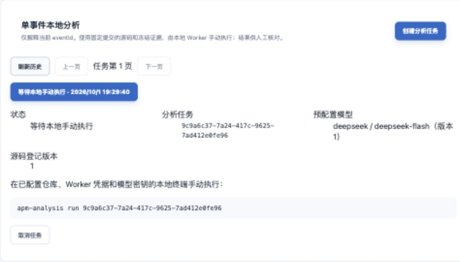
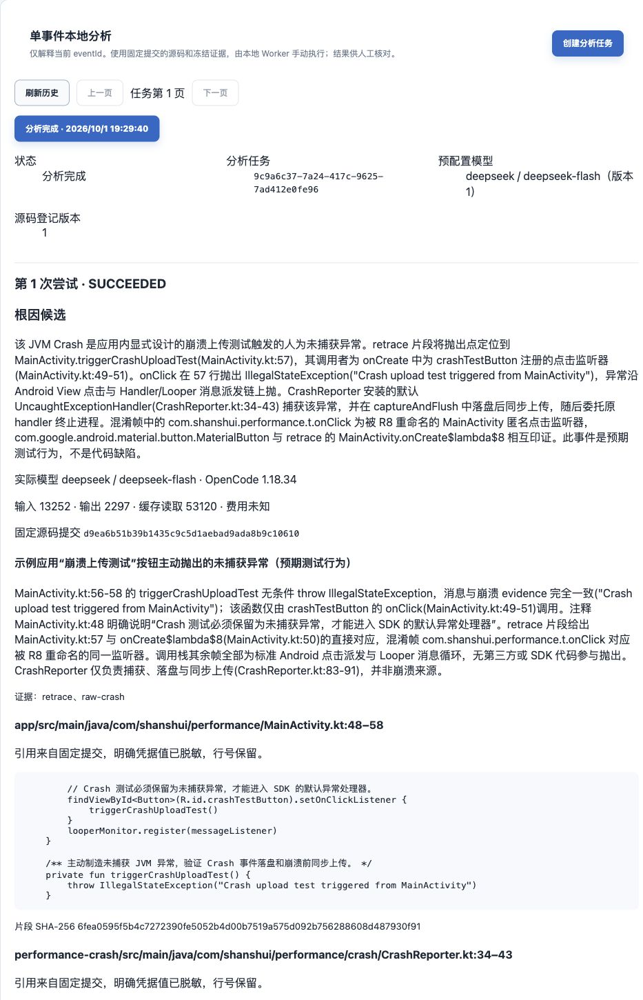
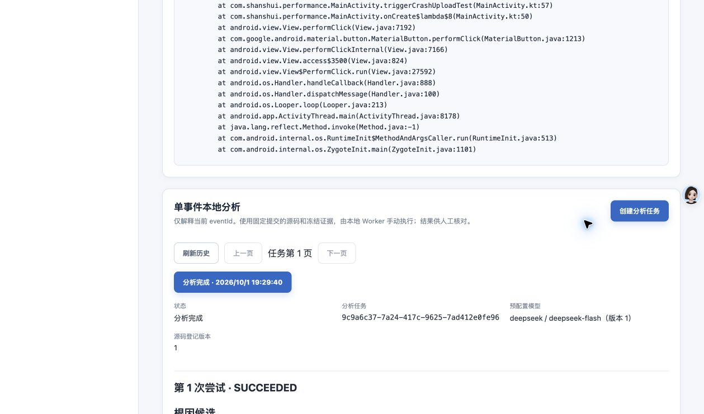

# 单事件本地分析跨端验收

2026-10-04 已发布云端控制面并完成真实 Python 回传与浏览器冒烟，见[云端发布验收](cloud-current-code-validation.md)。宿主仍在本地执行，完整回归保留一项既有 Rhea 摘要失败。

Skill 随附 Worker 的 ZIP 交付与独立安装验证见 [交付验收](skill-package-validation.md)。

**当前方案（2026-10-04）为宿主直接读取当前代码、明确授权时修改和测试；Python 管理任务/证据/租约/报告**，进度与证据见 [当前代码验收](current-code-validation.md)。原 2026-10-02 已改为宿主 Agent 直接分析，实现、自动化、真实 Codex 结果与停止未知见[宿主分析验收](host-analysis-validation.md)。下述固定 OpenCode/DeepSeek 与五例质量内容是历史记录，不代表当前任务仍使用该执行器。

新增自然语言入口的宿主加载、受控行为和真实任务结果见 [apm-crash-analyze Skill 验收](skill-validation.md)。安装与调用说明见 [Skill README](../../agent-skills/apm-crash-analyze/README.md)，以下既有质量评估继续独立保留。

## 已验证范围

日期：2026-10-01。变更为 [add-local-crash-analysis](../../openspec/changes/archive/2026-10-04-add-local-crash-analysis/tasks.md)。本次保留 Performance 源码与签名配置，不部署新功能到云端。临时本地 PostgreSQL 16 使用 Flyway V1～V11，事件存储为明确启用的 memory 联调适配器，Dashboard 通过同源 Vite 代理访问真实后端。

| 层次 | 事实与限制 |
|---|---|
| 自动化 | 后端 264 项：260 通过、既有 processor SHA 失败 1、条件跳过 3；构建登记/任务 PostgreSQL 25 项通过。Python 68 项、前端 120 项通过，前端类型检查与生产构建通过；MCP 15 项通过 |
| 真实模型合成任务 | 正式 Python CLI、Docker/OpenCode/DeepSeek 官方模型完成三行独立合成 Git 源码分析和回传；见 [Worker 记录](../../agent-skills/apm-crash-analyze/worker/validation.md)，不计入质量样本 |
| Performance 构建 | 完整干净提交 d9ea6b51b39b1435c9c5d1aebad9ada8b9c10610；JBR 21 assembleRelease 成功，既有签名覆盖安装成功，拉取设备实际 base.apk 后 SHA-256 与本次产物相同，无源码/签名配置改动 |
| 真机上报 | Android 10 设备触发现有崩溃按钮，重启后云端取得本次 buildId 的真实单事件；未保存设备序列号或安装标识到仓库 |
| 本地重放 | 仅为开发验收按 buildId、近一小时、LIMIT 1 的有界云端查询取得事件，在临时本地应用重放同 eventId 和原始异常链；验收工具执行数据库查询，Worker 本身始终只调用授权 HTTP |
| 网页 | 真实后端登记构建、上传同构建 mapping 后实时 Retrace 至 MainActivity.kt:57；网页创建单事件任务 READY 并显示无秘密本地命令 |
| Performance 模型分析 | 用户确认测试项目签名文件不阻断，模型源码视图明确排除已识别签名/私钥文件并记录路径；真实官方模型已成功分析该事件，Run 为 SUCCEEDED 且 stopConfirmed=true |
| 质量与生产 | 五个受控质量样本（其中两个预设证据不足场景）已评估，存在格式/引用失败及结论差异；未部署云端分析功能、未验证生产隔离或吞吐，不提供自动修复 |

## 构建与事件证据

Release buildId：`1.0-1-20261001112444949-7978035d`。APK SHA-256：`c8ddb5af3cccd4561813c2a415f2275f7688c0617b33cdf860e3717ba6dc4f6e`。同次 mapping SHA-256：`6478bc0e667515a472e3a3c1cc2b31e35889f159910b7747ebc77636f098b2c3`。Release 实际启用 R8 混淆，SDK environment 字段为 debug，不能据此推断 APK 未混淆。

事件 `e2102ee9-9527-4d4d-949d-0097c7ca36d4`，异常 `java.lang.IllegalStateException: Crash upload test triggered from MainActivity`。本地临时应用 ID `9734c89a-72ef-4133-9b04-d60aa613bd2d`，网页任务 `9c9a6c37-7a24-417c-9625-7ad412e0fe96`，冻结引用同一 SHA/登记版本/mapping 版本。既有 Debug APK 与设备已有签名不匹配，未卸载应用，也未更改签名；随后使用原 Release 签名配置成功安装。

构建步骤从 Performance 目录执行：

```sh
JAVA_HOME='/Users/mashanshui/Library/Java/JavaVirtualMachines/jbr-21.0.11/Contents/Home' \
  bash ./gradlew :app:assembleRelease --no-daemon --console=plain
```

初次 JBR 25 构建因 Gradle 8.13 工具链版本不兼容失败，切换已安装 JBR 21 后 Debug 和 Release 均成功。生成 BuildConfig 的 buildId 从同次产物读取，不通过再次配置 Gradle 取得另一个 buildId。

## 网页与文档核对

直接打开 Crash 详情发现创建按钮错误依赖 currentApp 预加载，已改为当前路由对应的应用列表成员角色，并补回归。任务创建使用 Session/CSRF 和稳定幂等 UUID，固定配置 deepseek/deepseek-flash；截图只保留分析面板，未包含上报 Key、模型密钥、Worker 完整凭据、设备或进程标识。



文档归属：根知识库当前状态、安全/运维和导航；后端知识库存储/身份/运行与回归；前端知识库页面/状态/联调/测试/安全；[分析 API](../api/analysis-api.md)与登录/迁移说明；[客户端目录](../client-integration/README.md)增加试点链接。Android 事件契约、批量、持久化及重试规则不变。

## 未完成验收

Performance 源码模型分析与结果网页回显已完成本机分层验收；真机上报到既有云端，再将同事件重放到临时本地服务，未验证新分析接口的云端部署。后续已完成五个受控场景的人工评估，结果不达预期，详见文末；重复点击同一显式异常不计作独立样本。不得把合成/Mock 测试换算成根因准确率。

关闭 `apm.agent.analysis.enabled` 会阻断新登记、创建、领取并对已有活动任务发出停止意图；停止回执、凭据撤销、历史读取继续可用，不清除数据库和原 Crash。内容保留 30 天，到期仅清理已结束且环境全部确认停止的正文，身份、摘要、状态与审计保留。相关自动化已覆盖关闭和清理竞争，生产回滚尚未实际部署验证。


## Performance 真实分析与结果回显

Run `a7c41ebf-0916-4b1e-a15b-c23102678e5c` 第一次执行成功，结论 ROOT_CAUSE_CANDIDATE。DeepSeek 官方 deepseek-flash / OpenCode 1.18.34 定位到 MainActivity.kt:57 的主动抛异常，引用该文件 48～58 行（按钮监听器与触发函数），以及 CrashReporter.kt 34～43 行（异常 handler）和 83～91 行（落盘与同步上传入口）。三处引用均重新从指定提交读取并核对片段及 SHA-256，一致。模型保留上传结果和 handler 实际运行事实的未知项；源码只能证明设计行为。

控制面 Run 从领取到成功保存用时 20.921 秒（不包含模型调用前源码准备）。结果 SHA-256：`273736d6c93b56a226ee667f1ecd21b3d5b0aab100214c26a1e53fd073aaeb22`。执行器报告非缓存输入 13252、输出 2297、缓存读 53120、缓存写 0 Token，费用未知。不能把非缓存输入视为全部输入，也不能由这一人工异常推导其他样本准确率或成本。

模型源码视图排除 `app/sign`，排除路径保存在私有恢复记录 sourceExclusions 并写入模型提示，不更改提交身份或开发者仓库。DONE 记录中的短期租约和结果原文已清除，源码临时目录及运行配置目录均已移除；按 Run 标签核验 Docker 容器与网络数量均为零。后端停止确认 true；网页显示分析完成、实际固定模型、候选、三处代码引用和费用未知。



## 最初闭环样本状态（不计入后续五例）

| 样本 | 预先已知事实 | 核验结论 | 用量/限制 |
|---|---|---|---|
| Performance 崩溃上传按钮 | 本次人工点击；源码第 57 行无条件抛 IllegalStateException，异常消息一致 | 根因候选与已知抛出点一致；三处引用均通过固定提交核验 | 输入 13252、缓存读 53120、输出 2297，费用未知；仅一个显式异常样本 |
| 其余四个独立样本 | 未提供独立 eventId、对应提交及人工根因/缺失事实 | 未评估 | 至少两个证据不足样本仍缺失 |

本次完成单事件实现闭环和一项人工核验，不宣称完成五例质量门槛。重复触发相同按钮和合成 Mock 不计为其他独立样本。


### 现有试点数据盘点

近 30 天按试点应用过滤，在 ClickHouse 内按异常类型、指纹和 buildId 聚合并有界返回：共 3 个分组、4 个去重 eventId；三个分组的最新事件异常均为 IllegalStateException，消息均为同一条 `Crash upload test triggered from MainActivity`。分组来自本次构建、2026-09-29 构建和旧 buildId `1.0-1`。不同混淆构建的指纹差异不能证明独立根因；旧 APK 的完整提交身份也未完成核验，因此未对历史事件登记未经证实的提交或重复调用模型。

此盘点使用 30 天窗口、LIMIT 20、2 秒、最多 100 万读取行/128 MiB 和有界结果；只保留上述统计及无敏感核验结论，不将设备标识、凭据或原始事件正文放入仓库。用户已确认保留独立五例质量门槛，并授权在 Performance 新增独立测试页生成不同场景；质量验收仍需固定提交、各例真实 eventId 与人工核验依据。

## 新增样本入口（2026-10-01）

Performance 独立测试页增加主动异常、空指针、数组越界、运行时状态异常和异步外部输入异常。后两项由人工输入模拟状态/响应，同一异常分支不包含实际输入；它们用于检验分析是否承认实际输入及上游来源缺失。完整堆栈保持原 SDK 采集规则，不人为截断。该页面在 Debug/Release 中可用，签名和 SDK 上传契约不变。源码与操作说明见外部检出的 [Performance 示例应用](../../../../AndroidStudioProjects/Performance/docs/knowledge-base/10-示例应用与调试路径.md)；该链接依赖同级外部仓库。

新增页面、构建及设备烟测与五例模型质量验收分别记录。当前未把新增源码登记为已有固定提交，不以旧 HEAD 指代尚未提交的改动；未将新测试的存在计为质量样本通过。

页面增量验证：Performance 应用 JVM 测试 6/6、Crash 页面 Release 仪器测试 3/3 通过；Android 10 设备上五类未捕获异常分别触发成功，其中外部输入异常发生在命名后台线程。Release APK 已沿用现有签名更新安装。此次新增样本尚未逐例核验服务端 eventId，也未执行正式模型质量评估；具体构建身份和截图见外部检出的 [Performance 构建测试](../../../../AndroidStudioProjects/Performance/docs/knowledge-base/11-构建测试与本地发布.md)。

## 五例续跑首次阻塞记录（后续已解除）

用户授权继续后，Performance 测试页及相关测试、文档形成单目的本地提交 `8d2ff5074b89ef2848e9cd79e0284f0fe0a5c3c4`，未推送。从干净工作区构建 Release：buildId `1.0-1-20261001123414170-f4b874e6`，APK SHA-256 `f88250ca55088394d59f3ef6435e16f4519fa5c537a95127f40766dd263d61f7`，R8 mapping SHA-256 `a2c736e64b12bf27376e5b08cc5c1e534e9902da219fccf2616e8480d4545285`。设备安装包重新拉取，摘要与本次 APK 一致；签名配置未变。

预先定义四类质量样本：空指针、数组越界、运行时状态及异步外部输入。后两项人工触发值分别为 `expired` 和 `malformed`，异常不携带这些输入。保持现有分析提示词，未用这些样本调试提示词。显式主动抛出异常依照规范只计闭环，第五类质量样本仍需确认补充方案。

设备五类未捕获异常均出现，但本轮 buildId 的云端有界查询返回零条，未创建质量分析任务，未发生本轮正式模型调用。开始只观察到上传被中断、队列保留重试；进一步检查发现 App 的 SDK 初始化 ClassCastException。用同次 mapping 还原后，异常位于 `FpsEventStore.recoverPreviousSession`，Gson 的 `LinkedTreeMap` 被转换为 `FpsAggregateRecord`。SDK 回滚关闭 CrashReporter，因此设备异常不能视为成功采集上报。当前 metrics 消费者规则未显式保留 FPS 持久化 DTO；修复效果仍待授权及验证。

已询问两个决定：补充数字解析并包装 cause 的第五类质量样本；修复 FPS DTO 的 R8 保留规则，或在测试配置中暂时关闭 FPS。收到答复前不执行这些修改。当前仍为 28/29，6.3 未完成。

## 五个受控质量样本评估结果（2026-10-01）

### 构建、执行与范围

用户授权修复 FPS R8 与恢复问题后，Performance 的修复提交为 `883563bcb25221d54b2552e4d0118b55a381e35a`。从干净工作区构建、安装并重新拉取 APK 校验：buildId `1.0-1-20261001125306410-e3ac2aba`，APK SHA-256 `4fd9c87b8c074834ac11d19b0b7bb44395f7a2d92c60fe26cec8f9208f3c32b0`，R8 mapping SHA-256 `83edf100380140bb2acb550f7e0009c15d95ddb06e1f86abe731c874e6a55655`。保持既有签名，未推送提交。FPS 持久化定向 JVM 4/4、Release 泛型与 Crash 页面仪器 4/4 通过；真实自动滚动后停止进程并重启，恢复 2 条快照记录，SDK 初始化成功。无效旧混淆快照保留原文件并移入现有 dead-letter，不清空应用数据。

包装 cause 样本对应独立提交 `7f666bf57f0ff8868b22faa25ae066ae2ba64277`，buildId `1.0-1-20261001130931734-ff5edede`，APK SHA-256 `be9ef07c97da9da1fefeb07e804f151a88f6b8724145a9e79e35f9b4b19a86d7`，mapping SHA-256 `adb538e0f1abfaf85ec621c6117c7b0585c1cec39eca4ed58d9ac7004a3af88f`。干净构建及设备实际 APK 摘要一致；应用 JVM 7/7、Release 仪器 4/4 通过。真机异常链包含外层 IllegalStateException 和 NumberFormatException cause。

五例均有实际设备事件、各自固定构建/提交及人工触发依据。事件经既有云端接收，再通过本机 HTTP 原样重放到本地隔离应用；分析功能仍未部署云端。按现有正式 Worker、固定 OpenCode 1.18.34 和 DeepSeek 官方 deepseek-flash 执行，未改分析提示词、未用本批次调试提示词、不向模型提交人工核验答案。显式主动抛出异常继续仅计闭环，未计入这五例。

### 逐例人工核验

耗时为 CLI 单次总耗时，含源码准备、执行及清理，不等同供应商推理耗时。失败没有有效结果正文，用量保留未知。两个证据不足场景的预期在模型调用前定义；它们的失败分支可从源码确认，但实际输入及上游事实未入事件，不属于无法还原抛出位置的强歧义样本。

| 场景 / eventId | 人工已知事实 | 实际结果与引用核验 | CLI 秒数 / 用量 |
|---|---|---|---|
| 空指针 / `2705653d-c1b3-4f89-9bfa-c2566f76bb8d` | 对 null 使用 !!，实际发生 NullPointerException | 首次 FORMAT_INVALID；用户授权显式重试后仍 FORMAT_INVALID。没有有效根因或引用，评估为失败 | 13.932 / 17.743；两次 Token 与费用未知 |
| 数组越界 / `fa24a03b-748b-42ec-9f09-37e24c1cf0b6` | 长度 2 的数组访问索引 2，设备消息 length=2; index=2 | SUCCEEDED / ROOT_CAUSE_CANDIDATE；识别数组长度与索引不一致；CrashTestCases.kt:17～22、TestCrashActivity.kt:33～35 两处引用独立核验通过 | 12.497；非缓存输入 9082、输出 1283、缓存读 24192、缓存写 0；费用未知 |
| 状态输入缺失 / `49663af5-3a4a-400a-9858-5d2155460aae` | 人工输入 expired；missing 等输入也走同一异常分支，事件不含实际输入 | SUCCEEDED / ROOT_CAUSE_CANDIDATE；正确解释非 ready 分支，并明确不能确认实际输入，未猜成 expired。三处引用独立核验通过；拒绝猜测符合预期，结论枚举未选择预期 INSUFFICIENT_EVIDENCE，记录为部分符合 | 15.729；非缓存输入 8540、输出 1982、缓存读 36864、缓存写 0；费用未知 |
| 异步输入缺失 / `ebd4041b-091f-45ab-9813-07fa92e6e742` | 人工模拟响应 malformed，在命名后台线程崩溃；事件不含响应和上游来源 | 首次 REFERENCE_INVALID；用户授权显式重试后 FORMAT_INVALID。未产出有效结果，无法核验未知项和源码解释，评估为失败 | 13.495 / 22.725；两次 Token 与费用未知 |
| 数字解析包装 cause / `f3e87c0d-f5eb-4329-99ec-43809b75b20b` | not-a-number 经 toInt 失败，外层业务异常保留 NumberFormatException cause | 首次 FORMAT_INVALID，没有有效异常链分析及引用，评估为失败；未自动重试 | 14.193；Token 与费用未知 |

状态样本的独立核验引用为 CrashTestCases.kt:24～29、TestCrashActivity.kt:36～40、activity_test_crash.xml:21～27。两个有效结果共五处引用均重新从固定提交读取、脱敏并计算片段 SHA-256，路径、行范围、文本和摘要一致；不以 Worker 自报取代这次人工检查。

### 结论与限制

五例评估已执行并记录，其中两个是预先定义的证据不足场景；不等于五例通过或两例正确返回证据不足。按样本计，2/5 产生有效结构化结果，3/5 未产生有效结果；按 Run 计，7 次中 2 次 SUCCEEDED、5 次 FAILED。没有真实样本成功返回 INSUFFICIENT_EVIDENCE。已知失败是格式或引用校验拒绝，尚不能据此断言供应商、执行器响应适配或具体 Schema 字段是哪一处根因。

全部七个 Run 均 stopConfirmed=true，按 Run 标签独立核验容器及网络为零；失败记录和显式重试历史保留。失败用量未回传，不能计算本轮完整 Token 总数或费用。未放宽 Schema、删除非法字段或修改提示词来把失败变成成功。

OpenSpec 6.3 的“完成评估”据上述五例记录完成；当前格式/引用稳定性和证据不足枚举表现未达预期，不能据此宣称质量验收通过、线上定位率或自动修复可用。后续应先增加安全的失败诊断，确定格式/引用拒绝原因，再用未参与修订的独立样本复测。

文档核对同时发现后端专题与 API 的头部仍写“Python/网页待实施”，与既有实际链路证据冲突；本轮据已核验实现修正状态文案，HTTP 契约不变。

## 2026-10-02 分析面板布局验证

修正标题额外缩进及任务字段默认定义列表缩进，复用前端元信息样式。真实本地后端的单事件详情已核对标题、历史操作和字段基线；四组字段标签和值左坐标一致，定义值左侧 margin 为 0。前端 120 项测试通过，类型检查通过；未重新执行模型分析。后端、API 和客户端契约不变。



2026-10-03 Skill 配置增量：随包提供空 config.local.json，用户本地填写，Python 检查后启动；独立新包及升级保留的受控验证见[配置验收](current-code-validation.md#skill-本地配置增量验收)。

2026-10-04 大仓库增量：二进制提前排除、有界排除清单、139 项 Python 回归与 sjQs3_0v3 指定任务的真实只读回传，见[采集与任务验收](current-code-validation.md#2026-10-04-大仓库源码采集与真实任务分析)。
