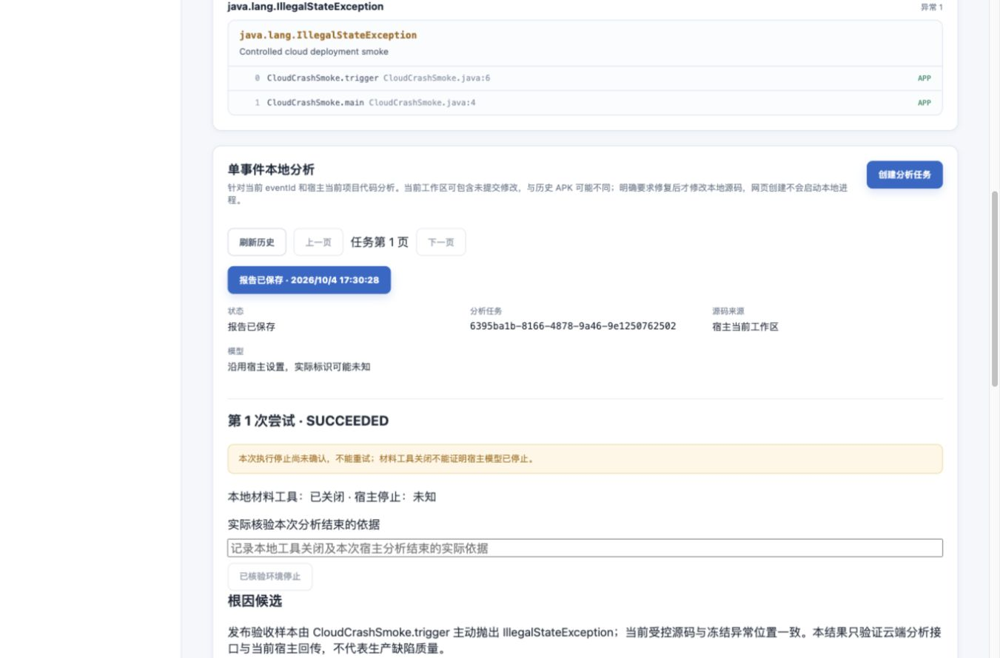

# 当前代码分析的云端发布与验收

日期：2026-10-04。用户授权发布当前实现并测试。本记录区分真实部署、受控接口闭环和生产质量。

## 发布与备份

- 入口：[云端控制台](http://124.221.252.121/login)。更新后端、Vue 生产产物及 MCP 镜像，沿用现有 PostgreSQL、ClickHouse、符号表和附件数据卷。
- 仅在云端受保护配置开启 `APM_AGENT_ANALYSIS_ENABLED=true`，其余身份参数和密钥保持原值。发布包不包含本地配置、Worker 凭据或模型密钥。
- 后端 JAR 与容器内 `/app/app.jar` 的 SHA-256 一致：`110bd0d32ed2a603d7b29d53d27fa9a7a5cc62999dea6601bd96fb63fdc4e81a`。镜像内复制 JAR，运行进程不受后续本机构建覆盖影响。
- Flyway 从 V5 实际执行 V6～V14，共九项迁移成功；升级前尚无分析任务表及旧活动分析，没有绕过 V14 停止门禁。
- 五容器均为 `running healthy`；Nginx 配置检查通过，公网健康为 UP，登录页和入口 JS/CSS 返回 200。

先分别构建和测试，再执行：

```sh
bash scripts/deploy-cloud.sh --skip-build --identity-file "$HOME/.ssh/apm_cloud_mac"
```

升级前在服务器 `/home/ubuntu/apm-server-backups/20261004-172534` 保存 PostgreSQL 自定义格式备份、旧运行包和原云端配置，并给旧 backend/web/mcp 镜像添加备份标签。目录权限 700，数据备份权限 600；未下载或输出密钥。备份已生成，不代表完整数据库恢复或回滚已演练。

迁移后、写入验收数据前，原应用 4 个、符号表 1 份、账号 1 个，与升级前一致。本次新增一个专用测试应用，保留其受控事件和报告，没有修改原应用源码、符号表或既有事件。

## 自动化结果

| 范围 | 本次结果 |
|---|---|
| 前端 | 44 个测试文件、124 项测试通过，类型检查和生产构建通过 |
| Python | 94 项测试通过 |
| 后端分析专项 | 35 项通过：任务/真实 PostgreSQL、迁移、架构及实时还原 |
| 后端全量 | 268 项：264 通过、3 跳过、1 失败；Boot JAR 可用 |

全量失败仍为 `RheaStackAnalyzerIntegrationTests.usesVerifiedProcessorFatJarAndPublicResolverApi`：预期摘要 `81b02da9…`，实际为 `0c1ac695…`。旧云端 JAR 内的同版本依赖也为 `0c1ac6952ab92526bec24355523048b5e10b14a6ec8a85c9c03070cc67ddb64f`。本次没有改变该依赖或测试预期，不能将完整回归写为全部通过，也不能由摘要相同推导正式制品来源已验证。

## 真实接口和 Python 闭环

测试应用 `com.example.apmcloudsmoke20261004`，ID `2d95dff6-568e-4c18-aa9c-e054fa66eda9`。临时 Git 项目的受控 Java 代码主动抛异常，实际运行退出码 1、堆栈位置 `CloudCrashSmoke.java:6`；随后通过公网上报 JVM Crash。本样本不来自 Android 设备。

- 接受一次，同 eventId 再次上报计为 duplicate。
- Session 登录成功；未登录返回 401，缺少 CSRF 的管理写入返回 403。
- 无分析构建登记、无 mapping 仍创建 READY，证据版本 2；同幂等键返回原 taskId。
- 临时应用 Worker 真实领取任务，Python 0.4.0 返回 HOST_DIRECT，状态和租约检查通过。
- 版本 4 报告保存为 SUCCEEDED，引用 CURRENT_MATCH，明确标记受控样本、未请求修复和未执行业务修复验证。
- 任务仅有一个 Run；成功任务重试返回 409，跨应用查询 404，错误及已撤销凭据 401。
- 隔离校验使用的另一应用 READY 任务已取消；两项临时 Worker 凭据均撤销，最终活动任务及测试应用有效凭据均为零。
- 公网 MCP、只读 Agent、Worker 无凭据请求均为 401，未匿名开放分析接口。

首轮隔离测试的默认时间窗未查到历史事件，改用明确的七天范围后复用原测试任务继续。第一次紧接 prepare 的 status 与后台看护锁竞争，后续有界等待并复用同一 Run 完成，没有换身份绕过门禁。

Task：`6395ba1b-8166-4878-9a46-9e1250762502`；Run：`d403f840-e804-4297-b093-142d01efdcbc`。

[真实云端报告](http://124.221.252.121/apps/2d95dff6-568e-4c18-aa9c-e054fa66eda9/crashes/events/dc1eeae5-a5a1-47b6-b193-c19ed7a8066e)已通过浏览器登录查看，确认成功状态、宿主自报、未知停止和当前引用匹配真实展示。按项目 PC 基线检查 1366×900 视口，随后恢复默认视口。



## 使用与边界

Skill 本地配置的 `platformUrl` 使用云端入口；在对应云端应用设置创建独立 Worker 凭据，填入受保护的本地配置。本机与云端凭据不能互换，本次验收凭据已撤销。

云端部署的是任务、证据、认证、报告和网页控制面。源码读取、模型分析、明确授权的修改和测试仍在宿主机器执行，没有部署云端修复执行器或独立模型服务。本次未调用独立 DeepSeek/OpenCode，未修复 Android 业务代码，未执行设备验收或新增生产质量评估。

本次保留 `localToolsStopped=true`、`hostStopState=UNKNOWN`、`stopConfirmed=false`，没有伪造管理员停止审计。受控 Python 测试进程及看护已退出；本次没有写入人工停止确认接口。报告保存、宿主停止、业务修复及业务验证继续分别判断。

HTTP、HTTPS 生产网关、容量及故障恢复沿用原边界；单个受控主动异常只证明有限链路，不能计入生产根因质量。

## 文档归属

根知识库同步当前实现、部署和测试；后端知识库同步运行和测试；前端知识库同步部署边界；分析 API 仅增加验收引用，没有修改契约。客户端事件、持久化、重试和接入契约不受影响，无增量修改。
