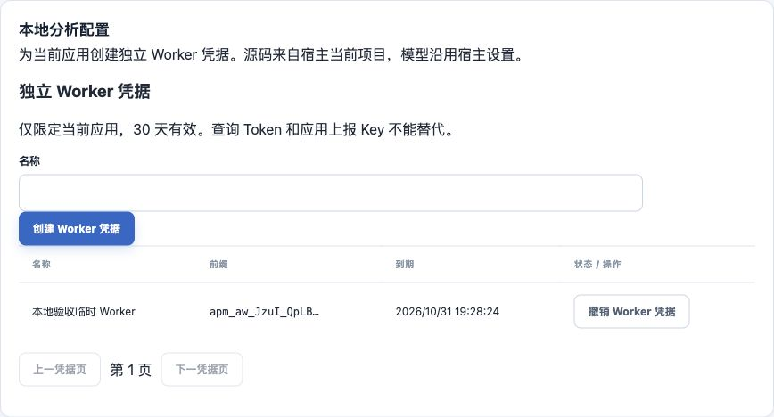
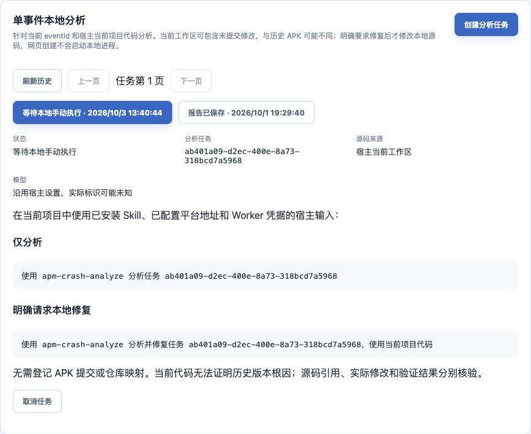
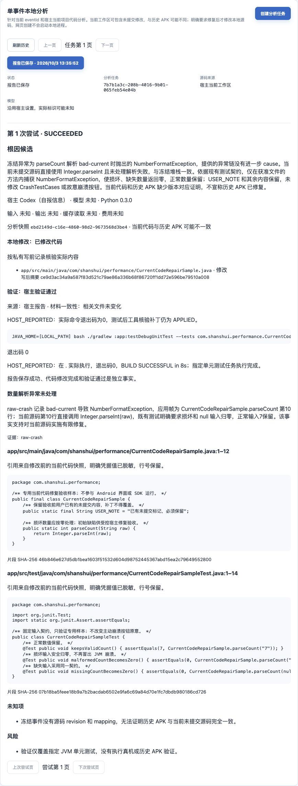
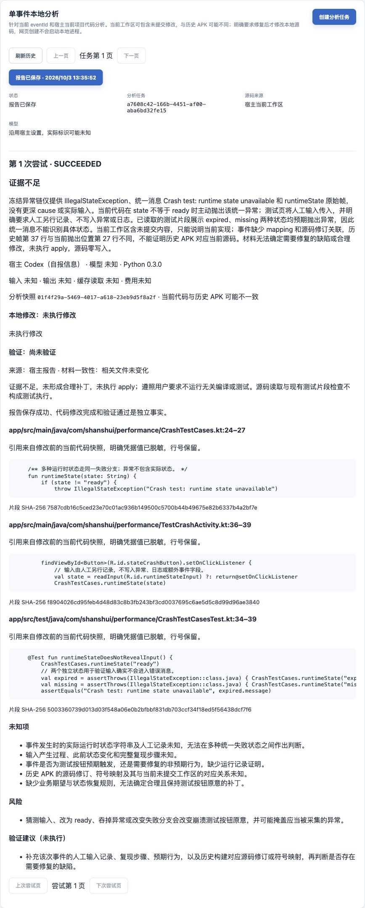
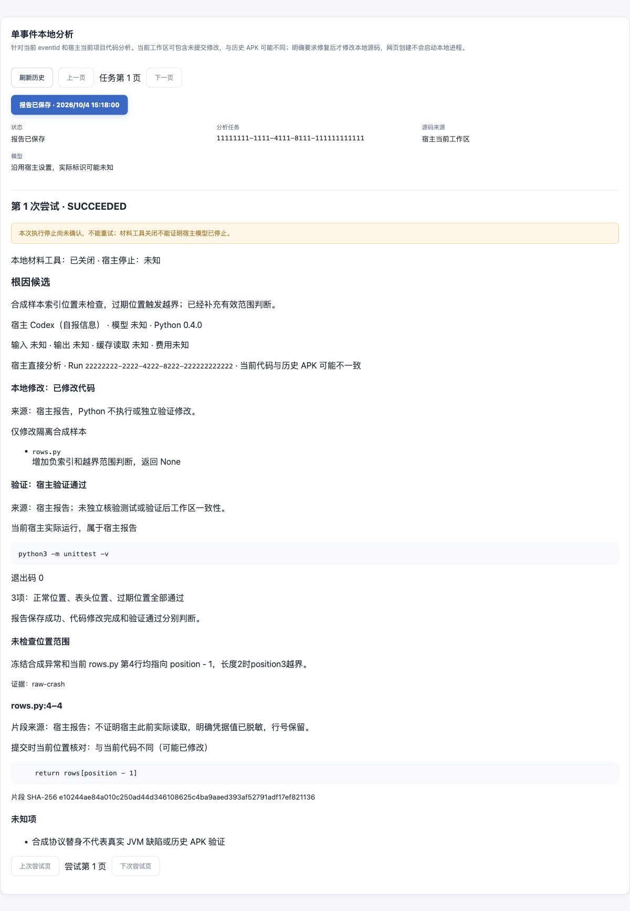

# 当前代码分析与本地修复验收

日期：2026-10-03。实施变更 [add-current-code-crash-fix](../../openspec/changes/archive/2026-10-04-add-current-code-crash-fix/tasks.md) 替代原固定提交方案；原 46 项完成及五例质量记录仍为历史，不重新计为本次修复质量。

## 切换前停止核验

旧 Run b33ceae8-05d9-4023-96eb-88c872d4d88d 原为 SUCCEEDED、工具已关闭但宿主停止 UNKNOWN。用户明确确认该次宿主分析已结束；同时核对私有状态 HOST_DONE、源码目录不存在、guardian PID 已退出、租约及待传结果已清除。使用管理员 Session/CSRF confirm-stopped 得到 204，记录上述实际依据；不把整条 Codex 聊天仍可运行当作本次分析尚在执行。

旧 READY c8ee85bd-ceac-4045-b01a-5bc43e909fc0 显式取消为 CANCELLED。数据库确认无活动任务、RUNNING 或停止未知 Run；旧后端随后停止。V14 未在门禁不足时强行执行。

## 自动化证据（逐项更新）

- 后端专项 35 项通过：任务 26、真实 PostgreSQL 迁移 3、ArchUnit 3、Crash 实时还原 3。迁移覆盖 V13 终态 JSON 原字节及审计保留、旧 READY 阻断、未知停止阻断；新库全量 Flyway 在任务集成测试启动时执行。
- Python 当前全量 102 项通过。覆盖未提交及新文件、忽略/秘密/链接、展开 LFS、整体期限、采集变化、引用、lease/guardian、有限写入、暂存区/权限保留、写后确认丢失、部分完成、并发新建、取消后保留事实、安全撤回及验证变化/脱敏；打包检查 6 项包含在内。
- 前端 123 项及类型检查通过，配置删除、应用凭据清理、路由/分页、旧报告只读、当前结果和 XSS 有覆盖。
- Skill 结构校验通过；ZIP 20 个公开文件包含 repair，不含仓库示例、秘密、.venv、旧执行器、测试或验收材料。

以上自动化不证明宿主模型修复质量或生产容量。后端全量 268 项：264 通过、既有 Rhea processor 制品 SHA 校验失败 1、条件跳过 3；不修改校验值或绕过失败。Boot JAR 独立构建通过。前端生产构建通过，最后历史来源文案修正后面板专项 11 项再次通过。

## 本地数据库和独立安装

迁移前 pg_dump 保存到用户私有临时目录，未进入仓库。旧停止核验通过后启动新后端，Flyway 验证 14 个迁移并从 V13 应用 V14 成功。服务使用原本地 PostgreSQL 16、明确启用的 memory 遥测适配器，监听 127.0.0.1:8080；Vite 5173 同源代理不变，未部署云端。

新 ZIP 解压至仓库外中文空格路径，用系统 Python 3.9 启动器、uv 0.12.21 及本机已有 CPython 3.12 新建独立 .venv，安装 12 个锁定生产包。初次禁止下载时 PATH 没有 3.12，安装失败；将已安装解释器的目录加入验收 PATH 后成功。没有复用 Worker .venv；Python 自动联网下载仍未验收。

help 返回 0，含 apply/revert 和 --project/--repair；未配置 doctor 返回 1、只有两个 false；合成 .env 未被自动加载；非法 UUID 返回 2；缺少 uv 的真实启动器返回 127。项目外对真实 READY 调用 prepare 返回 1/PROJECT_NOT_FOUND，没有领取 Run。显式 Performance 项目通过同一独立包正式准备及修复；默认项目定位在真实 Git 子目录/空提交/未提交专项和启动器 cwd 测试中核验。安装、项目定位和实际宿主质量分别记录。

## 真实网页

管理员登录真实本地后端：设置页仅应用 Worker 管理，无构建源码登记/提交/混淆表单；旧 Worker 元数据已不含仓库或类型。原事件 e2102ee9-9527-4d4d-949d-0097c7ca36d4 重放到 memory 后，原 buildId、mapping revision 1 和实时 MainActivity.kt:57 还原仍有效，原始结构/还原文本切换正常。

网页无需源码登记创建 READY 任务 ab401a09-d2ec-400e-8a73-318bcd7a5968，证据版本 2，显示仅分析与明确修复的不同指引；旧报告保持原引用/模型，只读。确认旧任务元数据来源文案应为“历史固定提交”，已同步修正。





## Performance 真实宿主有限修复

专用未提交 CurrentCodeRepairSample.java/CurrentCodeRepairSampleTest.java 不接入 Android 界面或 SDK。人工已知契约为正常整数保留、损坏/缺失数量归零。初始实际 :app:testDebugUnitTest 指定样本 3 项中 2 项失败。受控异常经正式 ingest/任务 API 输入本地应用，原始符号 mapping 不可用但 READY；这不是设备新崩溃或线上缺陷样本。

第一次独立 Codex CLI 因终端 JoinError::Panic 在命令启动前失败，未 prepare/未修改。使用清理过的运行环境和单次 --ignore-user-config 启动后工具可执行；这是本机验收观察，不将其当成通用故障根因。配置层参考 [官方说明](https://learn.chatgpt.com/docs/config-file/config-basic)。不更改用户全局配置。

Task 7b7b1a3c-208b-4016-9b01-065feb54e04b，Run 6f680ede-fec7-4ed5-bc3d-8ae70f232b55，snapshot ebd2149d-c16e-4860-98d2-9673568d3be4。宿主从新版完整 Skill 准备 --repair/--project，工具 read 覆盖未提交源码与现有契约测试，apply 仅修改授权方法，对 NumberFormatException 返回零。保留 USER_NOTE；修复后同一实际 Gradle 命令退出 0、三项样本通过，报告 APPLIED/PASSED/HOST_REPORTED 且相关文件未变。

原索引 SHA 未变、测试文件 SHA 未变、原受控标记保留、其他已跟踪源码 diff 为空，故意崩溃按钮未修改。写前摘要 eb50c7061510ac8e8befa432af5ca7f2c2baa90d6250b40126caa5b411e2b746，写后摘要 ce9d3ac34a9a587f83d521c79ae86a336b68f86720ff1dd72e596be79510a008。源码引用为修改前快照，写后摘要和验证独立展示。

同 Run 中首次语义 JSON 格式不合法被拒绝，宿主修正后 submit 成功；不创建新 Run、不重复补丁。并行命令曾被本地任务锁拒绝，后续串行完成；Skill 已明确同任务命令必须串行。过程失败记录保留在私有验收日志，不写成首次无错误成功。

独立宿主进程退出后，另行核对 HOST_DONE、快照删除、guardian PID 退出、租约/待传结果清除，网页管理员填写实际依据并确认指定 Run 停止。初次报告 UNKNOWN 有真实展示，确认后门禁解除。验证使用本机已安装的兼容 JBR 21，未执行真机或历史 APK 修复验证。



## 证据不足的真实宿主零修改

第二个独立 Codex 进程加载同一新版 Skill，按自然语言“分析并尝试修复”准备当前 Performance 工作区，Task a7608c42-166b-4451-af00-aba6bd32fe15，Run d64b490b-90bd-496f-8277-387081504cd0，snapshot 01f4f29a-5469-4017-a618-23eb9d5f8a2f。冻结异常的统一消息没有实际输入；当前 runtimeState 刻意将多种状态汇入同一异常分支，缺少预期行为及复现依据。宿主回传 INSUFFICIENT_EVIDENCE、NOT_APPLICABLE、NOT_RUN，并记录实际输入、复现步骤和版本对应关系等未知项。

独立核对命令记录未执行 apply，验收前 256 个文件摘要全部不变、Git 索引摘要不变。NOT_RUN 是未执行测试，不能计为测试通过。进程退出后核对 HOST_DONE、guardian 退出、快照删除、租约及待传结果清除；管理员 Session/CSRF 记录实际依据，confirm-stopped 返回 204，再查询两个新 Run 均为 CONFIRMED/stopConfirmed=true。删除的 analysis-builds 路由实际返回 404。

这两例证明本地受控修复和不足证据零写入的有限链路；未证明生产修复质量、历史 APK 修复、设备修复或其他宿主兼容。Performance 原崩溃按钮、SDK、签名与上传契约未修改。



## 交付核对

根、后端、前端知识库以及分析 API、Skill/Worker、客户端验收导航已同步当前方案；原客户端 Crash buildId 与 mapping 查询保留，MCP 仍为只读查询。原 add-local-crash-analysis 的 46/46 历史记录保留，本变更承担当前模式及修复交付。构建包位于忽略的 build/agent-skills/apm-crash-analyze.zip，可由共享打包脚本重新生成。


### 所属文档同步清单

- 根知识库：README、00 当前实现与验证边界、04 上报协议与可靠性、06 安全与隐私、07 部署与运维、08 测试与质量保障、09 实施路线图、10 架构决策记录、13 待确认事项。上述主题记录当前模式及受控验收，旧记录明确保留历史属性。
- 后端知识库：README、00 当前实现与验证边界、03 持久化与数据库迁移、04 认证授权与安全实现、05 构建配置与本地运行、06 测试与质量保障、local-analysis。
- 前端知识库：README、03 页面路由与交互、04 API数据模型与状态管理、05 本地开发与联调、06 测试与质量保障、local-analysis；既有 07 部署安全与运行边界保持停止审计/权限说明。
- API：docs/api/README.md、analysis-api.md、app-api.md；删除分析登记接口、新证据与结果、应用 Worker、V14 和历史只读说明。原 Crash/符号表与只读 MCP 契约核对未变。
- 客户端：docs/client-integration/README.md 追加当前验收导航；Crash buildId、mapping、事件字段、队列和重试文档核对未改契约。
- Skill/Worker：agent-skills/README.md、apm-crash-analyze/SKILL.md、README.md、agents/openai.yaml、worker/README.md；旧 worker/validation.md 去掉已删除配置的本地链接，内容仍为历史。
- 验收：analysis-validation/README.md、current-code-validation.md、skill-package-validation.md 及四张当前页面截图。
- Performance 外部项目知识库：README、00 项目概览与能力状态、10 示例应用与调试路径、11 构建测试与本地发布；新增专用样本及三项契约测试，受控修复仅一个方法。

最终核对：96 个 Markdown 文件的 888 个本地文件链接全部有效；两个仓库 git diff --check 通过；Skill quick_validate 通过；ZIP 20 个公开文件逐字节与当前源码一致；OpenSpec 严格验证通过。源码、自动化、真实本地服务与受控宿主质量分别记录，未部署云端或自动归档。

## Skill 本地配置增量验收

日期：2026-10-03。用户追加授权 Skill 根目录空配置、用户本地填写及缺失时提示。源码新增 config 解析模块及 config.local.json（忽略的本地文件），打包固定生成空模板，新增根 .gitignore；包为 23 个公开文件。原 102 项/20 文件的结果仍保留配置增量前的历史事实。

Python 全量 130 项通过，包含配置缺失在网络/状态/材料之前拒绝、合法本地文件、秘密不进入诊断与对象 repr、无效 JSON/未知重复字段/类型/8 KiB、权限 600、符号链接/FIFO、环境成对覆盖/部分拒绝、平台地址和前台配置传递给看护。源码排除测试覆盖未忽略的 config.local.json；打包测试将实际本地配置替换成私有哨兵，仍仅导出空 JSON，默认 ZIP 权限 600。

独立新包解压至仓库外中文空格目录，通过系统 Python 3.9、uv 和已有 CPython 3.12 新建独立环境，没有复用源码开发 .venv。启动器 prepare 在空模板时返回 1/CONFIG_MISSING，零 HTTP 请求且未创建任务状态。填入合成回环地址及合成 Worker 凭据后 doctor 返回 0、来源 file；不设置 APM 环境，实际 prepare/read/stop 共九次受控 HTTP，请求均使用预期凭据，只领取一次。真实后台看护认证成功，长期凭据未出现在公开输出或私有任务 JSON；项目根同名私有配置被排除，停止后快照删除且看护退出。此服务是受控协议替身，不是真实 APM 或模型质量验收。

按更新说明执行 unzip -o 并排除 config.local.json 后，已填配置逐字节保留，故意旧版 README 被更新，doctor 仍由文件正常读取。仅该更新流程已验证，不承诺任意直接覆盖解压会保护配置。Skill quick_validate、Git 忽略、差异及文档链接检查通过。未执行新的模型请求或 Performance 修改，也不改变后端/前端 HTTP、数据库、Android 或 MCP 契约。

本增量同步文件：Skill/Worker README、SKILL.md、Agent Skill 交付入口；根知识库 00/06/07/08 与总入口；本验收、交付验收与验收总导航；当前 OpenSpec proposal/design/spec/tasks。后端、前端知识库及 API、客户端文档核对不受影响，无须改动。

## 2026-10-04 大仓库源码采集与真实任务分析

本次针对 sjQs3_0v3 的 SOURCE_TOO_LARGE 修正 Python/Skill 材料采集，不修改 Android 业务源码、服务端 HTTP 或网页。原候选 17,113 文件、1,750,627,991 字节，包含 103,374,071 字节 ZIP、33,532,836 字节 JAR 和多份超过 16 MiB 的 AAR/静态库。原逻辑先检查大小再判别二进制，因此不属于可读源码的附件也会阻塞准备。

常见二进制附件改为读取前排除；普通文本总预算仍为 256 MiB、单文件仍为 16 MiB、候选文件仍最多五万、采集仍最多 120 秒。未知扩展名材料仍受单文件上限及两次一致性核验，不自动跳过过大的普通文本。Git 清单独立限 32 MiB，避免索引 mode/对象摘要等元数据提前耗尽四 MiB 小命令预算。SOURCE_TOO_LARGE 增加无内容 sourceLimit 计量。

实际私有快照成功：9,927 个普通文本、68,205,308 字节，7,829 条排除路径，约 9.26 秒；临时检查目录随后清理。完整排除路径 JSON 为 523,525 字节，若全量返回会挤占累计 512 KiB 材料。因此私有保存完整清单，准备/恢复仅返回最多 100 条且最多 16 KiB 的路径示例、准确总数及截断标记；不截断崩溃证据或实际源码读取。

### 自动化与安装

在 Worker 自身目录执行 `.venv/bin/python -m pytest -q`：139 项通过（7.45 秒）。新增覆盖大二进制读取前排除/不改索引、未知二进制不占文本总量、超过四 MiB 的真实 Git 索引、四类安全超限诊断，以及万条排除清单的领取/恢复/单次分配和示例字节边界。第一次误从仓库根执行测试导致链接路径重复发现与 fixture 错配；改用上述 Worker 目录后通过，未因此修改业务或测试断言。

23 文件 ZIP 重新生成，安装至 sjQs3_0v3 的 `.agents/skills` 时排除 config.local.json，已填配置保留；实际启动器 doctor 返回 0、配置来源 file。随后使用安装后的真实入口完成下述任务。Skill 结构校验通过；ZIP 的 23 个文件和 sjQs3_0v3 实际安装公开文件逐字节一致，空配置及权限模板正确；本次八份说明的 125 个本地文件链接存在，git diff --check 和 OpenSpec 严格校验通过（25/25）。

### 真实只读分析

用户明确目标项目 sjQs3_0v3。Task `ddd21d98-1b6e-4378-ac00-09aa68ca5475`，Run `84703c8b-e13a-4174-9c93-23515dc79200`，snapshot `d8e1abcf-2530-4fd6-b1a8-e141674ce5b0`。prepare 成功取得冻结异常链；本次未使用 --repair，未实施业务补丁。宿主通过 search/read 读取 JsonNewsListFragment 和 JsonNewsAdapter。

冻结事件为 IndexOutOfBoundsException，索引 -1、列表长度 20，调用点 JsonNewsListFragment.initListener 第 199 行；当前同位置使用 adapter.data[position-1]，缺少边界判断。报告 ROOT_CAUSE_CANDIDATE 保存成功，三处引用由工具按本 Run 实际读取核验；mapping_missing、历史 APK 与当前源码无可信绑定、第三方适配器准确回调语义仍列 unknowns。没有执行 Android 编译/测试或设备复现。

平台回执 repair=NOT_REQUESTED、verification=NOT_RUN、workspaceUnchanged=true、localToolsStopped=true；hostStopState=UNKNOWN、stopConfirmed=false，后续新尝试仍须管理员实际核验宿主停止，不绕过门禁。只证明本仓库采集及本次报告闭环，不证明所有大仓库、生产容量或修复质量。未调用独立 DeepSeek/OpenCode。

### 文档归属

根知识库同步当前边界、安全、运维和测试；Skill/Worker 说明、交付验收索引及本 OpenSpec 材料同步。后端知识库、前端知识库、已发布 HTTP API、客户端接入与 MCP 契约不受影响，不新增服务端字段或权限。

## 2026-10-04 宿主直接读取源码增量

按用户“实施”授权，将源码搜索、读取、明确授权后的编辑和测试交给宿主现有工具。Python 0.4.0 不遍历或复制仓库，不创建源码快照，不提供 read/search/apply/revert。保留受保护配置、应用 Worker 身份、冻结事件证据、Run/租约、报告校验、幂等回传及停止审计。新 claim 只有 requestId，报告版本 4 绑定 evidenceId/runId；不新增数据库迁移。旧报告版本 1～3 和 snapshot_id 保持原值。

### 实际验证结果

| 范围 | 结果和边界 |
|---|---|
| 后端专项 | 35 项通过：真实 PostgreSQL 任务 26、迁移 3、ArchUnit 3、实时还原 3；包括新 Run 归属、旧字段/伪造匹配状态拒绝、安全报告路径、应用隔离、停止门禁、相同摘要对账、旧 JSON 原样读取 |
| 后端全量和产物 | Android Studio JBR 执行 test/bootJar；268 项中 264 通过、条件跳过 3、既有 Rhea processor SHA 校验失败 1；Boot JAR 构建通过。没有修改无关 Rhea 工具或固定校验值 |
| Python 回归 | 94 项通过；移除旧快照/补丁测试，新增宿主自报、当前引用核对、只读授权、旧活动/待回传记录拒绝、租约/看护、原字节恢复、配置/秘密/路径/文件类型校验；不能按新旧用例数量推导功能质量 |
| 大项目边界 | 实际 Git 合成项目带 1 GiB 稀疏附件，准备仅定位根、取得证据，无文件清单/源码目录/快照；测试禁止 Path.rglob，核对暂存区不变。32 MiB 文件靠前引用可核对；无法核对的位置为 UNAVAILABLE，不阻止取得 Crash 证据 |
| 独立 ZIP/配置 | 21 个公开文件，新 ZIP 在仓库外中文空格目录解压，真实启动器/uv 创建锁定运行环境。空配置先返回 CONFIG_MISSING，未创建任务状态目录；仅文件配置完成整个 HTTP 流程，配置和凭据未进入报告/诊断/公开包。更新保留配置字节与权限，并清理旧 material.py/repair.py |
| 宿主直接修复和回传 | 当前宿主普通终端直接读取合成 rows.py，修复前 3 项测试为 1 通过、1 失败、1 异常；明确修复模式下直接编辑该样本，修复后 3 项全通过，暂存区保持。真实 Python 启动器向合成回环 HTTP 平台只领取/完成各 1 次，返回 SUCCEEDED；guardian 实际退出，无源码快照残留 |
| 引用和事实边界 | 报告保留修复前源码，提交时正确显示 CURRENT_DIFFERENT；sourceRefs/repair/verification 标为 HOST_REPORTED，模型/费用保持未知。localToolsStopped=true，但 hostStopState=UNKNOWN、stopConfirmed=false；没有把本任务工具关闭伪装成宿主停止 |
| 前端 | 全量 124 项、类型检查和生产构建通过；更新后面板专项 12 项和类型检查再通过。真实浏览器加载组件及合成 API，确认报告、修改/验证自报、当前引用差异、未知停止和一致左对齐；截图见下方。此页面检查未连接真实业务后端 |
| 交付与规范 | Skill 结构、空配置打包边界、Git 忽略、Markdown 本地链接、差异检查及 OpenSpec 严格校验通过；新增实施五项单独记入任务清单 |

```sh
# 在仓库根执行，测试选项属于 test；bootJar 放在测试选项之后。
JAVA_HOME='/Applications/Android Studio.app/Contents/jbr/Contents/Home' \
  bash backend/gradlew -p backend test \
  --tests '*AnalysisTaskPostgresTests' --tests '*AnalysisMigrationPostgresTests' \
  --tests '*ArchitectureBaselineTests' --tests '*CrashLiveSymbolicationTests' bootJar
JAVA_HOME='/Applications/Android Studio.app/Contents/jbr/Contents/Home' \
  bash backend/gradlew -p backend test bootJar --continue
# worker 目录：.venv/bin/python -m pytest -q
# frontend 目录：npm test && npm run typecheck && npm run build
python3 scripts/package-agent-skill.py
openspec validate add-current-code-crash-fix --strict
```



### 上线与未验证边界

本轮更新仓库源码、OpenSpec 与可再生成的交付包，未重跑已完成的 ddd21d98-1b6e-4378-ac00-09aa68ca5475，也未修改 sjQs3_0v3/Performance 业务代码、重新运行真实 JVM 质量样本或部署云端。已有本地服务仍运行旧进程，Android 项目内安装的旧 Skill 保留；启用时需将新版后端与新版 Skill 配套更新，并保留 config.local.json。现有联调进程使用内存事件存储，重启时需按联调流程恢复事件；此次没有切换该运行环境。

合成 HTTP 替身只证明协议、启动器和宿主直接工具流转；真实 PostgreSQL 自动化独立证明后端契约，不能组合成真实后端/模型的生产质量证明。Python 无法统一鉴证宿主实际读写/测试、验证后工作区一致性或强行中止宿主；当前引用匹配只能证明提交时的片段比较。旧版本受控补丁日志和快照保证只适用于原历史报告。其他宿主/系统及生产缺陷质量需要各自验收。

文档归属同步：根当前边界、协议/可靠性、安全、运维、测试、路线图和决策；后端本地分析、存储、安全、配置和测试；前端本地分析、页面、数据模型、联调和测试；正式分析 API。Android 事件/批量/持久化/重试、Crash/mapping buildId 和只读 MCP 无契约变化，客户端文档无需增量修改。
