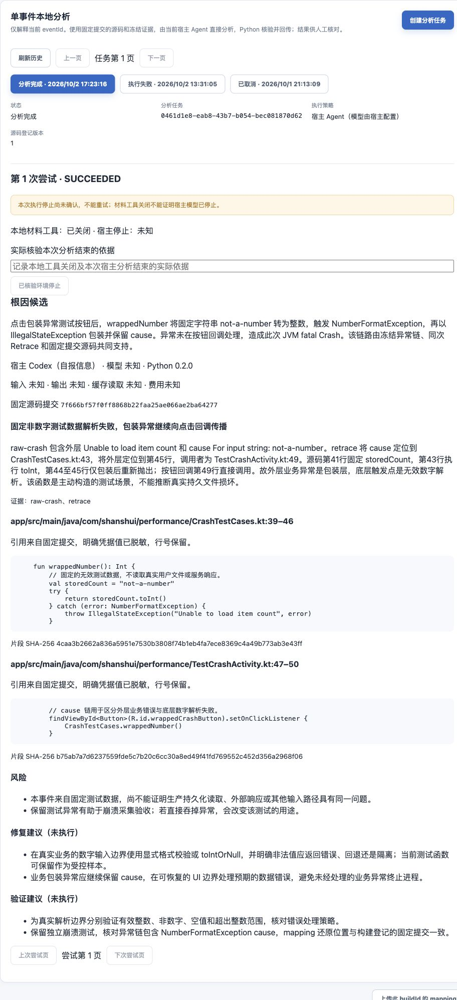

# 宿主 Agent 直接分析验收

日期：2026-10-02。对应 [实施任务第 8 节](../../openspec/changes/archive/2026-10-04-add-local-crash-analysis/tasks.md)、[该阶段历史设计](../../openspec/changes/archive/2026-10-04-add-local-crash-analysis/design.md) 和 [分析 API](../api/analysis-api.md)。用户确认提案后授权继续到执行阶段，不再逐份询问；本轮同步规划与实现。

## 当前实现与边界

新任务使用 HOST_AGENT，当前宿主按 [apm-crash-analyze](../../agent-skills/apm-crash-analyze/SKILL.md) 直接分析。Python 0.2.0 提供 prepare/read/search/submit/status/stop，负责固定提交材料、独立 Worker 身份、租约看护、真实读取范围、引用和结果幂等核验；当前 CLI 不启动 OpenCode、Docker 或 DeepSeek。旧执行器代码与测试保留为历史验证材料，不作为新任务入口。

工具与宿主停止分别记录。Python 可以关闭材料并报告 localToolsStopped=true，不能统一控制宿主所有模型请求、Token 或中止。报告成功可保持 hostStopState=UNKNOWN、stopConfirmed=false，继续阻止新尝试及原 Worker 新领取。管理员须实际核验本次宿主分析结束后另留审计；不要求关闭整个桌面应用，也不能只引用模型回答作为证明。

## 自动化

| 验证 | 本轮结果与范围 |
|---|---|
| Python | 92 项通过，包含原历史执行器测试；新增宿主测试覆盖准备、只读搜索/行范围、假引用、格式/来源、未知回传、材料预算、取消、看护期限、看护失联及双时钟暂停检查、清理失败；CLI 对缺失/非法/链接/多任务输入在网络动作前拒绝 |
| 锁定安装 | 使用现有 uv 执行 `uv sync --locked --python 3.12` 成功，安装元数据从 0.1.0 更新为 0.2.0；依赖版本未变 |
| 后端专项 | AnalysisTaskPostgresTests 24 项、AnalysisBuildPostgresTests 3 项、ArchUnit 3 项通过；真实 PostgreSQL 16 / Flyway V1～V13，未跳过 |
| 查询边界 | 在真实 PostgreSQL 注入一万条已确认停止的合成 Run，保留一个停止未知 Run；默认规划器选择 V13 的未停止凭据部分索引，EXISTS 命中即停。未关闭顺序扫描制造通过，不代表生产吞吐 |
| 后端全量 | 266 项：262 通过、既有 Rhea processor 制品摘要失败 1、按条件跳过 3；未修改或绕过摘要门禁。bootJar 成功 |
| 前端 | 44 个文件、121 项通过，类型检查及生产构建通过；覆盖宿主策略、历史报告及 SUCCEEDED/UNKNOWN 同时显示 |
| MCP | 原 TypeScript MCP 15 项回归通过，未改实现语言、工具或授权 |
| Skill | quick_validate 通过；项目发现链接指向当前 Skill。只实际验收当前 Codex 宿主，其他 Agent 兼容性未验证 |

示例命令从仓库根目录执行（uv 需在 PATH）：

```sh
# 后端使用本机 Android Studio JBR；Windows 路径不适用于当前 macOS。
JAVA_HOME='/Applications/Android Studio.app/Contents/jbr/Contents/Home' \
  bash backend/gradlew -p backend test --no-daemon --console=plain
# Python 从已有虚拟环境运行；依赖安装命令见 Worker README。
agent-worker/.venv/bin/pytest agent-worker/tests -q
# 前端及 MCP 在各自目录运行。
(cd frontend && npm test && npm run typecheck && npm run build)
(cd mcp-server && npm test)
```

前台材料操作必须取得有效服务端回执，并核对后台看护存在及近期心跳；看护已退出、记录过期或双时钟分歧时拒绝材料。看护复用同一租约时钟锚点，防止暂停后借新回执复活原执行；自身硬期限到达时尝试关闭材料。清理失败不能报告工具已关闭或上传成功，恢复必须先完成清理。无法取得平台回执仍保留停止未知，不能以这些测试宣称可中止宿主模型。

## 真实 Codex 闭环

验收控制端只在已授权的本地隔离环境工作：PostgreSQL 16 保存既有 Task/Run 历史，事件通过明确启用的 memory 适配器重放，Dashboard 使用 Vite 同源代理。后端更新后恢复原符号文件目录和七条既有验收事件；原设备安装、源码、签名和云端部署不变。

控制端为包装数字异常事件创建新宿主任务，将单个 taskId 显式绑定本轮工具调用。当前 Codex 阅读更新后的 Skill，实际调用 Python prepare、search、read，基于返回的冻结异常链和固定提交源码直接推理，再保存语义 JSON 并 submit。未启动额外 Codex CLI、OpenCode 或请求 DeepSeek。宿主身份 Codex 仅自报，实际模型/版本、Token 和费用均未知。

| 身份 | 值 |
|---|---|
| eventId | `f3e87c0d-f5eb-4329-99ec-43809b75b20b` |
| taskId | `0461d1e8-eab8-43b7-b054-bec081870d62` |
| runId | `b33ceae8-05d9-4023-96eb-88c872d4d88d`，attempt 1 |
| evidenceId | `52d97483-210a-4931-9293-d53f85e0723e` |
| commitSha | `7f666bf57f0ff8868b22faa25ae066ae2ba64277` |
| buildId | `1.0-1-20261001130931734-ff5edede` |
| mapping SHA-256 | `adb538e0f1abfaf85ec621c6117c7b0585c1cec39eca4ed58d9ac7004a3af88f`，revision 1 |

实际读取 TestCrashActivity.kt:41～56、CrashTestCases.kt:38～47。最初请求后者 35～60 超出真实文件行范围，被 REFERENCE_INVALID 拒绝，未记录该范围、未新建 Run；缩小后读取成功。最终报告引用前者 47～50、后者 39～46，均被成功 read 覆盖。平台保存 schemaVersion=2、SUCCEEDED/ROOT_CAUSE_CANDIDATE，后台看护续租可见。

独立验收随后使用网页身份读取平台报告，并从固定提交重新读取两处引用，核对路径、行号、LF 文本及 SHA-256；两处均一致。私有恢复记录为 HOST_DONE，租约与结果原文已清空，源码材料目录不存在，看护 PID 已退出。重复 prepare 返回原成功概述，不产生新 Run 或新推理。最新后端重启后报告仍保留且摘要/引用再次核对一致。

上述验收不核验宿主模型停止，故实际 Run 仍为 localToolsStopped=true、hostStopState=UNKNOWN、stopConfirmed=false，未自动填写管理员停止依据。管理员确认门禁由 PostgreSQL 测试验证；此次真实 Run 没有用合成证明解锁。

[报告简图](host-analysis-summary.png) 和 [脱敏结果及引用核对](host-analysis-result.json) 只保存报告、无秘密身份和核验摘要，不包含 Worker 凭据、租约、私有目录、原始设备标识或完整设备事件。真实网页显示分析完成、宿主自报、模型/用量未知、工具关闭和宿主未知；管理员核验入口可见，两处引用和未执行建议均可见。



## 质量记录

本次成功区分外层 IllegalStateException 包装与 NumberFormatException cause。事件与源码共同证明：固定 not-a-number 在第 43 行 toInt 失败，第 45 行保留 cause 包装，TestCrashActivity 第 49 行直接调用且未处理。报告承认这是受控测试，未将注释中的持久化场景当真实文件损坏。

这是既有包装样本在新流程中的一次复测，形成新增分析结果；不能当作新增独立事件、独立根因或未参与开发的质量样本。原 [五例评估](README.md#五个受控质量样本评估结果2026-10-01) 和 [旧 Skill 验收](skill-validation.md) 保持原结论。仅此一例成功不能证明已解决旧方案全部格式/引用失败，也不能证明两类证据不足枚举正确、生产定位率、自动修复或其他宿主兼容。

## 文档同步与差异

旧 API/知识库中的“固定 DeepSeek/OpenCode 当前执行”与新代码已不一致；用户已确认替换意图，本轮改为宿主方案，并保留带日期历史记录。API complete/stopped 的停止语义、新字段和结果版本已更新，未假称仅改文案。另据内容维护代码明确旧文档“执行摘要”的范围：到期保留任务策略、生命周期和停止审计，报告中的宿主来源与业务结论随正文清理，当前没有单独永久存储它们。

- 根知识库：总入口、实现边界、安全、运维；总体 Agent 方案增加当前替换说明，下文平台扩展设计保留参考属性。
- 后端知识库：总入口、实现边界、分析专题；补 V12/V13、停止审计、查询边界及当前结果契约。
- 前端知识库：总入口和分析专题；补自然语言指令、来源未知、历史报告及成功/停止未知组合。
- API：分析 API；客户端事件字段、队列和上传契约无变化，仅客户端入口补本次试点链接。
- Worker/Skill：当前运行、安装、输入与恢复说明；旧模型/容器验收记录保持历史，不代替新能力证据。

### 同步文件清单

| 归属 | 文件 |
|---|---|
| 根知识库 | [入口](../knowledge-base/README.md)、[实现边界](../knowledge-base/00-当前实现与验证边界.md)、[安全](../knowledge-base/06-安全与隐私.md)、[运维](../knowledge-base/07-部署与运维.md)、[测试](../knowledge-base/08-测试与质量保障.md) |
| 后端知识库 | [入口](../../backend/docs/knowledge-base/README.md)、[实现边界](../../backend/docs/knowledge-base/00-当前实现与验证边界.md)、[分析专题](../../backend/docs/knowledge-base/local-analysis.md)、[测试](../../backend/docs/knowledge-base/06-测试与质量保障.md) |
| 前端知识库 | [入口](../../frontend/docs/knowledge-base/README.md)、[分析专题](../../frontend/docs/knowledge-base/local-analysis.md)、[测试](../../frontend/docs/knowledge-base/06-测试与质量保障.md) |
| API | [分析契约](../api/analysis-api.md) |
| 客户端 | [接入入口](../client-integration/README.md)，仅补试点验收导航，事件契约无变化 |
| 跨端 | [Agent 总体方案](../../apm-agent-platform-design.md)、[验收入口](README.md)、本文及脱敏 JSON/截图 |
| Worker/Skill | [Worker README](../../agent-skills/apm-crash-analyze/worker/README.md)、[Skill](../../agent-skills/apm-crash-analyze/SKILL.md)、[安装说明](../../agent-skills/apm-crash-analyze/README.md) |
| OpenSpec | [提案](../../openspec/changes/archive/2026-10-04-add-local-crash-analysis/proposal.md)、[设计](../../openspec/changes/archive/2026-10-04-add-local-crash-analysis/design.md)、Worker/任务/前端 delta 规范和[任务清单](../../openspec/changes/archive/2026-10-04-add-local-crash-analysis/tasks.md) |

未归档、未提交、未部署云端修复或模型管理。实际宿主停止未知仍需真实管理员核验，质量和生产能力继续按上述边界记录。
