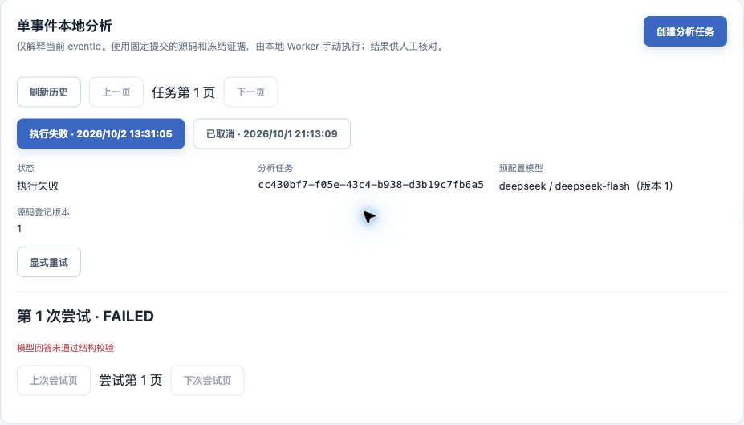

# apm-crash-analyze Skill 验收

日期：2026-10-02。对应 [实施任务 7.1～7.5](../../openspec/changes/archive/2026-10-04-add-local-crash-analysis/tasks.md)。Skill 交付为中文指令与安装说明，复用现有 CLI；本轮没有修改后端、前端、Worker 执行代码、API 或 Android 事件契约。

## 结构和运行条件

- [Skill 入口](../../agent-skills/apm-crash-analyze/SKILL.md)、[安装与使用](../../agent-skills/apm-crash-analyze/README.md) 和 Codex 展示信息已交付。项目 `.agents/skills/apm-crash-analyze` 使用相对符号链接指向交付目录，无本机固定路径。
- skill-creator 官方 `quick_validate.py` 通过。其 PyYAML 6.0.3 仅安装在临时验证目录，没有修改 Worker 依赖或锁文件。
- `.venv/bin/python -m pytest -q tests/test_cli.py tests/test_runner.py tests/test_state.py`：22 项通过。覆盖配置阻断零模型、诊断不输出秘密、回传响应丢失同摘要恢复、停止未知门禁及私有状态保护。
- 本机 Codex CLI 版本 `0.159.2`，已有 ChatGPT 登录；真实本地后端和 Vite 健康入口分别返回 200。用户已明确允许独立宿主进程、受控失败场景和一次 READY 任务分析。

结构和运行条件本身不证明宿主已实际加载或模型质量通过；实际调用证据见下文。

## 受控宿主行为

每例启动独立、临时 Codex CLI 会话，在私有测试项目的标准 `.agents/skills` 位置链接真实 Skill。配置使用合成入口、UUID 和凭据，合成 Worker 只记录无秘密 CLI 参数并返回预设状态，不访问真实平台、Docker 或模型。宿主未获得预期答案，以自然语言请求实际观察处理行为。

首批测试请求中“不要联网”范围存在歧义，可能同时禁止 Worker 模型调用；保留已完成的输入校验结果，停止剩余合成宿主进程，将后续请求改为“宿主不自行联网，允许已配置 Worker 自身模型调用”。该调整只修正测试请求，未放宽 Skill 或真实 Worker 权限。

| 场景 | 当前结果 |
|---|---|
| 缺少任务 ID | 请求补充，零 CLI 分析调用 |
| 无效任务 ID | 请求有效 UUID，零 CLI 分析调用 |
| 多个候选未选择 | 请求选择，零 CLI 分析调用 |
| 仅事件链接 | 指引网页创建任务，不把 eventId 当 taskId，零 CLI 分析调用 |
| 缺少本地凭据 | 明确指出缺少 `APM_WORKER_CREDENTIAL` 并指导安全注入，零 CLI 分析调用 |
| 明确执行失败 | doctor 一次、run 一次，反馈 `REFERENCE_INVALID` 和用量未知，不自动重试 |
| 完成响应待确认 | doctor 一次、run 一次，解释 `RESULT_PENDING`，指导同任务、同平台、同目录对账，不自动创建新尝试 |
| 用户要求恢复原任务 | doctor 一次、原任务 run 一次，使用原状态目录，正确解释合成 `INSUFFICIENT_EVIDENCE` 和未知用量，不计作新模型分析 |
| 停止未确认 | doctor 一次、原任务 run 一次，反馈 `STOP_UNCONFIRMED`，保留原状态并指导管理员核验，不重跑 |

以上九例均已核对，宿主退出码为 0；原状态标记全部保留，调用参数中的任务、仓库映射、执行器和状态目录与原配置一致。macOS 的 `/tmp` 与 `/private/tmp` 按解析后的同一目录核验。宿主原始事件及最终回复扫描未出现两类合成秘密。宿主原始事件、合成秘密及状态标记只保存在权限受限的临时目录，不纳入仓库。恢复正确性同时由现有 Worker 测试核验；合成宿主测试只验证调用决策和参数，不能代替真实模型 Run。

## 真实任务验收

通过受限 Worker HTTP 只读核对任务 `cc430bf7-f05e-43c4-b938-d3b19c7fb6a5` 起始为 READY，对应事件 `f3e87c0d-f5eb-4329-99ec-43809b75b20b`，应用为本地验收应用，固定 Performance 提交 `7f666bf57f0ff8868b22faa25ae066ae2ba64277`。

独立 Codex CLI 从标准 `.agents/skills` 位置读取交付 Skill，接收自然语言分析请求，检查环境变量存在性并调用真实 `doctor` 和一次 `run`。调用使用既有仓库映射、执行器及指定私有状态目录；凭据从受保护本地配置注入。实际命令为：

```sh
# 路径是本轮已确认的非敏感本地配置；秘密仅通过环境注入。
"$APM_ANALYSIS_WORKER_ROOT/.venv/bin/apm-analysis" doctor
"$APM_ANALYSIS_WORKER_ROOT/.venv/bin/apm-analysis" run \
  cc430bf7-f05e-43c4-b938-d3b19c7fb6a5 \
  --repositories "$APM_ANALYSIS_REPOSITORIES" \
  --executor "$APM_ANALYSIS_EXECUTOR" \
  --state-dir "$APM_ANALYSIS_STATE_DIR"
```

| 核对项 | 真实结果 |
|---|---|
| 预检 | Docker 和模型密钥存在，未以预检代替正式分析 |
| Run | `d5e32dcf-c536-4f52-8bba-b222ee618c11` |
| Worker 返回 | 退出码 1，`status=failed`、`code=FORMAT_INVALID` |
| 平台状态 | Run 和任务均为 FAILED，`errorCode=FORMAT_INVALID` |
| 分析结论及用量 | 未返回有效结论，用量未知；没有有效新报告或源码引用可核验 |
| 宿主反馈 | 退出码 0，如实说明失败和未知用量，指引网页查看，不自动重试 |
| 停止与资源 | 只读 Run 查询 `stopConfirmed=true`；按 Run 标签查不到残留容器或网络 |
| 网页回显 | 同任务显示“执行失败”“第 1 次尝试 · FAILED”和“模型回答未通过结构校验” |
| 凭据保护 | 宿主原始事件和最终回复扫描未发现真实 Worker 凭据或 DeepSeek 密钥回显 |



此次验证证明 Codex 加载、自然语言调用、真实 Worker 执行和失败回显链路成立；模型结构校验失败，不能计为一次成功根因分析。未自动创建新尝试或执行额外模型调用，原失败记录保留。

## 文档归属与边界

- 根知识库：维护 Skill 入口、当前实现和调用验证边界；总体 Agent 方案说明宿主、Worker、OpenCode 的分工。
- Worker 说明：维护安装链接和运行配置；Skill README 提供宿主安装及自然语言调用流程。
- 后端知识库：本轮未修改内部实现、授权、存储或生命周期，暂无同步变更。
- 前端知识库：本轮未修改页面或交互，暂无同步变更。
- API 文档：路由、字段、错误语义及凭据权限不变，暂无同步变更。
- 客户端文档：事件、构建、队列及上报协议不变，暂无同步变更。

九份本轮涉及的 Markdown 共 193 个本地文件链接均有效；其中总体 Agent 方案的既有 MCP 任务链接已指向实际归档目录。`openspec validate add-local-crash-analysis --strict --json` 无问题，`git diff --check` 通过。没有因本轮指令入口重复执行全量后端、前端、MCP 或设备回归；其历史结果继续由原验收记录维护。

Codex 宿主已完成上述实际调用；其他 Agent 工具未验收。本轮入口验证不改变既有五例模型质量评估结论，不支持源码修复、构建验证、MR 或云端调度。
