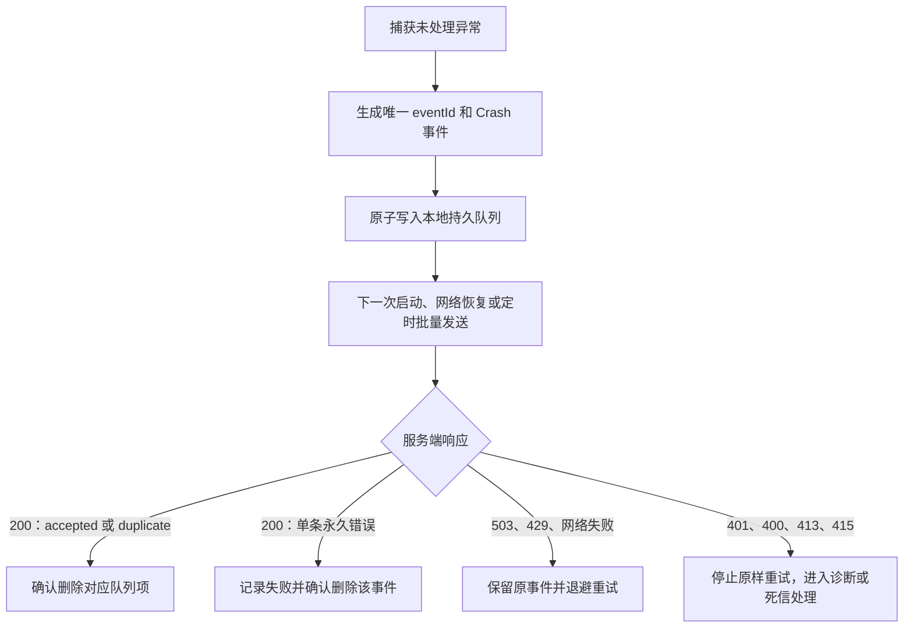

# Android JVM Crash 上传接入文档

本文面向 Android 客户端和 SDK 开发人员，说明如何把 Java/Kotlin 致命崩溃可靠地上传到 APM 服务端。

## 1. 接入结论

当前版本的接入约定如下：

| 应用 | 当前约定 |
|---|---|
| 接口 | `POST /ingest/v1/batches` |
| 请求格式 | `application/json`，可使用 gzip |
| 认证 | `X-App-Key` 应用上报 Key |
| Schema | `2` |
| 支持范围 | Java/Kotlin JVM、`fatal=true` 的 Crash |
| 传递语义 | 至少一次；网络重试可能收到 `duplicate` |
| 去重依据 | `appId + eventId` |
| 本地队列 | Crash 发生后必须先持久化，再尝试上传 |

首期不接收 NDK/native Crash、ANR、非致命异常和 Protobuf。Crash 统计以 `app_start` 的去重 `sessionId` 作为分母，因此客户端需要同时上报启动事件。

### 身份生命周期

`anonymousDeviceId` 在首次安装时生成并持久化，所有进程共用；每次应用启动生成新的 UUID v4 `sessionId`。主进程的 `processId` 使用本次 `sessionId`，子进程每次创建都生成新的 UUID v4。三者在事件入队时固定，跨启动补传不能改成当前上传进程的身份；服务端不接受 Android 数值 PID，也不会补造 `processId`。

## 2. 推荐接入流程



实现时请遵循以下顺序：

1. 在 `UncaughtExceptionHandler` 中完成最小化事件组装。
2. 使用文件数据库、SQLite 或等价方案原子落盘；落盘成功前不要认为事件已保存。
3. 落盘后再尝试发送，发送失败不能删除队列项。
4. 发送成功或服务端返回重复时确认删除；重试必须保留原始 `eventId`。
5. 最后调用之前的系统 `UncaughtExceptionHandler`，不要改变 Android 原有的进程终止语义。

仓库中的 Kotlin 联调样例见 [AndroidCrashHandler.kt](../examples/AndroidCrashHandler.kt)。样例中的内存队列仅用于演示，正式 SDK 必须替换为原子持久化实现。

## 3. 接口和请求头

生产环境使用 HTTPS，完整地址为：

```text
<服务端基础地址>/ingest/v1/batches
```

请求示例：

```http
POST /ingest/v1/batches HTTP/1.1
Host: apm.example.com
Content-Type: application/json
Content-Encoding: gzip
X-App-Key: <应用上报Key>
X-Schema-Version: 2
```

请求头说明：

| 请求头 | 必填 | 说明 |
|---|---:|---|
| `Content-Type` | 是 | 当前只能是 `application/json` |
| `Content-Encoding` | 否 | 使用 gzip 时填写 `gzip`；不压缩时可省略或使用 `identity` |
| `X-App-Key` | 是 | 后端为应用分配的上报标识；缺失或错误返回 `401` |
| `X-Schema-Version` | 建议 | 当前填写 `2`；不填写时服务端仍按事件内的 `schemaVersion` 校验 |

应用 Key 在网页创建应用时生成，`OWNER`/`ADMIN` 可在应用设置页随时查看。它与应用的 Android application ID 永久绑定、不过期且不可轮换、重置或撤销；不同环境或不同包名变体必须分别创建应用。Key 会被打包进客户端，可能被逆向，不能当作用户密码或真正的客户端秘密。客户端不得在日志、异常上报内容、埋点、URL 或版本库中打印或保存完整 Key。

## 4. 批量请求格式

`requestId` 只用于请求追踪，不参与去重；`eventId` 才是事件的幂等标识。网络重试可以生成新的 `requestId`，但不得重新生成已落盘事件的 `eventId`。

```json
{
  "requestId": "upload-20260817-0001",
  "events": [
    {
      "schemaVersion": 2,
      "eventId": "6c8c9c2c-5e22-4c16-8d5f-0b4c1d7d9e01",
      "eventType": "crash",
      "occurredAt": 1786963200000,
      "sessionId": "session-20260817-0001",
      "processId": "11111111-1111-4111-8111-111111111111",
      "anonymousDeviceId": "install-9d1a0b2c",
      "packageName": "com.example.app",
      "appVersion": "3.2.0",
      "versionCode": 320,
      "buildId": "build-320",
      "environment": "production",
      "channel": "official",
      "osVersion": "16",
      "deviceModel": "Pixel-8",
      "networkType": "wifi",
      "attributes": {
        "process": "main"
      },
      "crash": {
        "kind": "jvm",
        "fatal": true,
        "throwableChain": [
          {
            "type": "java.lang.IllegalStateException",
            "message": "payment state is invalid",
            "frames": [
              {
                "className": "com.example.PaymentActivity",
                "methodName": "submit",
                "fileName": "PaymentActivity.kt",
                "lineNumber": 120,
                "applicationFrame": true
              },
              {
                "className": "android.app.Activity",
                "methodName": "performCreate",
                "fileName": "Activity.java",
                "lineNumber": 1,
                "applicationFrame": false
              }
            ]
          }
        ]
      }
    }
  ]
}
```

字段名必须使用上述 camelCase。当前服务端不接受未知 JSON 字段；新增字段必须等待协议版本兼容后再使用。

## 5. 事件字段说明

### 5.1 公共事件字段

| 字段 | 必填 | 约束和客户端要求 |
|---|---:|---|
| `schemaVersion` | 是 | 整数 `2` |
| `eventId` | 是 | 1～128 个字符；每条逻辑事件生成一次并持久化 |
| `eventType` | 是 | 只能是 `crash` 或 `app_start` |
| `occurredAt` | 是 | Unix Epoch 毫秒，使用 `System.currentTimeMillis()`；不能使用客户端本地格式化时间 |
| `sessionId` | 是 | 1～128 个字符；同一次会话的 `app_start` 和 Crash 必须一致 |
| `processId` | 是 | 标准连字符 UUID v4；主进程可与本次 `sessionId` 相同，子进程每次创建独立生成；禁止使用 Android 数值 PID |
| `anonymousDeviceId` | 是 | 1～256 个字符；建议使用应用安装级随机 ID，不要使用 IMEI、Android ID 等直接设备标识 |
| `packageName` | 是 | 必须等于 appKey 绑定的 Android application ID；服务端不提供默认值 |
| `appVersion` | 是 | 最长 128 个字符，例如 `3.2.0` |
| `versionCode` | 是 | 非负整数 |
| `buildId` | 是 | 最长 256 个字符；应能唯一对应一次可发布构建，后续符号化依赖它 |
| `environment` | 是 | 最长 64 个字符，例如 `production`、`staging` |
| `channel` | 是 | 最长 128 个字符，例如 `official`、`huawei` |
| `osVersion` | 是 | 最长 64 个字符 |
| `deviceModel` | 是 | 最长 256 个字符 |
| `networkType` | 否 | 最长 32 个字符，例如 `wifi`、`4g` |
| `measurements` | 否 | 只放数字型测量值，例如耗时；不要放用户输入或原始对象 |
| `attributes` | 否 | 只放低基数属性；键名只能包含字母、数字、`_`、`.`、`-` |
| `crash` | Crash 必填 | `eventType=crash` 时必须提供；`app_start` 不应携带该字段 |

服务端默认最多保留 32 个属性，属性值会被截断或脱敏。客户端仍应在发送前主动限制属性数量和长度。

### 5.2 Crash 载荷

| 字段 | 必填 | 约束和客户端要求 |
|---|---:|---|
| `crash.kind` | 是 | 固定为 `jvm` |
| `crash.fatal` | 是 | 固定为 `true` |
| `crash.throwableChain` | 是 | 至少 1 个、最多 16 个异常节点；第一个为主异常，后续依次为 cause |
| `throwable.type` | 是 | 异常类全名，最长 512 个字符 |
| `throwable.message` | 否 | 最长 4096 个字符；先在客户端清理敏感值 |
| `throwable.frames` | 是 | 每个异常节点至少 1 帧，总帧数最多 200 |
| `frame.className` | 是 | 最长 512 个字符 |
| `frame.methodName` | 是 | 最长 512 个字符 |
| `frame.fileName` | 否 | 最长 512 个字符 |
| `frame.lineNumber` | 否 | `-1` 表示未知；有效范围为 `-1`～`1000000000` |
| `frame.applicationFrame` | 否 | 应用代码为 `true`，系统或三方库为 `false`；建议准确填写 |

如果异常链或堆栈超过限制，客户端应裁剪后再发送。不能把超限事件反复原样重试，因为这属于永久错误。

## 6. `app_start` 与会话分母

每次创建新的应用使用会话时发送一个 `eventType=app_start` 事件。该事件使用与 Crash 相同的公共字段，但不携带 `crash`：

```json
{
  "schemaVersion": 2,
  "eventId": "start-6c8c9c2c",
  "eventType": "app_start",
      "occurredAt": 1786963200000,
      "sessionId": "session-20260817-0001",
      "processId": "11111111-1111-4111-8111-111111111111",
      "anonymousDeviceId": "install-9d1a0b2c",
  "packageName": "com.example.app",
  "appVersion": "3.2.0",
  "versionCode": 320,
  "buildId": "build-320",
  "environment": "production",
  "channel": "official",
  "osVersion": "16",
  "deviceModel": "Pixel-8"
}
```

服务端按照以下口径统计：

```text
startedSessions = distinct(sessionId where eventType = app_start)
crashedSessions = distinct(sessionId where eventType = crash)
crashEvents = distinct(eventId where eventType = crash)
affectedDevices = distinct(anonymousDeviceId where eventType = crash)
crashRatePer1000Sessions = crashedSessions / startedSessions * 1000
crashFreeSessionRate = 1 - crashedSessions / startedSessions
```

没有 `app_start` 分母时，崩溃率和无崩溃会话率会返回空值并标记为 `denominator_insufficient`，不会把“没有分母”误报成零崩溃。

## 7. 本地队列和重试实现

### 7.1 队列要求

- Crash 事件先写入持久队列，再执行网络请求。
- 文件实现应使用临时文件写入、刷盘、原子重命名，避免进程终止时留下半个 JSON。
- 队列记录至少包含完整事件、创建时间、发送次数和下一次发送时间。
- 发送线程不能运行在主线程；Crash Handler 中的同步工作应有明确的大小和时间上限。
- 建议单批 20～50 个事件，并在压缩前后都检查大小；不要等服务端返回 `413` 才切批。
- 事件默认只能接收最近 7 天，客户端离线队列应尽量在 7 天内完成发送。

### 7.2 响应后的确认规则

成功响应为 HTTP `200`，示例：

```json
{
  "requestId": "upload-20260817-0001",
  "accepted": 1,
  "rejected": 1,
  "duplicate": 0,
  "retryable": false,
  "retryAfterSeconds": null,
  "errors": [
    {
      "index": 1,
      "eventId": "bad-event",
      "code": "UNSUPPORTED_CRASH_KIND",
      "message": "首期仅支持 crash.kind=jvm",
      "retryable": false
    }
  ]
}
```

客户端处理方式：

1. 收集 `errors[].index`，同一事件可能因为多个字段问题出现多条错误。
2. `200` 响应中，未出现在错误索引里的事件已经被接受或判定为重复，可以确认删除。
3. `errors[].retryable=false` 的事件是永久失败，修复数据后再决定是否人工重放；不要自动循环重试。
4. 如果未来出现 `errors[].retryable=true`，只保留对应索引的事件。
5. `accepted + rejected + duplicate` 应等于本批事件数；`errors` 条数可能大于 `rejected`，因为一条事件可能有多个错误。

网络超时、连接断开或没有收到响应时，无法判断服务端是否已经写入，必须保留整批并使用原始 `eventId` 重试。服务端会把已写入的重试识别为 `duplicate`，不会再次放大 Crash 统计。

### 7.3 批次级错误

| HTTP 状态 | 错误码 | 客户端处理 |
|---:|---|---|
| `401` | `INVALID_APP_KEY` | 不要自动重试；检查是否使用应用设置页显示的完整 Key |
| `403` | `PACKAGE_NAME_MISMATCH` | 不要自动重试；检查事件 `packageName` 与 appKey 绑定包名 |
| `503` | `APP_AUTH_UNAVAILABLE` | 保留原批次和 eventId，按 `Retry-After` 重试 |
| `400` | `INVALID_BATCH` | 不要原样重试；检查 JSON、字段名、批次是否为空和未知字段 |
| `400` | `UNSUPPORTED_SCHEMA_VERSION` | 升级或降级客户端协议，不要重试当前版本 |
| `413` | `PAYLOAD_TOO_LARGE` | 减小批次；若单事件超限则裁剪堆栈或进入死信处理 |
| `415` | `UNSUPPORTED_MEDIA_TYPE` | 检查 `Content-Type` 和 `Content-Encoding` |
| `503` | `EVENT_STORE_UNAVAILABLE` | 保留事件，优先使用响应的 `Retry-After`；当前默认值为 30 秒 |
| `429` | `INGEST_RATE_LIMITED` | 若网关返回该状态，遵循 `Retry-After` 并指数退避 |

批次级永久错误没有逐事件索引。客户端应停止对同一批次的原样重试，并把批次放入受数量限制的诊断/死信队列，以便修复配置后人工重放；不要因为一次错误清空所有其他正常队列数据。

批次级错误响应采用以下结构，客户端应优先读取稳定的 `code` 和 `retryable`，不要只根据 HTTP 状态码判断：

```json
{
  "code": "EVENT_STORE_UNAVAILABLE",
  "message": "事件存储暂时不可用",
  "retryable": true,
  "requestId": null,
  "errors": [],
  "timestamp": "2026-08-17T08:00:00Z"
}
```

建议对网络失败、`429`、`503` 采用指数退避并加入随机抖动，例如 30 秒、60 秒、120 秒……设置最大间隔和最大保留次数。重试过程中不生成新的 Crash `eventId`。

## 8. 隐私和安全要求

客户端和服务端都要做脱敏，不能只依赖服务端：

- 异常消息中不要上传邮箱、手机号、完整 URL 查询参数、Cookie、Token、Authorization 或用户输入。
- 不要把原始设备标识、广告 ID 或账号 ID 放进 `anonymousDeviceId`；使用应用安装级随机值。
- `attributes` 只加入排障所需的低基数信息，不上传整份用户对象、请求体或响应体。
- 堆栈文件名、异常消息和自定义属性都可能包含业务数据，日志中只记录 `eventId`、错误码和计数，不记录完整事件。
- 生产必须使用 HTTPS；不要为了“测试方便”关闭证书校验。

服务端还会对设备 ID 做应用级 SHA-256 哈希，并对异常消息、路径、URL、邮箱、手机号和 UUID 做脱敏及截断。但这不代表客户端可以上传原始敏感数据。

## 9. 联调与验收清单

客户端接入完成后至少验证以下场景：

- 正常网络下，Crash 能在下一次请求中收到 `200` 和 `accepted`。
- Crash 发生时关闭网络，事件仍能落盘；下次启动或网络恢复后自动发送。
- 同一事件重复发送时返回 `duplicate`，统计不会增加两次。
- 同一批混入合法事件和 native/non-fatal 事件时，合法事件被接受，非法事件在 `errors` 中返回永久错误。
- gzip 请求可以成功处理；错误的 gzip 或未知 JSON 字段不会被无限重试。
- 事件时间使用 Epoch 毫秒；模拟超过 7 天的历史事件和超过 15 分钟的未来事件，能够识别为永久错误。
- 缺失 `sessionId`、`buildId`、堆栈帧等必填字段时，客户端能够记录失败原因并停止原样重试。
- 缺失、空值、数值 PID 或非 v4 `processId` 时，客户端能够记录永久错误并停止原样重试；合法事件的重试保持原 `processId`。
- 异常消息和自定义属性中的敏感内容不会出现在客户端或服务端日志中。

可使用以下命令发送未压缩 JSON 进行联调：

```bash
curl -X POST "<服务端基础地址>/ingest/v1/batches" \
  -H "Content-Type: application/json" \
  -H "X-App-Key: <应用上报Key>" \
  -H "X-Schema-Version: 2" \
  --data-binary @batch.json
```

gzip 联调时先压缩文件，再增加 `Content-Encoding: gzip`：

```bash
gzip -c batch.json > batch.json.gz
curl -X POST "<服务端基础地址>/ingest/v1/batches" \
  -H "Content-Type: application/json" \
  -H "Content-Encoding: gzip" \
  -H "X-App-Key: <应用上报Key>" \
  -H "X-Schema-Version: 2" \
  --data-binary @batch.json.gz
```

## 10. 当前服务端限制和参考资料

默认部署参数如下，具体环境如果调整了配置，以服务端实际配置为准：

| 限制 | 默认值 |
|---|---:|
| 压缩前请求体 | 1 MiB |
| 解压后请求体 | 4 MiB |
| 单事件 | 256 KiB |
| 异常消息 | 4096 字符 |
| 异常链 | 16 个节点 |
| 堆栈帧总数 | 200 帧 |
| 允许的历史时间 | 7 天 |
| 允许的未来时间偏差 | 15 分钟 |

- [Crash API 与统计公式](../api/crash-api.md)
- [Crash 错误码与部分接受语义](../api/crash-error-codes.md)
- [JVM Crash v2 JSON Schema](../../backend/src/main/resources/schema/crash-event-v2.schema.json)
- [Android Crash Handler Kotlin 联调样例](../examples/AndroidCrashHandler.kt)
