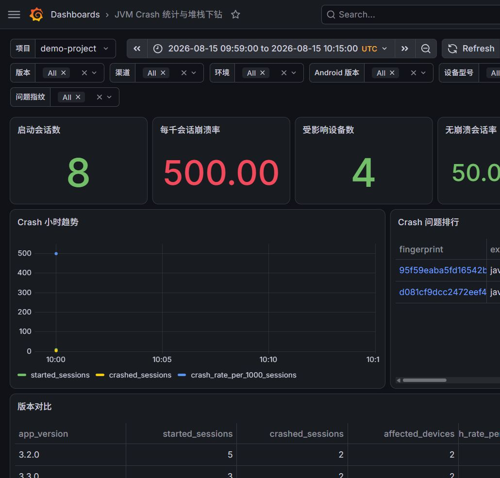
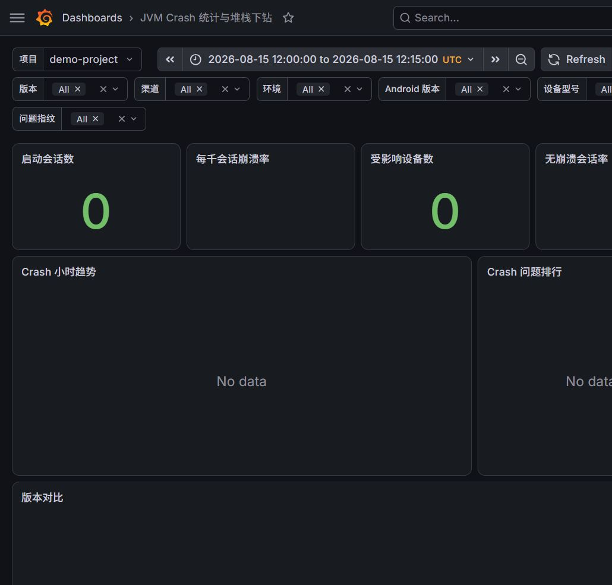
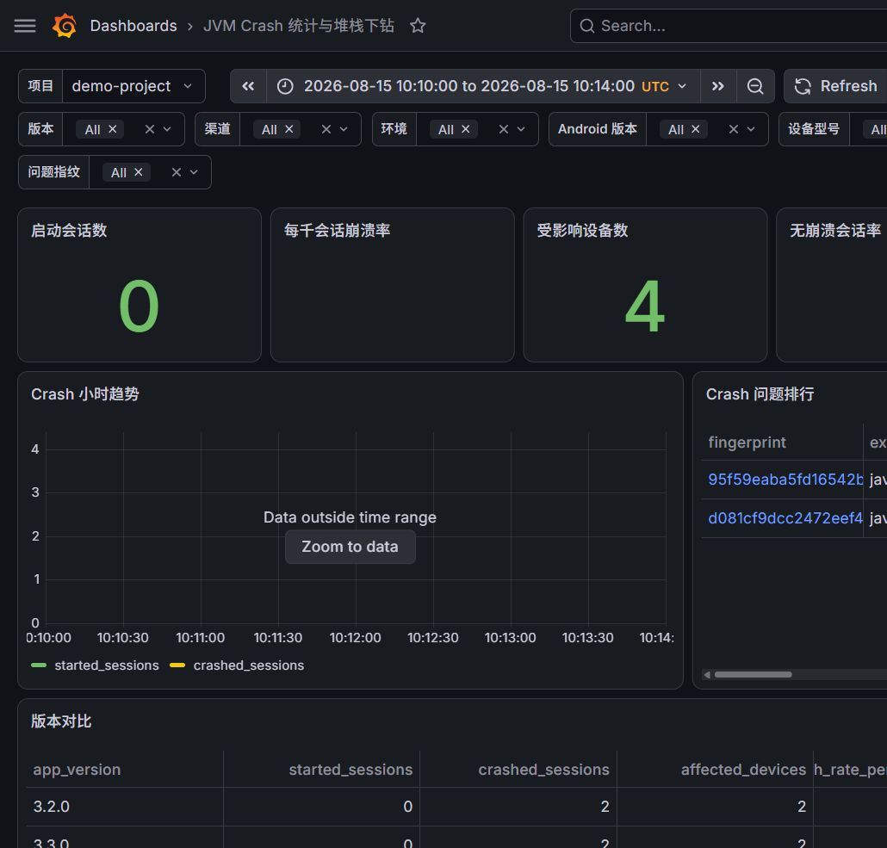
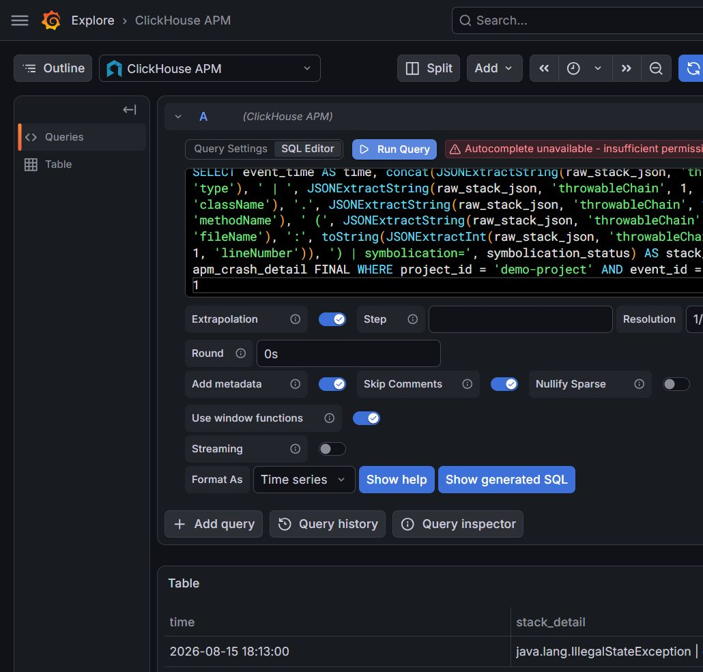

# JVM Crash Grafana 实例截图验收

## 验收环境

- ClickHouse：26.7.3.19，数据库为 `apm`。
- Grafana：13.1.3，数据源为 `ClickHouse APM`。
- 固定数据集：8 个 `app_start` 会话、4 个唯一 Crash 事件、1 个重复 `eventId`、2 个应用版本和 2 个问题指纹。
- 项目：`demo-project`。

## 验收场景

### 正常统计

时间范围为 `2026-08-15T09:59:00Z` 至 `2026-08-15T10:15:00Z`，期望启动会话数为 8、每千会话崩溃率为 500、受影响设备数为 4、无崩溃会话率为 50%。问题排行为 3 次和 1 次，版本对比为 3.2.0 与 3.3.0。

### 无数据

时间范围为 `2026-08-15T12:00:00Z` 至 `2026-08-15T12:15:00Z`，启动会话数和受影响设备数显示为 0，比率保持为空，趋势、问题排行和版本对比显示 `No data`。

### 分母不足

时间范围为 `2026-08-15T10:10:00Z` 至 `2026-08-15T10:14:00Z`，窗口内没有 `app_start`，但有 4 个受影响设备和 2 个问题指纹；崩溃率和无崩溃会话率保持为空，版本面板中的比率也为空。

### 堆栈下钻

通过 Grafana Explore 查询 `apm_crash_detail FINAL` 的 `crash-202` 明细，页面展示了 `java.lang.IllegalStateException`、`com.example.checkout.PaymentActivity.submit`、`PaymentActivity.kt:210` 和 `raw_only`。同一事件的后端详情接口返回 HTTP 200，并包含原始异常链、原始堆栈和符号化状态。

截图是本机实例的验收产物，不包含数据库密码、上报 Key 或完整设备标识。
