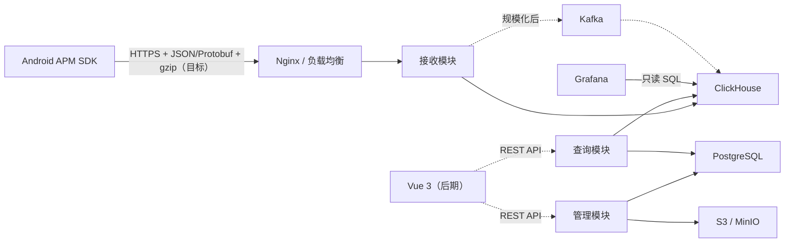

# 总体架构与模块

## 架构总览



上图是目标架构，不是当前仓库的完整运行拓扑。当前代码路径是 Android/HTTP 客户端 → Spring Boot 接收控制器 → 校验/脱敏/指纹 → `EventRepository`；仓库根据配置选择内存实现或 ClickHouse HTTP 实现。Nginx、PostgreSQL、Kafka、Vue 和对象存储尚未接入当前进程。

## 核心原则：模块化单体

第一版保持一个仓库、一个 Spring Boot 进程和一次部署，但在代码中隔离职责。这样既降低部署与调试成本，又能在负载明确后拆分接收和查询服务。

目标架构建议按职责组织包：

```text
com.shanshui.apmserver
├─ common       # 通用错误、时间、标识和基础类型
├─ auth         # 登录、Session、角色与权限
├─ project      # 项目、App、版本、成员与上报 Key
├─ ingest       # 接收、校验、脱敏、标准化与写入
├─ query        # 趋势、分位数、排行、版本对比与详情
├─ alert        # 告警规则与辅助任务
├─ storage      # PostgreSQL、ClickHouse、对象存储适配
└─ config       # 安全、Web、数据库和可观测性配置
```

这些是代码边界，不等于独立部署单元。

当前仓库的实际包结构仍处于 Crash 首期范围：

```text
com.shanshui.apmserver
├─ config        # Ingest、Query、Storage、ClickHouse 配置
├─ domain        # 事件、Crash 载荷、查询响应和错误模型
├─ repository    # EventRepository、内存实现、ClickHouse HTTP 实现
├─ service       # 校验、脱敏、指纹、接收、查询、权限和质量指标
└─ web           # 接收/查询控制器、参数处理和异常响应
```

`project`、`auth`、`alert`、PostgreSQL、对象存储和后台任务仍是目标边界，不应在当前状态表述为已实现模块。

## 模块职责

| 模块 | 主要职责 | 第一版形态 |
|---|---|---|
| Android SDK | 本地队列、批量、gzip、采样、弱网重试、Schema 版本 | 集成于业务 App |
| 接入层 | HTTPS、限流、请求大小限制、反向代理 | Nginx 或云负载均衡 |
| 接收模块 | 项目识别、Schema 校验、脱敏、标准化、批量入库 | Spring Boot 内部模块 |
| 管理模块 | 用户、项目、App、版本、成员、密钥、制品 | Spring Boot 内部模块 |
| 查询模块 | 趋势、排行、分位数、版本对比、事件详情 | Spring Boot 内部模块 |
| 后台任务 | 数据质量、保留策略、归档、告警辅助 | Spring Scheduler |
| Grafana | Dashboard、临时分析和告警 | 独立容器 |

## 技术栈

| 领域 | 方案 | 使用边界 |
|---|---|---|
| Web | Spring MVC + Jackson | 已实现接收和 Crash 查询 API；与阻塞式 HTTP 存储适配器匹配 |
| 事务数据 | PostgreSQL + Spring Data JPA | 目标架构；当前依赖和代码尚未加入 |
| 分析数据 | ClickHouse HTTP JSONEachRow + Java `HttpClient` | 已实现原始事件/Crash 明细写入和读取；聚合表已建模但后端查询尚未使用 |
| 数据迁移 | ClickHouse 版本化 SQL | 已提供 `001_crash_schema.sql`；Flyway 仅是 PostgreSQL 目标方案 |
| 安全 | 项目 Key + 开发期请求头校验 | 已实现最小边界；Spring Security、Session/OIDC 和正式成员授权尚未加入 |
| 接口 | REST | 已实现 Crash 接收与查询路由；OpenAPI 和管理 API 尚未加入 |
| 后台任务 | — | 当前未实现 Scheduler、归档或告警任务 |
| 展示 | Grafana JSON 资源 | 已提供 JVM Crash Dashboard；依赖外部 Grafana/ClickHouse 实例 |

## 当前工程差异

原方案推荐 Java 21，当前 `build.gradle.kts` 的工具链为 Java 17。Spring Boot 4.1 可在 Java 17 上运行，但是否升级到 Java 21 必须作为工程决策确认；在确认前，知识库不把 Java 21 视为已落地配置。

当前 `build.gradle.kts` 实际依赖为 Actuator、Jackson、Validation、WebMVC 和测试组件，不包含 PostgreSQL、JPA、Flyway、ClickHouse 官方 Java 驱动、Spring Security 或 Testcontainers。上述组件仍可按目标架构逐步引入，但不能把方案技术栈表直接当作当前构建结果。
