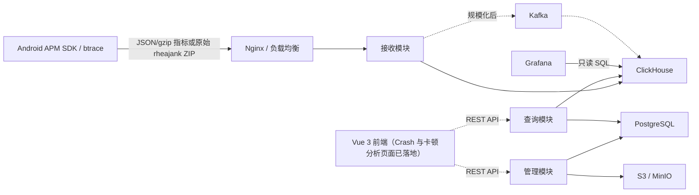

# 总体架构与模块

本页并列描述目标架构与当前代码边界；当前能力和验证结论统一见[当前实现与验证边界](00-当前实现与验证边界.md)。

## 架构总览



上图是目标架构。当前后端代码路径分为三条：Android Crash/启动/指标事件 → JSON/gzip 控制器 → Schema 校验、分派、脱敏 → `EventRepository`；btrace 卡顿 ZIP → 原始受限请求流 → `StackParser` 一次解析 → 主线程证据归一化、指纹和幂等落库 → accepted/duplicate；网页用户 → Spring Security Session → 应用成员授权 → 管理/Crash/卡顿 API。仓库根据配置选择内存或 ClickHouse HTTP 实现，管理用户、应用、成员和 Session 使用 PostgreSQL。Nginx、Kafka、对象存储、OIDC 和生产网关仍未接入当前进程。

ClickHouse 卡顿指标适配器在 Spring 运行时使用带 `@Autowired` 的 `ClickHouseEventRepository` 构造器；`EventRepository` 重载构造器仅供不启动 Spring 的测试或替身使用，避免生产启动时发生构造器选择歧义。内存模式仍由 `InMemoryJankMetricsRepository` 提供指标查询实现。

## 核心原则：模块化单体

第一版保持一个仓库、一个 Spring Boot 进程和一次部署，但在代码中隔离职责。这样既降低部署与调试成本，又能在负载明确后拆分接收和查询服务。

目标架构建议按职责组织包：

```text
com.shanshui.apmserver
├─ common       # 通用错误、时间、标识和基础类型
├─ auth         # 登录、Session、角色与权限
├─ app          # 应用、版本、成员与上报 App Key
├─ ingest       # 接收、校验、脱敏、标准化与写入
├─ query        # 趋势、分位数、排行、版本对比与详情
├─ alert        # 告警规则与辅助任务
├─ storage      # PostgreSQL、ClickHouse、对象存储适配
└─ config       # 安全、Web、数据库和可观测性配置
```

这些是代码边界，不等于独立部署单元。

当前仓库的实际包结构如下：

```text
com.shanshui.apmserver
├─ config        # Ingest、Query、Storage、ClickHouse、认证和安全配置
├─ security      # 数据库用户加载与认证主体
├─ domain        # 事件、Crash 载荷、查询响应和错误模型
├─ repository    # EventRepository、内存实现、ClickHouse HTTP 实现
├─ service       # 公共接收、Crash/卡顿校验、脱敏、估算、指纹、查询、认证与权限
└─ web           # 接收/查询/认证/应用控制器、参数处理和异常响应
```

仓库根目录的 `frontend/` 是独立的 Vue 工程；Crash 闭环和卡顿指标、问题、Issue 事件、单事件证据页面已经落地。卡顿页面使用 URL 恢复筛选、独立区域请求、游标去重，以及时间片、递归调用树和无新增依赖的 SVG 火焰图。浏览器只通过 Spring Boot 查询 API 访问数据。前端开发服务器不是 Spring Boot 静态资源托管，也不构成生产网关。工程结构和运行时数据流见[前端架构与代码组织](../../frontend/docs/knowledge-base/02-架构与代码组织.md)。

应用管理与 `auth` 的最小网页子集已经实现（用户、Session、应用、成员关系、基础信息和永久 App Key 查看）；服务端可从运维配置的应用目录读取 mapping，但成员邀请/角色管理、mapping 上传/注册/生命周期、告警、对象存储和后台任务仍是目标边界，不应表述为已实现管理模块。

## 模块职责

| 模块 | 主要职责 | 第一版形态 |
|---|---|---|
| Android SDK | 本地队列、批量、gzip、采样、弱网重试、Schema 版本 | 集成于业务 App |
| 接入层 | HTTPS、限流、请求大小限制、反向代理 | Nginx 或云负载均衡 |
| 接收模块 | 应用识别、JSON Schema 校验/入库，以及原始二进制堆栈产物的大小保护、应用级 mapping 和同步解析 | Spring Boot 内部模块 |
| 管理模块 | 用户、应用、版本、成员、App Key、制品 | Spring Boot 内部模块 |
| 查询模块 | 趋势、排行、分位数、版本对比、事件详情 | Spring Boot 内部模块 |
| 后台任务 | 数据质量、保留策略、归档、告警辅助 | Spring Scheduler |
| Grafana | Dashboard、临时分析和告警 | 独立容器 |

## 技术栈

| 领域 | 方案 | 使用边界 |
|---|---|---|
| Web | Spring MVC + Jackson | 已实现 JSON 接收、原始二进制堆栈流、Crash/卡顿查询和认证/应用 API；与同步 processor 和阻塞式 HTTP 存储适配器匹配 |
| 事务数据 | PostgreSQL + Spring Data JPA | 已落地用户、应用、应用成员、App Key 凭据和 Spring Session 表；Flyway 迁移、JPA schema 校验与本地 Compose 已加入 |
| 分析数据 | ClickHouse HTTP JSONEachRow + Java `HttpClient` | 已实现原始事件/Crash 明细、卡顿事实/详情和帧/挂起对象写入；卡顿 Issue 与指标均有独立查询边界，固定数据集已在真实 ClickHouse 验收，生产容量查询仍待压测 |
| 数据迁移 | ClickHouse 版本化 SQL + PostgreSQL Flyway | 已提供 `001_crash_schema.sql`、`002_jank_schema.sql` 与 `V1__management_schema.sql`；Flyway 不修改 ClickHouse schema |
| 安全 | 上报 App Key + 网页 Session/CSRF/成员关系 | Android 上报和网页用户分离；网页登录不信任 `X-App-Id`/`X-User-App-Ids`；OIDC 尚未加入 |
| 接口 | REST | 已实现 Crash/指标 JSON 接收、v3 manifest 边界、卡顿解析落库与查询、FPS 小时/天及挂起率 UTC 天趋势、Session 登录/退出和应用列表/创建/详情/修改；OpenAPI 尚未加入 |
| 后台任务 | — | 当前未实现 Scheduler、归档或告警任务 |
| 展示 | Grafana JSON + Vue 前端 | Grafana 用于内部分析和告警；Vue 已展示 Crash 闭环与卡顿指标、Issue 下钻和采样证据，PC 宽度基线为 1280px，不做移动端适配 |

## 当前工程差异

原方案推荐 Java 21，当前 `build.gradle.kts` 的工具链为 Java 17。Spring Boot 4.1 可在 Java 17 上运行，但是否升级到 Java 21 必须作为工程决策确认；在确认前，知识库不把 Java 21 视为已落地配置。

当前 `build.gradle.kts` 实际依赖包含 Actuator、Jackson、Validation、WebMVC、Spring Security、Spring Session JDBC、Spring Data JPA、Flyway、PostgreSQL 驱动、Testcontainers 和非传递接入的 `rhea-trace-processor:1.0.1` fat JAR；ClickHouse 仍使用 JDK `HttpClient`。processor 可从 Maven Local 或 `RHEA_PROCESSOR_REPOSITORY_URL` 指向的受控制品库取得；当前真实 v3 解析证据来自本机 Maven Local，生产不能依赖本地缓存。正常运行环境需要 PostgreSQL，测试默认使用 H2，PostgreSQL schema 测试在 Docker 可用时使用 Testcontainers。

前端依赖、页面范围和未实现能力由[前端知识库](../../frontend/docs/knowledge-base/README.md)维护。平台侧只依赖其遵守“浏览器不直连 ClickHouse、正式权限由后端强制执行、生产通过同源网关或静态服务器代理 `/api`”的边界。

应用管理域新增独立一对一 `app_ingest_credential` 表和 `AppKeyCrypto`/`AppIngestCredentialService`。普通应用查询只读取包名投影，不加载密文或摘要；上报鉴权只按 Key 摘要唯一索引读取 `appId + packageName` 投影，不执行解密。只有敏感凭据查询接口才加载密文并使用部署主密钥解密。
