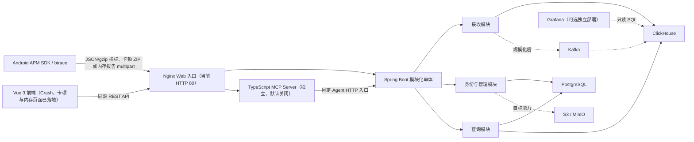

# 总体架构与模块

本页并列描述目标架构与当前代码边界；当前能力和验证结论统一见[当前实现与验证边界](00-当前实现与验证边界.md)。

## 架构总览

上图同时标注目标能力和当前部署边界：实线表示当前代码或 Compose 已接入的主要链路，虚线表示可选或尚未完成的目标能力。当前后端仍是一个 Spring Boot 进程，但代码已经按业务域拆分：Android Crash/启动事件由 `ingest` 完成协议解析与批次编排，再调用 `crash`；FPS、前台挂起和内存采样由 `ingest` 分派到 `jank` 或 `memory`；btrace 卡顿 ZIP 直接进入 `jank` 的受限读取、processor 解析、主线程证据归一化、指纹和幂等写入链路；网页用户通过 `identity` 的 Spring Security Session、应用成员授权访问管理、Crash、卡顿和内存 API。管理数据使用 PostgreSQL，遥测数据根据配置选择领域专属内存或 ClickHouse 适配器。

Nginx 已作为独立 Web 容器接入，提供 Vue 静态资源、同源 HTTP 反向代理、请求体和超时边界；当前配置只监听 HTTP 80，HTTPS 证书、生产限流策略和外层生产网关仍未完成。Kafka、S3/MinIO 和 OIDC 尚未接入。MCP 通过独立容器访问固定的 Java Agent HTTP 入口，不直连数据库；MCP 与 Agent HTTP 默认关闭。

ClickHouse HTTP、认证、超时和 JSONEachRow 基础能力统一由 `platform.api.ClickHouseHttpClient` 提供，但表名、SQL、事件映射和修复逻辑归属 `crash`、`jank` 或 `memory`。各领域分别定义自己的写入和查询端口，不再共享联合 `EventRepository`、运行时类型判断或联合事件模型。

## 核心原则：模块化单体

首版后端保持一个仓库和一个 Spring Boot 业务进程，在代码中隔离职责；整体运行通过 Compose 组合 PostgreSQL、ClickHouse、Spring Boot、Nginx/Vue 和 MCP 容器，MCP 查询能力默认关闭。这样既降低后端部署与调试成本，又能在负载明确后拆分接收和查询服务。

仓库根目录的 `frontend/` 是独立的 Vue 工程；Crash 闭环、卡顿指标/问题/Issue 事件/单事件证据、PSS/VSS/Java 堆内存指标，以及 SDK 内存异常报告的问题/趋势/引用链页面已经落地。卡顿页面使用 URL 恢复筛选、独立区域请求、游标去重，以及时间片、递归调用树和无新增依赖的 SVG 火焰图；内存页面使用 summary/trend 两个独立区域和 URL 筛选状态。浏览器只通过 Spring Boot 查询 API 访问数据。前端开发服务器不是 Spring Boot 静态资源托管，也不构成生产网关。工程结构和运行时数据流见[前端架构与代码组织](../../frontend/docs/knowledge-base/02-架构与代码组织.md)。

应用管理与 `identity` 的最小网页子集已经实现（用户、Session、应用、成员关系、基础信息和永久 App Key 查看）；`symbol` 模块提供按 `appId + buildId` 隔离的网页 mapping 上传、列表、审计替换和受控文件租约。Crash 详情请求内实时 Retrace，卡顿上传解析时读取当前版本；构建后自动上传、历史事件重算、下载/删除和对象存储仍是目标边界。

## 模块职责

| 模块 | 主要职责 | 当前/目标形态 |
|---|---|---|
| Android SDK | 本地队列、批量、gzip、采样、弱网重试、Schema 版本 | 业务 App 集成目标；当前仓库提供协议和接入示例，持久队列和完整生命周期仍待验收；实际设备卡顿 ZIP 的服务端链路已有验收 |
| 接入层 | HTTP 反向代理、请求大小和超时边界；生产 HTTPS 与限流 | Nginx Web 容器已接入，当前 HTTP 80；HTTPS 和生产限流待完成 |
| 身份与应用管理 | 用户、Session、应用、成员、App Key 和授权 | Spring Boot `identity` 内部模块，当前已实现基础网页子集 |
| 接收模块 | 应用识别、协议/字段校验、JSON/gzip 批次编排与领域分派 | Spring Boot `ingest` 内部模块 |
| Crash 模块 | 启动/Crash 写入、指纹、趋势、Issue、事件详情和查询内 Retrace | Spring Boot `crash` 内部模块 |
| Jank 模块 | 卡顿 ZIP 受限读取、processor 解析、FPS/挂起指标、Issue 和采样证据 | Spring Boot `jank` 内部模块；同步解析 |
| Memory 模块 | PSS/VSS/Java 堆指标、内存异常报告、问题/趋势查询和附件清理 | Spring Boot `memory` 内部模块；附件使用受控本地目录 |
| 符号表模块 | 按 `appId + buildId` 管理 mapping、审计替换、文件租约和 Retrace | Spring Boot `symbol` 内部模块；不使用 S3/MinIO |
| 查询模块 | 趋势、排行、分位数、筛选、事件详情和 Crash 请求内符号化 | Spring Boot `crash`/`jank`/`memory` 查询边界；当前没有独立版本对比 API |
| Agent 查询/MCP | 受限的只读查询、应用范围鉴权和 MCP 工具封装 | Java `agentquery` + 独立 TypeScript `mcp-server`；默认关闭 |
| 后台任务 | 内存报告附件临时文件和过期文件清理；数据质量、通用归档和告警辅助 | Spring Scheduler 已实现附件清理，其余仍是目标能力 |
| Grafana | Dashboard、临时分析和告警方向 | 已提供 Dashboard JSON 和独立安装方式；当前不属于 Compose 默认服务，生产告警未验收 |

## 技术栈

| 领域 | 方案 | 使用边界 |
|---|---|---|
| Web | Spring MVC + Jackson | 已实现 JSON 接收、原始二进制堆栈流、Crash/卡顿查询和认证/应用 API；与同步 processor 和阻塞式 HTTP 存储适配器匹配 |
| 事务数据 | PostgreSQL + Spring Data JPA | 已落地用户、应用、应用成员、App Key 凭据和 Spring Session 表；Flyway 迁移、JPA schema 校验与本地 Compose 已加入 |
| 分析数据 | ClickHouse HTTP JSONEachRow + Java `HttpClient` | 已实现原始事件/Crash 明细、卡顿事实/详情、帧/挂起对象和 PSS/VSS/Java 堆采样写入；卡顿与内存均有独立查询边界，Crash 下推、卡顿、内存指标和内存报告已有真实 ClickHouse 有限范围验收；内存报告仍在 Java 聚合，生产容量和故障恢复待验证 |
| 数据迁移 | ClickHouse 版本化 SQL + PostgreSQL Flyway | 已提供 ClickHouse `001_crash_schema.sql`～`007_event_process_identity.sql` 和 PostgreSQL Flyway `V1__management_schema.sql`～`V5__application_query_tokens.sql`；Flyway 不修改 ClickHouse schema |
| 安全 | 上报 App Key + 网页 Session/CSRF/成员关系 + 查询 Token | Android 上报、网页用户和 Agent 只读身份分离；网页登录不信任 `X-App-Id`/`X-User-App-Ids`；OIDC 尚未加入 |
| 接口 | REST | 已实现 Crash、卡顿指标和内存指标 JSON 接收，v3 manifest 边界，卡顿解析落库与查询，FPS 小时/天及挂起率 UTC 天趋势，PSS/VSS/Java 堆 summary/trend，Session 登录/退出和应用列表/创建/详情/修改；OpenAPI 尚未加入 |
| 后台任务 | Spring Scheduler | 已实现内存报告附件清理；数据质量、通用归档和告警任务仍未实现 |
| 展示 | Grafana JSON + Vue 前端 | Grafana 用于内部分析和告警方向，当前不随 Compose 默认启动；Vue 已展示 Crash 闭环、卡顿指标/Issue 下钻/采样证据、PSS/VSS/Java 堆内存和 SDK 内存异常报告分析，PC 宽度基线为 1280px，不做移动端适配 |

## 当前工程差异

后端工具链、依赖及实现差异由后端工程文档维护。详见[后端知识库](../../backend/docs/knowledge-base/01-工程结构与模块边界.md)。

## 工程目录边界

`backend/` 与 `frontend/` 并列，根目录 `docs/`、`scripts/`、Compose 和 OpenSpec 服务于整个平台。后端内部包结构和依赖规则见[后端工程结构](../../backend/docs/knowledge-base/01-工程结构与模块边界.md)。目录独立不改变 Spring Boot 后端的单进程架构；Nginx/Vue 和 MCP 是独立部署单元。

## 只读 Agent 查询部署单元

新增 TypeScript mcp-server 为独立部署单元，Compose 中由 Nginx 的 `/mcp` 入口代理，只通过固定 Java Agent HTTP 入口读取数据，不直连数据库；Java 业务域仍为单进程模块化单体。MCP 与 Agent HTTP 默认关闭；本地真实客户端和网页端到端已验收。2026-09-29 云端调试环境已显式开启并完成五容器部署及入口冒烟，有效 Token 的云端工具查询尚未验收。
